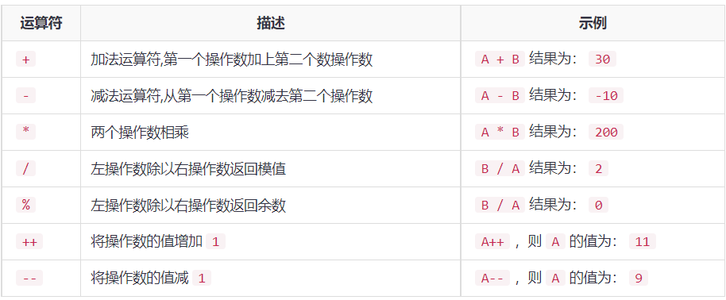
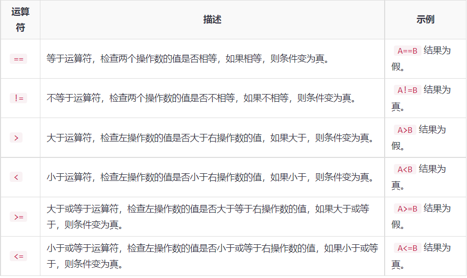
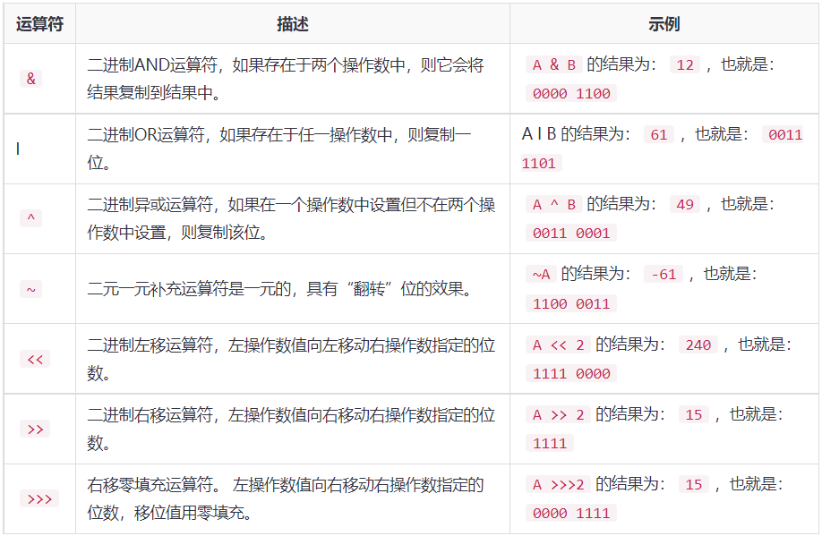
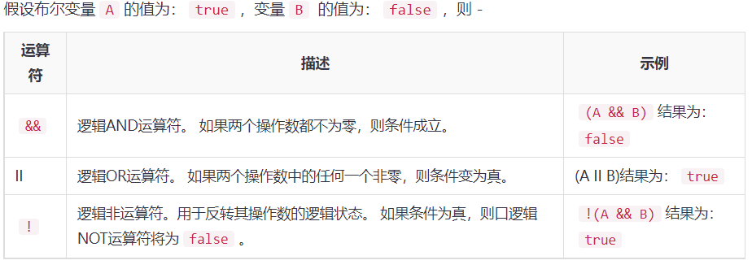
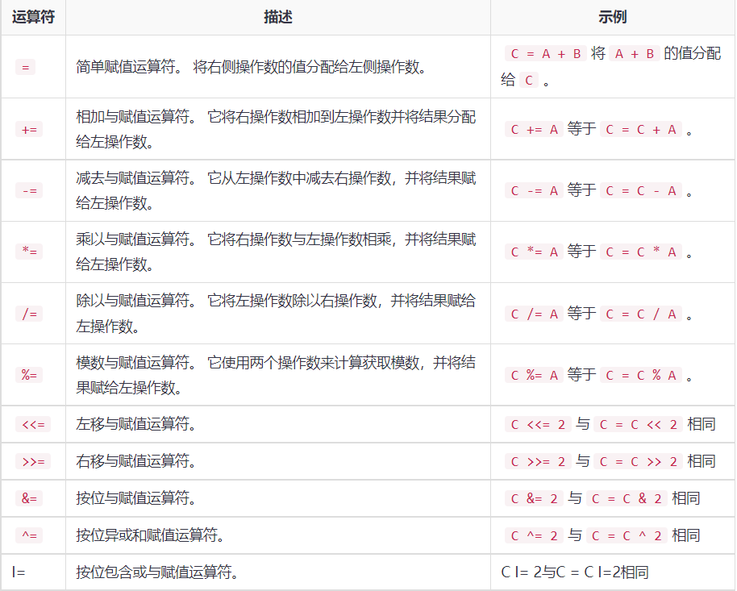
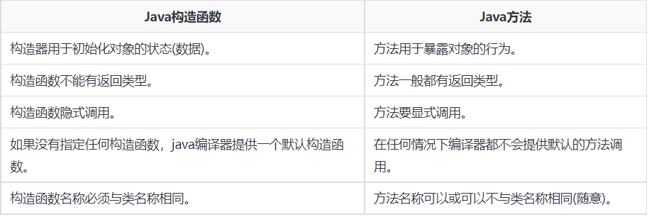
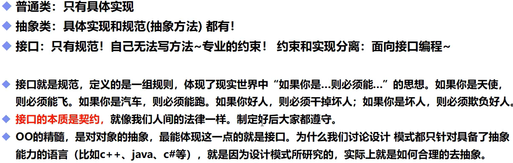

# JavaSe基础

# 1.Java简单介绍

## 1.1Java的特性和优势

- 简单性
- 面向对象
- 可移植性
- 高性能
- 分布式
- 动态性
- 多线程
- 安全性
- 健壮性

## 1.2 Java的三大版本

- JavaSE: 标准版（桌面程序、控制台开发....）

- javaME: 嵌入式开发（手机，小家电....）
- JavaEE：E企业级开发（web端、服务端开发....）

## 1.3 JDK JRE JVM

- JDK: JAVA Development Kit
- JRE:java runtime environment
- JVM:java virtual machine


## 1.4 jdk目录介绍

- **bin**: 该路径下存放了JDK的各种命令，常用的javac、java等。

- **include**: 一些平台特定的头文件，支持Java本地接口和Java虚拟机调试程序接口的本地编程技术。

- **jre**: 运行java程序所必须的JRE环境。

- **lib**：JDK工具命令的实际执行程序，bin路径下的绝大部分命令都是包装了tools.jar如（lib->tools.jar->sun\tools\javac\Main.class javac命令的实际执行类；bin下的javac.exe命令实际上仅仅包装了这个Java类）。

- **javafx-src.zip**：Java FX所有核心类库的源代码，JavaFX它是一种声明式、静态类型编程语言。(jdk1.8下新加的)。

- **src.zip**：Java所有核心类库的源代码。

## 1.5 编译型和解释型

- 编译型
- 解释型
- 程序运行机制：


# 2.Java基础

## 2.1注释

### 2.1.1 常见注释

- 单行注释 `// 这是单注释`
- 多行注释 `/*这是多行注释*/`
- Javadoc注释 `/**这是javadoc注释*/`

``` java
类，接口
package com.andyqian.utils;

/**
 * @author: 
 * @date: 
 * @version:
 * @description: 生成PDF 工具类
 */
public class PdfUtil {

}
```

```java
方法
/**
  * 生成pdf文件
  * @param htmlContent  待生成pdf的 html内容
  * @param file  生成pdf文件地址
  * @see  PdfUtils#getFontPath()
  * @return true 生成成功    false 生成失败
*/
public static boolean generatePdf(String htmlContent,File file){
        ...
    return result;
}    
```

```java
常量
public class StatusConsts {

    /**
     * 博客地址
     */
    public static final String BLOG="www.andyqian.com";
}
```

```java
关键算法上
/**
     * 应用场景:
     * 1.在windows下,使用Thread.currentThread()获取路径时,出现空对象，导致不能使用
     * 2.在linux下,使用PdfUtils.class获取路径为null,
     * 获取字体路径
     * @return 返回字体路径
     */
    private static String getFontPath(){
        String path="";
        // 1.
        ClassLoader classLoader= Thread.currentThread().getContextClassLoader();
        URL url = (classLoader==null)?null:classLoader.getResource("/");
        String threadCurrentPath = (url==null)?"":url.getPath();
        // 2. 如果线程获取为null,则使用当前PdfUtils.class加载路径
        if(threadCurrentPath==null||"".equals(threadCurrentPath)){
            path = PdfUtils.class.getClass().getResource("/").getPath();
        }
        // 3.拼接字体路径
        StringBuffer stringBuffer = new StringBuffer(path);
        stringBuffer.append("/fonts/SIMKAI.TTF");
        path = stringBuffer.toString();
        return path;
    }
```

### 2.1.2 怎么添加注释

- **1. IDEA 自动生成**

  - ```
    javadoc 需要熟知的注释标签
    @see 引用类/方法。
    @author: 作者。
    @date：日期。
    @version: 版本号。
    @throws：异常信息。
    @param：参数
    @return： 方法返回值。
    @since: 开源项目常用此标签用于创建日期 。
    {@value}: 会使用该值，常用于常量。
    {@link} 引用类/方法。
    {@linkplain} 与@link功能一致
    ```
  
    
  
  - ```
    对于类中的注释，我们可以通过IDEA自动生成。
    如IDEA 可以通过：File->Settings->Editor->File and Code Templates->Includes->File Header来设置模板，这样新建文件时，IDEA会按照设置的模板，会自动生成一个注释，就不需要一个一个敲了
    其中标签有:
    ${USER} : 当前用户。
    ${DATE} : 当前日期。
    ${PACKAGE_NAME}：包名。
    ${TIME}: 当前时间。
    ${YEAR}： 当前年。
    ${MONTH}：当前月。
    ${DAY}: 当前日。
    ${HOURS}： 当前小时。
    ${MINUTE}: 当前分钟
    ```

## 2.2 关键字和标识符

- 关键字

  

- 标识符注意点

  - ```
    所有的标识符都应该以字母（A-Z或者a-z），美圆符（$）,或者下划线（—）开始
    
    首字符之后可以是字母（A-Z或者a-z），美圆符（$）,下划线（—）或数字的任何字符组合
    
    不能使用关键字作为变量名或方法名。
    
    标识符是大小写敏感的
    
    合法标识符举例：age，$salary，—value，——1—value
    
    非法标识符举例：123abc，-salary，#abc
    
    可是使用中文命名，但是一般不建议这样去使用，也不建议使用拼音，很low
    ```

## 2.3常见命名规则

### 2.3.1**小驼峰法**

​	变量一般用小驼峰法标识。

- 第一个单词以小写字母开始；第二个单词的首字母大写或每一个单词的首字母都采用大写字母，例如：myFirstName、myLastName

### 2.3.2大驼峰法

- （pascal方法）常用于类名，函数名，属性，命名空间。

- 相比小驼峰法，大驼峰法把第一个单词的首字母也大写了。例如：public class DataBaseUser

- - ```java
    下面是分别用骆驼式命名法和下划线法命名的同一个函数：
    
       printEmployeePaychecks()；骆驼式命名法——函数名中的每一个逻辑断点都有一个大写字母来标记
    
       print_employee_paychecks()；下划线法----函数名中的每一个逻辑断点都有一个下划线来标记。
    ```

### 2.3.3 常用命名规范


## 2.4 数据类型

### 2.4.1基本数据类型


### 2.4.2引用类型

- 强引用

  ```
  当使用Object o = new Object();时这个o对象就是一个强引用类型对象。只要o还指向Object对象，Object对象就不会回收，除非设置o为null才会被回收。
  只要强引用存在，垃圾回收器就永远不会回收强引用的对象，内存不足时也不会去回收，JVM会直接抛出OutOFMemoryError错误。如果想中断强引用与对象之间的联系，可以显式地将强引用赋值为null，这样jvm就会回收这些对象。
  ```

  

- 软引用

  ```
  软引用用来描述一些非必需但仍有用的对象。在内存足够时，软引用对象不会被回收，只有在内存不足时系统才会回收软引用对象。如果回收了软引用对象之后仍然没有足够空间才会抛出内存溢出情况。
  ```

  

- 弱引用

  ```
  无论内存是否足够，只要JVM开始进行垃圾回收，被弱引用关联的对象就会被回收。
  ```

  

- 虚引用

  ```
  如果一个对象仅持有虚引用，那么它就和没有任何引用一样，随时可能会被回收。永远无法通过虚引用来获取对象，虚引用必须要和ReferenceQueue引用队列一起使用。
  ```


## 2.5类型转换

### 2.5.1 **基本数据类型的类型转换**

- ```
   基本数据类型中，布尔类型boolean占有一个字节，由于其本身所代码的特殊含义，boolean类型与其他基本类型不能进行类型的转换（既不能进行自动类型的提升，也不能强制类型转换）， 否则，将编译出错。
  ```

- 1.基本数据类型中数值类型的自动类型提升

  - **在Java中，整数类型（byte/short/int/long）中，对于未声明数据类型的整形，其默认类型为int型。在浮点类型（float/double）中，对于未声明数据类型的浮点型，默认为double型。**

  - ```java
    	//细节1： 有多种类型的数据混合运算时，
    	//系统首先自动将所有数据转换成容量最大的那种数据类型，然后再进行计算
    	int n1 = 10; //ok
    	//float d1 = n1 + 1.1;//错误 n1 + 1.1 => 结果类型是 double
    	//double d1 = n1 + 1.1;//对 n1 + 1.1 => 结果类型是 double
    	float d1 = n1 + 1.1F;//对 n1 + 1.1 => 结果类型是 float
    	
    	//细节2: 当我们把精度(容量)大 的数据类型赋值给精度(容量)小 的数据类型时，
    	//就会报错，反之就会进行自动类型转换。
    	//
    	//int n2 = 1.1;//错误 double -> int 
    	
    	//细节3: (byte, short) 和 char之间不会相互自动转换
    	//当把具体数赋给 byte 时，(1)先判断该数是否在byte范围内，如果是就可以
    	byte b1 = 10; //对  , -128-127
    	// int n2 = 1; //n2 是int 
    	// byte b2 = n2; //错误，原因： 如果是变量赋值，判断类型
    	// 
    	// char c1 = b1; //错误， 原因 byte 不能自动转成 char
    
    	//细节4: byte，short，char  他们三者可以计算，在计算时首先转换为int类型
    	
    	byte b2 = 1;
    	byte b3 = 2;
    	short s1 = 1;
    	//short s2 = b2 + s1;//错, b2 + s1 => int
    	int s2 = b2 + s1;//对, b2 + s1 => int
    	
    	//byte b4 = b2 + b3; //错误: b2 + b3 => int
    	
    	//boolean 不参与转换
    	boolean pass = true;
    	//int num100 = pass;// boolean 不参与类型的自动转换
    	
    	//自动提升原则： 表达式结果的类型自动提升为 操作数中最大的类型
    	//看一道题
    	
    	byte b4 = 1;
    	short s3 = 100;
    	int num200 = 1;
    	float num300 = 1.1F;
    	
    	double num500 = b4 + s3 + num200 + num300; //float -> double
    ```

    

  

- 2.基本数据类型中的数值类型强制转换

  - 当我们需要将数值范围较大的数值类型赋给数值范围较小的数值类型变量时，由于**此时可能会丢失精度**，因此，需要人为进行转换。我们称之为强制类型转换。

  - **当进行数学运算时，数据类型会自动发生提升到运算符左右之较大者**，以此类推。当将最后的运算结果赋值给指定的数值类型时，可能需要进行强制类型转换。**使用时要加上强制转换符()，但可能造成精度降低或溢出,格外要注意。**

  - ```java
    	//演示强制类型转换
    	int n1 = (int)1.9;
    	System.out.println("n1=" + n1);//1, 造成 精度损失
    	
    	int n2 = 2000;
    	byte b1 = (byte)n2;
    	System.out.println("b1=" + b1);//-48, 造成 数据溢出
    
    	//演示强制类型转换
    	//强转符号只针对于最近的操作数有效，往往会使用小括号提升优先级
    	//int x = (int)10*3.5+6*1.5;//编译错误： double -> int 
    	int x = (int)(10*3.5+6*1.5);// (int)44.0 -> 44
    	System.out.println(x);//44
    	
    	char c1 = 100; //ok
    	int m = 100; //ok
    	//char c2 = m; //错误
    	char c3 = (char)m; //ok
    	System.out.println(c3);//100对应的字符, d字符
    ```

    


### 2.5.2 **引用数据类型的类型转换**

- 进行**强制类型转换**的唯一原因是：在暂时忽视对象的实际类型之后，使用对象的全部功能。

  - ```
    编写Java程序时，引用类型只能调用声明该变量的类型的方法，也就是编译时类型的方法，不允许调用运行时类型所定义的方法，即使它实际所引用的对象包含该方法。解释一下就是我们说的，父类对象不能调用子类中新定义的方法，即使new 实例化的是子类类型。如果想要让这个父类类型的变量能够调用子类中新添的方法，就必须对该变量进行强制类型转换，将其转换成自类类型。强制转换类型的方式和基本类型的转换方式之一致的。
    ```

    ```
    引用类型之间的转化只能是两个类型具有继承关系，就是说一个类型是另一个类型的子类类型。不具备继承关系的两个引用类型变量是不能进行强制类型转换的。否则程序会引发ClassCastException异常。
    ```

    ```java
    public class Cast {
    	public static void main(String[] args) {
    		double d = 1.23;
    		long l = (long) (d);
    		System.out.println(l);
    		int i = 3;
    		//boolean bl = (boolean)i;
    		//布尔类型的变量不能和数值类型的变量之间进行转换
    		Object obj = "hello";
    		//Java中String类继承于Object类
    		String objStr = (String)obj;
    		System.out.println(objStr);
    		Object obj1 = new Integer(20);
    		String str = (String)obj1;
    		//obj1 的编译时类型是Objext 运行时类型是Integer
    		// Object与Integer存在继承关系   
    		//可以强制类型转换 而obj1的实际类型是Integer
    		//所以下面的代码运行时会引发类型转换的异常 因为String类和integer类不存在继承关系
    		System.out.println(str);
    	}
    }
    ```

  - **考虑到强制类型转换可能会引发程序异常，所以在进行引用类型的强制类型转换之前要先使用instanceof关键字进行判断。关键字是用来判断类类型的。**

    ```java
    instanceof运算符的前一个操作数通常是一个引用类型的变量，后一个操作数通常是一个类，也可以是接口，可以把接口理解成为一种特殊的类，它用于判断前面的对象是否是后面的类，或者子类，实现类的实例。
    在使用instanceof关键字的时候要注意，instanceof运算符前面的操作数的编译时类型要么与后面的类相同，要么与后面的类具有父子继承关系，否则会引起编译错误。
    ```

  - ```java
    String strr = "";
    if(  strr instanceof Object) {
    			
        System.out.println("Yes");
    }
    if(strr instanceof String) {
    	System.out.println("Yes");
    }
    ```

## 2.6 变量、常量、作用域

```java
public class variable {

/**
 * 类变量(静态变量)
 * */
    static double salary=2500;

/** 常量(不会变动的值);修饰符不存在先后顺序
    但注意：double是数据类型！后必须跟变量名
    在程序运行过程一直不会改变的量,在整个程序中只能被赋值一次
*/
    static final double PI=3.14;
    final static double PI1=3.1415;

/** 实例变量(成员变量):从属于对象；不进行初始化，输出该类型的默认值 0、0.0布尔值默认值为false
    除基本类型其余默认值为null
 */
     //推荐  属性：变量
    String name;
    int age;

    public static void main(String[] args) {
        //int a,b,c;
        //int a=1,b=2,c=3;(程序可读性)
        //变量推荐
        int a=1;
        int b=2;
        int c=3;

        //局部变量:必须声明和初始化值
        int i=10;
        System.out.println(i);


        //变量类型(自定义)    变量名字 =值
        //有static可弃
        variable   demo5 = new variable();
        System.out.println(demo5.name);
        System.out.println(demo5.age);


        //类变量
        System.out.println(salary);

        //常量
        System.out.println(PI);
        System.out.println(PI1);

    }
/**
   * 其他方法
*/
    public void add(){}
    //上面的局部变量中的i不可在此运用

}
```


## 2.7 基本运算符

### 2.7.1  算术运算符



### 2.7.2 关系运算符



### 2.7.3 按位运算符



### 2.7.4 逻辑运算符



### 2.7.5 赋值运算符



### 2.7.6  条件运算符(?:)

```java
variable x = (expression) ? value if true : value if false
```

### 2.7.7 instanceof运算符

``` java
此运算符仅用于对象引用变量。 运算符检查对象是否属于特定类型(类类型或接口类型)。 instanceof运算符写成:
( Object reference variable ) instanceof  (class/interface type)
```


## 2.8 包机制

### 2.8.1 包名规范

```java
公司域名倒序+项目名+模块名+功能名；
例如：com.sun.beans.util.Cache
```


# 3.Java 流程控制

## 3.1 用户交互Scanner

### 3.1.1 使用next方式接收输入的数据

```java
package Demo;
import java.util.Scanner; //导入Scanner类
public class Hello {
    public static void main(String[] args) {
    //创建一个扫描器对象，用于接收键盘数据
        Scanner scanner = new Scanner(System.in);
        System.out.println("请输入数据");

        //判断用户有没有输入数据
        if (scanner.hasNext()){ //用next方式接收
            String str = scanner.next();
            System.out.println("输入的内容为："+str);
            
            scanner.close(); //IO流的类用完即时以关掉节省资源
        }
    }
}

测试数据：Hello World！
结果：只输出了Hello
```

### 3.1.2 使用nextLine()方式接收输入的数据

``` java
public static void main(String[] args) {
    //创建一个扫描器对象，用于接收键盘数据
        Scanner scanner = new Scanner(System.in);
        System.out.println("请输入数据");

        //判断用户有没有输入数据
        if (scanner.hasNextLine()){ //用next方式接收
            String str = scanner.nextLine();
            System.out.println("输入的内容为："+str);

            scanner.close(); //IO流的类用完即时以关掉节省资源
        }
    }

测试数据：Hello World
结果：输出了Hello World
```

### 3.1.3 区别

```java
next():
对输入有效字符之前遇到的空白，next() 方法会自动将其去掉。
输入有效字符后next() 方法会将其后面输入的空白作为结束符。
按下回车键后会保留回车符nextInt、Double、Float等系列（统称nextXxx()），hasNextXxx（）也是
    
nextLine()：
以Enter为结束符,也就是说nextLine()方法返回的是输入回车之前的所有字符。按下回车键后会吃掉回车符
可以获得空白。适用于nextXxxLine()
    
hasNextXxxx():
检测接下来是否还有非空字符为主，如果有则返回true，否则false
    
hasNextXxxLine():
判断接下来是否还有一行（\n、空行也被当作一行），如果有则返回true，反之返回false
```

## 3.2 顺序结构

## 3.3 选择结构

### 3.3.1 if选择结构

### 3.3.2 Switch 选择结构

## 3.4 循环结构

### 3.4.1 While循环

### 3.4.2 DoWhile循环

### 3.4.3 For循环

### 3.4.4 break、continus、goto

# 4.Java 方法

## 4.1 方法的定义

```java
     修饰符 返回值类型 方法名(参数类型 参数名){
        ...
        方法体
        ...
        return 返回值;   //如果方法存在返回值的情况下（除void）,一定要把方法通过return返回出去，如果返回值类型是void就不用。
    }
```

## 4.2 方法调用

- 调用方法: 对象名.方法名(实参列表)

- Java支持两种调用方法的方式，根据方法是否返回值来选择。

- 当方法返回一个值的时候，方法调用通常被当做一个值。

## 4.3 值传递和引用传递

- 1.**值传递**，是对于基本类型的变量而言的。传递的是该变量的一个副本，改变副本并不影响原变量。（java是值传递）
- 2.**引用传递**，是对于引用类型的变量而言的。传递的是该变量地址的一个副本，并不是该对象本身。

## 4.4 **四种**类型的访问说明符

- **public:** 当我们在应用程序中使用公共说明符时，所有类都可以访问该方法。
- **private:** 当我们使用私有访问说明符时，仅在定义该方法的类中可以访问该方法。
- **protect:** 当我们使用受保护的访问说明符时，该方法可在相同包中或在不同包中的子类中访问。
- **default:** 当我们在方法声明中不使用任何访问说明符时，Java默认使用默认的访问说明符。仅从同一程序包中可见。


## 4.5 方法的命名

在定义方法时，请记住方法名称必须为 **动词**，并以 **小写**字母开头。如果方法名称包含两个以上的单词，则名字必须是动词，后跟形容词或名词。在多单词方法名称中，每个单词的第一个字母必须为 **大写**，但第一个单词除外。例如:

**单字方法名称:** sum()，area()

**多字方法名称:** AreaOfCircle()，stringComparision()

在同一个类中，一个方法也可能具有与另一个方法名称相同的名称，这称为 **方法重载**。

## 4.6 静态方法

具有静态关键字的方法称为静态方法。换句话说，属于类而不是类实例的方法称为静态方法。我们还可以通过在方法名称之前使用关键字 **static** 来创建静态方法。

静态方法的主要优点是无需创建对象即可调用它。它可以访问静态数据成员，也可以更改其值。它用于创建实例方法。通过使用类名来调用它。静态方法的最佳示例是 **main()**方法。

## 4.7 实例方法

### 4.7.1 **访问器（accessor）方法**

读取实例变量的方法称为访问器方法。我们可以轻松识别它，因为该方法的前缀为 **get** 。也称为 **获取器**。

```java
public int getId()
{
    return Id;
}
```


### 4.7.2 **修改器（mutator）方法**

该方法读取实例变量，并修改值。我们可以很容易地识别出它，因为该方法的前缀是单词 **set** 。也称为 **设置者**或 **修饰符**。它不返回任何东西。它接受取决于字段的相同数据类型的参数。

```java
public void setRoll(int roll)
{
    this.roll = roll;
}
```

## 4.8 抽象方法

没有方法主体的方法称为抽象方法。换句话说，没有实现的方法被称为抽象方法。它总是在 **抽象类**中声明。这意味着如果类具有抽象方法，则该类本身必须是抽象的。要创建抽象方法，我们使用关键字 **抽象**

```java
abstract void method_name();
```

## 4.9 工厂方法

这是一种将对象返回到其所属类的方法。所有静态方法都是工厂方法.

```java
NumberFormat obj = NumberFormat.getNumberInstance();
```


# 5.Java 数组

## 5.1 数组的特点

```java
1.在Java中，无论使用数组或集合，都有边界检查。如果越界操作就会得到一个RuntimeException异常。
2.数组只能保存特定类型。数组可以保存原生数据类型，集合则不能。集合不以具体的类型来处理对象，它们将所有对象都按Object类型处理，集合中存放的是对象的引用而不是对象本身。
3.集合类只能保存对象的引用。而数组既可以创建为直接保存原生数据类型，也可以保存对象的引用。在集合中可以使用包装类（Wrapper Class），如Integer、Double等来实现保存原生数据类型值。
4.对象数组和原生数据类型数组在使用上几乎是相同的；唯一的区别是对象数组保存的是引用，原生数据类型数组保存原生数据类型的值。
```

## 5.2 数组的格式

- 元素类型[]数组名 = new元素类型[元素个数或数组长度]

```java
int[] arr = new int[5];
 
arr[0] = 1;
arr[1] = 2;
```

- 元素类型[]数组名 = new元素类型[]{元素，元素，……}

```java
int[] arr = new int[]{3,5,1,7};
 
int[] arr = {3,5,1,7};
```

## 5.3 声明数组变量

```java
String[] aArray = new String[5];  
String[] bArray = {"a","b","c", "d", "e"};  
String[] cArray = new String[]{"a","b","c","d","e"}; 
```

## 5.4 Arrays类

java.util.Arrays是一个非常有用数组工具类，里面有很多工具方法，检索、填充、排序、比较、toString()等。

## 5.5 数组的复制

```java
java.lang.System
 
public static void arraycopy(Object src,
                             int srcPos,
                             Object dest,
                             int destPos,
                             int length)
参数：
src - 源数组。
srcPos - 源数组中的起始位置。
dest - 目标数组。
destPos - 目标数据中的起始位置。
length - 要复制的数组元素的数量。
```

## 5.6 数组的常见异常

### 5.6.1 数组角标越界异常

- 注意：数组的角标从0开始

```java
public static void main(String[] args) {
int[] x = { 1, 2, 3 };
System.out.println(x[3]);
//java.lang.ArrayIndexOutOfBoundsException
}
```

### 5.6.2 空指针异常

```java
public static void main(String[] args) {
int[] x = { 1, 2, 3 };
x = null;
System.out.println(x[1]);
// java.lang.NullPointerException
}
```

## 5.7 **多维数组**

### 5.7.1 二维数组的定义

```java
type arrayName[ ][ ]；   
type [ ][ ]arrayName; 
```

### 5.7.2 二维数组的初始化

- 静态初始化

```java
int intArray[ ][ ]={{1,2},{2,3},{3,4,5}}; 
```

- 动态初始化

```java
String s[ ][ ] = new String[2][ ];   
s[0]= new String[2];//为最高维分配引用空间  
s[1]= new String[2]; //为最高维分配引用空间  
s[0][0]= new String("Good");// 为每个数组元素单独分配空间  
s[0][1]= new String("Luck");// 为每个数组元素单独分配空间  
s[1][0]= new String("to");// 为每个数组元素单独分配空间  
s[1][1]= new String("You");// 为每个数组元素单独分配空间 
```


# 6.Java 面向对象

## 6.1 **对象**

- 对象是系统中用来描述客观事物的一个实体，它是构成系统的一个基本单位。一个对象由一组属性和对这组属性进行操作的一组服务组成。

- 类的实例化可生成对象，一个对象的生命周期包括三个阶段：生成、使用、消除。

- 当不存在对一个对象的引用时，该对象成为一个无用对象。Java的垃圾收集器自动扫描对象的动态内存区，把没有引用的对象作为垃圾收集起来并释放。当系统内存用尽或调用System.gc( )要求垃圾回收时，垃圾回收线程与系统同步运行。

## 6.2类

- 类是具有相同属性和方法的一组对象的集合，它为属于该类的所有对象提供了统一的抽象描述，其内部包括属性和方法两个主要部分。在面向对象的编程语言中，类是一个独立的程序单位，它应该有一个类名并包括属性和方法两个主要部分。

### 6.2.1 **类声明**

```java
[public][abstract|final] class className [extends superclassName] [implements interfaceNameList]{……}
```

- 其中，修饰符public,abstract,final 说明了类的属性，className为类名，superclassName为类的父类的名字，interfaceNameList为类所实现的接口列表。

### 6.2.2 **类体**

```java
class className{
    [public | protected | private ] [static] [final] [transient] [volatile] type variableName;//成员变量
    [public | protected | private ] [static] [final | abstract] [native] [synchronized] returnType methodName([paramList]) [throws exceptionList]{
        statements
    }//成员方法
}
```

- ```
  成员变量限定词的含义：
  
  - static: 静态变量（类变量）
  - final: 常量；transient: 暂时性变量，用于对象存档，用于对象的串行化
  - volatile: 贡献变量，用于并发线程的共享
  ```

- ```
  方法声明中的限定词的含义：
  
  - static: 类方法，可通过类名直接调用
  - abstract: 抽象方法，没有方法体
  - final: 方法不能被重写
  - native: 集成其它语言的代码
  - synchronized: 控制多个并发线程的访问
  ```

  

## 6.3 构造器（构造方法）




## 6.4 封装

封装性就是尽可能的隐藏对象内部细节，对外形成一道边界，只保留有限的接口和方法与外界进行交互。封装的原则是使对象以外的部分不能随意的访问和操作对象的内部属性，从而避免了外界对对象内部属性的破坏。

　　可以通过对类的成员设置一定的访问权限，实现类中成员的信息隐藏。

- private：类中限定为private的成员，只能被这个类本身访问。如果一个类的构造方法声明为private,则其它类不能生成该类的一个实例。
- default：类中不加任何访问权限限定的成员属于缺省的（default）访问状态，可以被这个类本身和同一个包中的类所访问。
- protected：类中限定为protected的成员，可以被这个类本身、它的子类（包括同一个包中以及不同包中的子类）和同一个包中的所有其他的类访问。
- public：类中限定为public的成员，可以被所有的类访问。

## 6.4 继承

子类的对象拥有父类的全部属性与方法，称作子类对父类的继承。

- Java中父类可以拥有多个子类，但是子类只能继承一个父类，称为单继承。
- 继承实现了代码的复用。
- Java中所有的类都是通过直接或间接地继承java.lang.Object类得到的。
- 子类不能继承父类中访问权限为private的成员变量和方法。
- 子类可以重写父类的方法，即命名与父类同名的成员变量。

　　Java中通过**super**来实现对父类成员的访问，super用来引用当前对象的父类。super 的使用有三种情况：

- 访问父类被隐藏的成员变量，如：super.variable;
- 调用父类中被重写的方法，如：super.Method([paramlist]),super()调用父类构造方法;
- 调用父类的构造函数，如：super([paramlist]);

## 6.5 多态

对象的多态性是指在父类中定义的属性或方法被子类继承之后，可以具有不同的数据类型或表现出不同的行为。这使得同一个属性或方法在父类及其各个子类中具有不同的语义。例如："几何图形"的"绘图"方法，"椭圆"和"多边形"都是"几何图"的子类，其"绘图"方法功能不同。

　　Java的多态性体现在两个方面：由方法重载实现的静态多态性（编译时多态）和方法重写实现的动态多态性（运行时多态）。

- 编译时多态：在编译阶段，具体调用哪个被重载的方法，编译器会根据参数的不同来静态确定调用相应的方法。
- 运行时多态：由于子类继承了父类所有的属性（私有的除外），所以子类对象可以作为父类对象使用。程序中凡是使用父类对象的地方，都可以用子类对象来代替。一个对象可以通过引用子类的实例来调用子类的方法。


## 6.6 **重载（Overloading）**

- 方法重载是让类以统一的方式处理不同数据类型的手段。
- 一个类中可以创建多个方法，它们具有相同的名字，但具有不同的参数和不同的定义。调用方法时通过传递给它们的不同参数个数和参数类型来决定具体使用哪个方法。
- 返回值类型可以相同也可以不相同，无法以返回型别作为重载函数的区分标准。

## 6.7 **重写（Overriding）**

- 子类对父类的方法进行重新编写。如果在子类中的方法与其父类有相同的的方法名、返回类型和参数表，我们说该方法被重写 (Overriding)。
- 如需父类中原有的方法，可使用super关键字，该关键字引用了当前类的父类。
- 子类函数的访问修饰权限不能低于父类的。

## 6.8 抽象类

- 1、抽象类不能被实例化。
-  2、抽象类应该至少有一个抽象方法，否则它没有任何意义。
-  3、抽象类中的抽象方法没有方法体。 
- 4、抽象类的子类必须给出父类中的抽象方法的具体实现，除非该子类也是抽象类。

### 6.8.1 定义抽象类

定义抽象类的时候需要用到关键字 `abstract`，放在 `class` 关键字前，就像下面这样。

```java
abstract class AbstractPlayer {
}
```

关于抽象类的命名，《阿里的 Java 开发手册》上有强调，“抽象类命名要使用 Abstract 或 Base 开头”，这条规约还是值得遵守的。

### 6.8.2 抽象类的特征

抽象类是不能实例化的，尝试通过 `new` 关键字实例化的话，编译器会报错，提示“类是抽象的，不能实例化”。

抽象类中既可以定义抽象方法，也可以定义普通方法，就像下面这样：

```java
public abstract class AbstractPlayer {
    abstract void play();
    
    public void sleep() {
        System.out.println("运动员也要休息而不是挑战极限");
    }
}
```

### 6.8.3 抽象类的应用场景

- 当我们希望一些通用的功能被多个子类复用的时候，就可以使用抽象类。比如说，AbstractPlayer 抽象类中有一个普通的方法 `sleep()`，表明所有运动员都需要休息，那么这个方法就可以被子类复用。

- 当我们需要在抽象类中定义好 API，然后在子类中扩展实现的时候就可以使用抽象类。


## 6.9 接口

### 6.9.1 定义接口

- 接口通过 interface 关键字来定义

  ```java
  public interface Electronic {
      // 常量
      String LED = "LED";
  
      // 抽象方法
      int getElectricityUse();
  
      // 静态方法
      static boolean isEnergyEfficient(String electtronicType) {
          return electtronicType.equals(LED);
      }
  
      // 默认方法
      default void printDescription() {
          System.out.println("电子");
      }
  }
  ```



### 6.9.2  接口在应用中常见的三种模式

- 策略模式、适配器模式和工厂模式


## 6.10 内部类

　1.成员内部类

　　成员内部类是最普通的内部类，它的定义为位于另一个类的内部，形如下面的形式：

```java
class Circle {
    double radius = 0;

    public Circle(double radius) {
        this.radius = radius;
    }

    class Draw {     //内部类
        public void drawSahpe() {
            System.out.println("drawshape");
        }
    }
}
```

2.局部内部类

```java
Class People{
public People() {

        }
        }

class Man{
    public Man(){

    }

    public People getWoman(){
        class Woman extends People{   //局部内部类
            int age =0;
        }
        return new Woman();
    }
}
```

　3.匿名内部类

匿名内部类应该是平时我们编写代码时用得最多的，在编写事件监听的代码时使用匿名内部类不但方便，而且使代码更加容易维护

　4.静态内部类

# 7.异常

## 7.1 Exception和Error的区别

从单词的释义上来看，error 为错误，exception 为异常，错误的等级明显比异常要高一些。

从程序的角度来看，也的确如此。

Error 的出现，意味着程序出现了严重的问题，而这些问题不应该再交给 Java 的异常处理机制来处理，程序应该直接崩溃掉，比如说 OutOfMemoryError，内存溢出了，这就意味着程序在运行时申请的内存大于系统能够提供的内存，导致出现的错误，这种错误的出现，对于程序来说是致命的。

Exception 的出现，意味着程序出现了一些在可控范围内的问题，我们应当采取措施进行挽救。

比如说之前提到的 ArithmeticException，很明显是因为除数出现了 0 的情况，我们可以选择捕获异常，然后提示用户不应该进行除 0 操作，当然了，更好的做法是直接对除数进行判断，如果是 0 就不进行除法运算，而是告诉用户换一个非 0 的数进行运算。


## 7.2 checked和unchecked异常

checked 异常（检查型异常）在源代码里必须显式地捕获或者抛出，否则编译器会提示你进行相应的操作；而 unchecked 异常（非检查型异常）就是所谓的运行时异常，通常是可以通过编码进行规避的，并不需要显式地捕获或者抛出。

## 7.3  throw 和 throws

1）throws 关键字用于声明异常，它的作用和 try-catch 相似；而 throw 关键字用于显式的抛出异常。

2）throws 关键字后面跟的是异常的名字；而 throw 关键字后面跟的是异常的对象。

```text
throws ArithmeticException;
```

```text
throw new ArithmeticException("算术异常");
```

3）throws 关键字出现在方法签名上，而 throw 关键字出现在方法体里。

4）throws 关键字在声明异常的时候可以跟多个，用逗号隔开；而 throw 关键字每次只能抛出一个异常。

## 7.4 try-catch-finally

```java
try {
    // 可能发生异常的代码
}catch {
   // 异常处理
}finally {
   // 必须执行的代码
}
```

