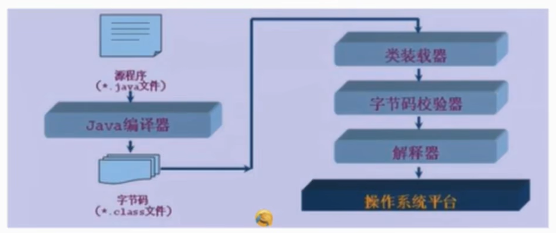
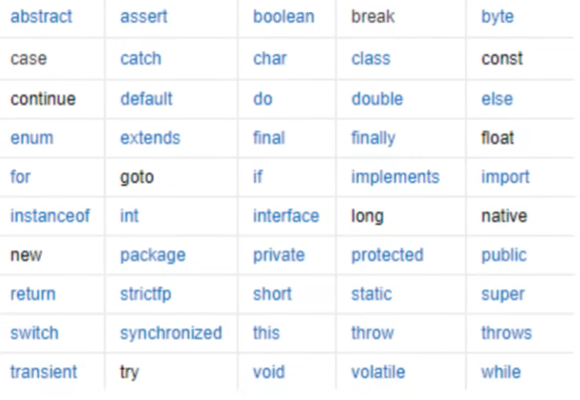
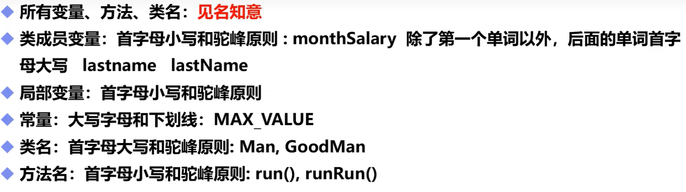
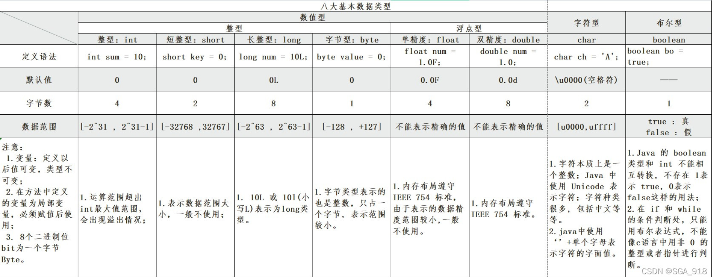
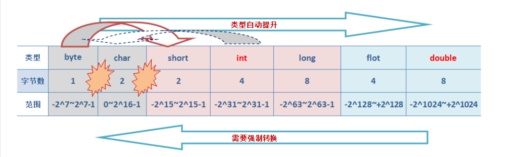

# JavaSe基础

# 1 java简单介绍

## 1.1Java的特性和优势

- 简单性
- 面向对象
- 可移植性
- 高性能
- 分布式
- 动态性
- 多线程
- 安全性
- 健壮性

## 1.2 Java的三大版本

- JavaSE: 标准版（桌面程序、控制台开发....）

- javaME: 嵌入式开发（手机，小家电....）
- JavaEE：E企业级开发（web端、服务端开发....）

## 1.3 JDK JRE JVM

- JDK: JAVA Development Kit
- JRE:java runtime environment
- JVM:java virtual machine


## 1.4 jdk目录介绍

- **bin**: 该路径下存放了JDK的各种命令，常用的javac、java等。

- **include**: 一些平台特定的头文件，支持Java本地接口和Java虚拟机调试程序接口的本地编程技术。

- **jre**: 运行java程序所必须的JRE环境。

- **lib**：JDK工具命令的实际执行程序，bin路径下的绝大部分命令都是包装了tools.jar如（lib->tools.jar->sun\tools\javac\Main.class javac命令的实际执行类；bin下的javac.exe命令实际上仅仅包装了这个Java类）。

- **javafx-src.zip**：Java FX所有核心类库的源代码，JavaFX它是一种声明式、静态类型编程语言。(jdk1.8下新加的)。

- **src.zip**：Java所有核心类库的源代码。

## 1.5 编译型和解释型

- 编译型
- 解释型
- 程序运行机制：



# 2 java基础

## 2.1注释

### 2.1.1 常见注释

- 单行注释 `// 这是单注释`
- 多行注释 `/*这是多行注释*/`
- Javadoc注释 `/**这是javadoc注释*/`

``` java
类，接口
package com.andyqian.utils;

/**
 * @author: 
 * @date: 
 * @version:
 * @description: 生成PDF 工具类
 */
public class PdfUtil {

}
```

```java
方法
/**
  * 生成pdf文件
  * @param htmlContent  待生成pdf的 html内容
  * @param file  生成pdf文件地址
  * @see  PdfUtils#getFontPath()
  * @return true 生成成功    false 生成失败
*/
public static boolean generatePdf(String htmlContent,File file){
        ...
    return result;
}    
```

```java
常量
public class StatusConsts {

    /**
     * 博客地址
     */
    public static final String BLOG="www.andyqian.com";
}
```

```java
关键算法上
/**
     * 应用场景:
     * 1.在windows下,使用Thread.currentThread()获取路径时,出现空对象，导致不能使用
     * 2.在linux下,使用PdfUtils.class获取路径为null,
     * 获取字体路径
     * @return 返回字体路径
     */
    private static String getFontPath(){
        String path="";
        // 1.
        ClassLoader classLoader= Thread.currentThread().getContextClassLoader();
        URL url = (classLoader==null)?null:classLoader.getResource("/");
        String threadCurrentPath = (url==null)?"":url.getPath();
        // 2. 如果线程获取为null,则使用当前PdfUtils.class加载路径
        if(threadCurrentPath==null||"".equals(threadCurrentPath)){
            path = PdfUtils.class.getClass().getResource("/").getPath();
        }
        // 3.拼接字体路径
        StringBuffer stringBuffer = new StringBuffer(path);
        stringBuffer.append("/fonts/SIMKAI.TTF");
        path = stringBuffer.toString();
        return path;
    }
```

### 2.1.2 怎么添加注释

- **1. IDEA 自动生成**

  - ```
    javadoc 需要熟知的注释标签
    @see 引用类/方法。
    @author: 作者。
    @date：日期。
    @version: 版本号。
    @throws：异常信息。
    @param：参数
    @return： 方法返回值。
    @since: 开源项目常用此标签用于创建日期 。
    {@value}: 会使用该值，常用于常量。
    {@link} 引用类/方法。
    {@linkplain} 与@link功能一致
    ```
  
    
  
  - ```
    对于类中的注释，我们可以通过IDEA自动生成。
    如IDEA 可以通过：File->Settings->Editor->File and Code Templates->Includes->File Header来设置模板，这样新建文件时，IDEA会按照设置的模板，会自动生成一个注释，就不需要一个一个敲了
    其中标签有:
    ${USER} : 当前用户。
    ${DATE} : 当前日期。
    ${PACKAGE_NAME}：包名。
    ${TIME}: 当前时间。
    ${YEAR}： 当前年。
    ${MONTH}：当前月。
    ${DAY}: 当前日。
    ${HOURS}： 当前小时。
    ${MINUTE}: 当前分钟
    ```

## 2.2 关键字和标识符

- 关键字

  

- 标识符注意点

  - ```
    所有的标识符都应该以字母（A-Z或者a-z），美圆符（$）,或者下划线（—）开始
    
    首字符之后可以是字母（A-Z或者a-z），美圆符（$）,下划线（—）或数字的任何字符组合
    
    不能使用关键字作为变量名或方法名。
    
    标识符是大小写敏感的
    
    合法标识符举例：age，$salary，—value，——1—value
    
    非法标识符举例：123abc，-salary，#abc
    
    可是使用中文命名，但是一般不建议这样去使用，也不建议使用拼音，很low
    ```

## 2.3常见命名规则

### 2.3.1**小驼峰法**

​	变量一般用小驼峰法标识。

- 第一个单词以小写字母开始；第二个单词的首字母大写或每一个单词的首字母都采用大写字母，例如：myFirstName、myLastName

### 2.3.2大驼峰法

- （pascal方法）常用于类名，函数名，属性，命名空间。

- 相比小驼峰法，大驼峰法把第一个单词的首字母也大写了。例如：public class DataBaseUser

- - ```java
    下面是分别用骆驼式命名法和下划线法命名的同一个函数：
    
       printEmployeePaychecks()；骆驼式命名法——函数名中的每一个逻辑断点都有一个大写字母来标记
    
       print_employee_paychecks()；下划线法----函数名中的每一个逻辑断点都有一个下划线来标记。
    ```

### 2.3.3 常用命名规范



## 2.4 数据类型

### 2.4.1基本数据类型



### 2.4.2引用类型

- 强引用

  ```
  当使用Object o = new Object();时这个o对象就是一个强引用类型对象。只要o还指向Object对象，Object对象就不会回收，除非设置o为null才会被回收。
  只要强引用存在，垃圾回收器就永远不会回收强引用的对象，内存不足时也不会去回收，JVM会直接抛出OutOFMemoryError错误。如果想中断强引用与对象之间的联系，可以显式地将强引用赋值为null，这样jvm就会回收这些对象。
  ```

  

- 软引用

  ```
  软引用用来描述一些非必需但仍有用的对象。在内存足够时，软引用对象不会被回收，只有在内存不足时系统才会回收软引用对象。如果回收了软引用对象之后仍然没有足够空间才会抛出内存溢出情况。
  ```

  

- 弱引用

  ```
  无论内存是否足够，只要JVM开始进行垃圾回收，被弱引用关联的对象就会被回收。
  ```

  

- 虚引用

  ```
  如果一个对象仅持有虚引用，那么它就和没有任何引用一样，随时可能会被回收。永远无法通过虚引用来获取对象，虚引用必须要和ReferenceQueue引用队列一起使用。
  ```


## 2.5类型转换

### 2.5.1 **基本数据类型的类型转换**

- ```
   基本数据类型中，布尔类型boolean占有一个字节，由于其本身所代码的特殊含义，boolean类型与其他基本类型不能进行类型的转换（既不能进行自动类型的提升，也不能强制类型转换）， 否则，将编译出错。
  ```

- 1.基本数据类型中数值类型的自动类型提升

  - **在Java中，整数类型（byte/short/int/long）中，对于未声明数据类型的整形，其默认类型为int型。在浮点类型（float/double）中，对于未声明数据类型的浮点型，默认为double型。**

  - ```java
    	//细节1： 有多种类型的数据混合运算时，
    	//系统首先自动将所有数据转换成容量最大的那种数据类型，然后再进行计算
    	int n1 = 10; //ok
    	//float d1 = n1 + 1.1;//错误 n1 + 1.1 => 结果类型是 double
    	//double d1 = n1 + 1.1;//对 n1 + 1.1 => 结果类型是 double
    	float d1 = n1 + 1.1F;//对 n1 + 1.1 => 结果类型是 float
    	
    	//细节2: 当我们把精度(容量)大 的数据类型赋值给精度(容量)小 的数据类型时，
    	//就会报错，反之就会进行自动类型转换。
    	//
    	//int n2 = 1.1;//错误 double -> int 
    	
    	//细节3: (byte, short) 和 char之间不会相互自动转换
    	//当把具体数赋给 byte 时，(1)先判断该数是否在byte范围内，如果是就可以
    	byte b1 = 10; //对  , -128-127
    	// int n2 = 1; //n2 是int 
    	// byte b2 = n2; //错误，原因： 如果是变量赋值，判断类型
    	// 
    	// char c1 = b1; //错误， 原因 byte 不能自动转成 char
    
    	//细节4: byte，short，char  他们三者可以计算，在计算时首先转换为int类型
    	
    	byte b2 = 1;
    	byte b3 = 2;
    	short s1 = 1;
    	//short s2 = b2 + s1;//错, b2 + s1 => int
    	int s2 = b2 + s1;//对, b2 + s1 => int
    	
    	//byte b4 = b2 + b3; //错误: b2 + b3 => int
    	
    	//boolean 不参与转换
    	boolean pass = true;
    	//int num100 = pass;// boolean 不参与类型的自动转换
    	
    	//自动提升原则： 表达式结果的类型自动提升为 操作数中最大的类型
    	//看一道题
    	
    	byte b4 = 1;
    	short s3 = 100;
    	int num200 = 1;
    	float num300 = 1.1F;
    	
    	double num500 = b4 + s3 + num200 + num300; //float -> double
    ```

    

  

- 2.基本数据类型中的数值类型强制转换

  - 当我们需要将数值范围较大的数值类型赋给数值范围较小的数值类型变量时，由于**此时可能会丢失精度**，因此，需要人为进行转换。我们称之为强制类型转换。

  - **当进行数学运算时，数据类型会自动发生提升到运算符左右之较大者**，以此类推。当将最后的运算结果赋值给指定的数值类型时，可能需要进行强制类型转换。**使用时要加上强制转换符()，但可能造成精度降低或溢出,格外要注意。**

  - ```java
    	//演示强制类型转换
    	int n1 = (int)1.9;
    	System.out.println("n1=" + n1);//1, 造成 精度损失
    	
    	int n2 = 2000;
    	byte b1 = (byte)n2;
    	System.out.println("b1=" + b1);//-48, 造成 数据溢出
    
    	//演示强制类型转换
    	//强转符号只针对于最近的操作数有效，往往会使用小括号提升优先级
    	//int x = (int)10*3.5+6*1.5;//编译错误： double -> int 
    	int x = (int)(10*3.5+6*1.5);// (int)44.0 -> 44
    	System.out.println(x);//44
    	
    	char c1 = 100; //ok
    	int m = 100; //ok
    	//char c2 = m; //错误
    	char c3 = (char)m; //ok
    	System.out.println(c3);//100对应的字符, d字符
    ```

    


### 2.5.2 **引用数据类型的类型转换**

- 进行**强制类型转换**的唯一原因是：在暂时忽视对象的实际类型之后，使用对象的全部功能。

  - ```
    编写Java程序时，引用类型只能调用声明该变量的类型的方法，也就是编译时类型的方法，不允许调用运行时类型所定义的方法，即使它实际所引用的对象包含该方法。解释一下就是我们说的，父类对象不能调用子类中新定义的方法，即使new 实例化的是子类类型。如果想要让这个父类类型的变量能够调用子类中新添的方法，就必须对该变量进行强制类型转换，将其转换成自类类型。强制转换类型的方式和基本类型的转换方式之一致的。
    ```

    ```
    引用类型之间的转化只能是两个类型具有继承关系，就是说一个类型是另一个类型的子类类型。不具备继承关系的两个引用类型变量是不能进行强制类型转换的。否则程序会引发ClassCastException异常。
    ```

    ```java
    public class Cast {
    	public static void main(String[] args) {
    		double d = 1.23;
    		long l = (long) (d);
    		System.out.println(l);
    		int i = 3;
    		//boolean bl = (boolean)i;
    		//布尔类型的变量不能和数值类型的变量之间进行转换
    		Object obj = "hello";
    		//Java中String类继承于Object类
    		String objStr = (String)obj;
    		System.out.println(objStr);
    		Object obj1 = new Integer(20);
    		String str = (String)obj1;
    		//obj1 的编译时类型是Objext 运行时类型是Integer
    		// Object与Integer存在继承关系   
    		//可以强制类型转换 而obj1的实际类型是Integer
    		//所以下面的代码运行时会引发类型转换的异常 因为String类和integer类不存在继承关系
    		System.out.println(str);
    	}
    }
    ```

  - **考虑到强制类型转换可能会引发程序异常，所以在进行引用类型的强制类型转换之前要先使用instanceof关键字进行判断。关键字是用来判断类类型的。**

    ```java
    instanceof运算符的前一个操作数通常是一个引用类型的变量，后一个操作数通常是一个类，也可以是接口，可以把接口理解成为一种特殊的类，它用于判断前面的对象是否是后面的类，或者子类，实现类的实例。
    在使用instanceof关键字的时候要注意，instanceof运算符前面的操作数的编译时类型要么与后面的类相同，要么与后面的类具有父子继承关系，否则会引起编译错误。
    ```

  - ```java
    String strr = "";
    if(  strr instanceof Object) {
    			
        System.out.println("Yes");
    }
    if(strr instanceof String) {
    	System.out.println("Yes");
    }
    ```

## 2.6 变量、常量、作用域

```java
public class variable {

/**
 * 类变量(静态变量)
 * */
    static double salary=2500;

/** 常量(不会变动的值);修饰符不存在先后顺序
    但注意：double是数据类型！后必须跟变量名
    在程序运行过程一直不会改变的量,在整个程序中只能被赋值一次
*/
    static final double PI=3.14;
    final static double PI1=3.1415;

/** 实例变量(成员变量):从属于对象；不进行初始化，输出该类型的默认值 0、0.0布尔值默认值为false
    除基本类型其余默认值为null
 */
     //推荐  属性：变量
    String name;
    int age;

    public static void main(String[] args) {
        //int a,b,c;
        //int a=1,b=2,c=3;(程序可读性)
        //变量推荐
        int a=1;
        int b=2;
        int c=3;

        //局部变量:必须声明和初始化值
        int i=10;
        System.out.println(i);


        //变量类型(自定义)    变量名字 =值
        //有static可弃
        variable   demo5 = new variable();
        System.out.println(demo5.name);
        System.out.println(demo5.age);


        //类变量
        System.out.println(salary);

        //常量
        System.out.println(PI);
        System.out.println(PI1);

    }
/**
   * 其他方法
*/
    public void add(){}
    //上面的局部变量中的i不可在此运用

}
```


## 2.7 基本运算符

