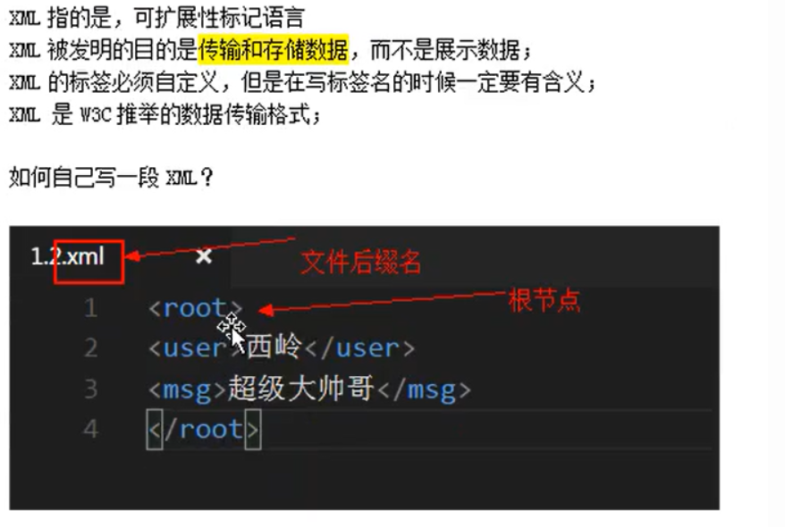

XML 数据传输格式

## 1. XML概述

### 1.1 引入

```xml
xml 发明的目的：  传输和存储数据。

xml 不是为了展示数据，

html 才是为了展示数据用的。
```


### 1.2 什么是XML




## 2. XML 的基本语法

### 2.1 语法规则


### 2.2 语法属性


### 2.3 CDATA


**所有 XML 文档中的文本均会被解析器解析，只有 CDATA 区段（CDATA section）中的文本会被解析器忽略。**
**在 XML 元素中，"<" 和 "&" 是非法的。"<" 会产生错误，因为解析器会把该字符解释为新元素的开始，"&" 也会产生错误，因为解析器会把该字符解释为字符实体的开始。**

**在html中，某些文本，比如 [JavaScript](https://so.csdn.net/so/search?q=JavaScript&spm=1001.2101.3001.7020) 代码，包含大量 "<" 或 "&" 字符。为了避免错误，可以将脚本代码定义为 CDATA。**


```xml
<script>
<![CDATA[function matchwo(a,b){
if (a < b && a < 0) then
  {
  return 1;
  }
else
  {
  return 0;
  }
}
]]>
</script>
```


**注意点：**

**1、CDATA 部分不能包含字符串 "]]>"。也不允许嵌套的 CDATA 部分。**
 **2、标记 CDATA 部分结尾的 "]]>" 不能包含空格或折行。**

## 3. 解析XML

XML (eXtensible Markup Language) 意为可扩展标记语言，被多数技术人员用以选择作为数据传输的载体，成为一种通用的数据交换格式,xml的平台无关性,语言无关性,系统无关性,给数据集成与交互带来了极大的便利。在不同的语言中，解析xml的方式都是一样的,只不过实现的语法不同而已。众所周知，现在解析XML的方法越来越多，但主流的方法也就四种，即：DOM、SAX、JDOM和DOM4J。


这四种方法的jar包下载地址：

**①DOM：**在现在的Java JDK里都自带了，在xml-apis.jar包里

**②SAX**：http://sourceforge.net/projects/sax/

**③JDOM：**http://jdom.org/downloads/index.html

**④DOM4J：**http://sourceforge.net/projects/dom4j/


下面以一个实例来具体说明这4种方法：

xml文件：

```xml
＜?xml version="1.0" encoding="GB2312"?＞
＜RESULT＞
＜VALUE＞
　　 ＜NO＞A1234＜/NO＞
　　 ＜ADDR＞四川省XX县XX镇XX路X段XX号＜/ADDR＞
＜/VALUE＞
＜VALUE＞
　　 ＜NO＞B1234＜/NO＞
　 　＜ADDR＞四川省XX市XX乡XX村XX组＜/ADDR＞
＜/VALUE＞
＜/RESULT＞
```


### 1、使用DOM（JAXP Crimson解析器）

DOM是用与平台和语言无关的方式表示XML文档的官方W3C标准。DOM是以层次结构组织的节点或信息片断的集合。这个层次结构允许开发人员在树中寻找特定信息。分析该结构通常需要加载整个文档和构造层次结构，然后才能做任何工作。由于它是基于信息层次的，因而DOM被认为是基于树或基于对象的。DOM以及广义的基于树的处理具有几个优点。首先，由于树在内存中是持久的，因此可以修改它以便应用程序能对数据和结构作出更改。它还可以在任何时候在树中上下导航，而不是像SAX那样是一次性的处理。DOM使用起来也要简单得多。

**实现方法：**

```java
import java.io.*;
import java.util.*;
import org.w3c.dom.*;
import javax.xml.parsers.*;
public class MyXMLReader{
　public static void main(String arge[]){
　　long lasting =System.currentTimeMillis();
　　try{
　　　File f=new File("data_10k.xml");
　　　DocumentBuilderFactory factory=DocumentBuilderFactory.newInstance();
　　　DocumentBuilder builder=factory.newDocumentBuilder();
　　　Document doc = builder.parse(f);
　　　NodeList nl = doc.getElementsByTagName("VALUE");
　　　for (int i=0;i＜nl.getLength();i++){
　　　　System.out.print("车牌号码:" + doc.getElementsByTagName("NO").item(i).getFirstChild().getNodeValue());
　　　　System.out.println("车主地址:" + doc.getElementsByTagName("ADDR").item(i).getFirstChild().getNodeValue());
　 　}
　　}catch(Exception e){
　　　e.printStackTrace();
}
```

**【优点】**
**①允许应用程序对数据和结构做出更改。**
**②访问是双向的，可以在任何时候在树中上下导航，获取和操作任意部分的数据。**
**【缺点】**
**通常需要加载整个XML文档来构造层次结构，消耗资源大。**


### 2. 使用SAX

SAX处理的优点非常类似于流媒体的优点。分析能够立即开始，而不是等待所有的数据被处理。而且，由于应用程序只是在读取数据时检查数据，因此不需要将数据存储在内存中。这对于大型文档来说是个巨大的优点。事实上，应用程序甚至不必解析整个文档；它可以在某个条件得到满足时停止解析。一般来说，SAX还比它的替代者DOM快许多。


选择DOM还是选择SAX？ 对于需要自己编写代码来处理XML文档的开发人员来说， 选择DOM还是SAX解析模型是一个非常重要的设计决策。 DOM采用建立树形结构的方式访问XML文档，而SAX采用的事件模型。


**DOM解析器把XML文档转化为一个包含其内容的树，并可以对树进行遍历。用DOM解析模型的优点是编程容易，开发人员只需要调用建树的指令，然后利用navigation APIs访问所需的树节点来完成任务。可以很容易的添加和修改树中的元素。然而由于使用DOM解析器的时候需要处理整个XML文档，所以对性能和内存的要求比较高，尤其是遇到很大的XML文件的时候。由于它的遍历能力，DOM解析器常用于XML文档需要频繁的改变的服务中。**


**SAX解析器采用了基于事件的模型，它在解析XML文档的时候可以触发一系列的事件，当发现给定的tag的时候，它可以激活一个回调方法，告诉该方法制定的标签已经找到。SAX对内存的要求通常会比较低，因为它让开发人员自己来决定所要处理的tag.特别是当开发人员只需要处理文档中所包含的部分数据时，SAX这种扩展能力得到了更好的体现。但用SAX解析器的时候编码工作会比较困难，而且很难同时访问同一个文档中的多处不同数据。**

实现方法：

```java
import org.xml.sax.*;
import org.xml.sax.helpers.*;
import javax.xml.parsers.*;
public class MyXMLReader extends DefaultHandler {
　java.util.Stack tags = new java.util.Stack();
　public MyXMLReader() {
　　super();
}
　public static void main(String args[]) {
　　long lasting = System.currentTimeMillis();
　　try {
　　　SAXParserFactory sf = SAXParserFactory.newInstance();
　　　SAXParser sp = sf.newSAXParser();
　　　MyXMLReader reader = new MyXMLReader();
　　　sp.parse(new InputSource("data_10k.xml"), reader);
　　} catch (Exception e) {
　　　e.printStackTrace();
　　}
 
　　System.out.println("运行时间：" + (System.currentTimeMillis() - lasting) + "毫秒");}
　　public void characters(char ch[], int start, int length) throws SAXException {
　　String tag = (String) tags.peek();
　　if (tag.equals("NO")) {
　　　System.out.print("车牌号码：" + new String(ch, start, length));
}
if (tag.equals("ADDR")) {
　　System.out.println("地址:" + new String(ch, start, length));
}
}
 
　　public void startElement(String uri,String localName,String qName,Attributes attrs) {
　　tags.push(qName);}
}
```

**【优点】**
**①不需要等待所有数据都被处理，分析就能立即开始。**
**②只在读取数据时检查数据，不需要保存在内存中。**
**③可以在某个条件得到满足时停止解析，不必解析整个文档。**
**④效率和性能较高，能解析大于系统内存的文档。**
**【缺点】**
**①需要应用程序自己负责TAG的处理逻辑（例如维护父/子关系等），文档越复杂程序就越复杂。**
**②单向导航，无法定位文档层次，很难同时访问同一文档的不同部分数据，不支持XPath。**

### 3、使用JDOM

JDOM的目的是成为Java特定文档模型，它简化与XML的交互并且比使用DOM实现更快。由于是第一个Java特定模型，JDOM一直得到大力推广和促进。正在考虑通过“Java规范请求JSR-102”将它最终用作“Java标准扩展”。从2000年初就已经开始了JDOM开发。


JDOM与DOM主要有两方面不同。首先，JDOM仅使用具体类而不使用接口。这在某些方面简化了API，但是也限制了灵活性。第二，API大量使用了Collections类，简化了那些已经熟悉这些类的Java开发者的使用。


JDOM文档声明其目的是“使用20%（或更少）的精力解决80%（或更多）Java/XML问题”（根据学习曲线假定为20%）。JDOM对于大多数Java/XML应用程序来说当然是有用的，并且大多数开发者发现API比DOM容易理解得多。JDOM还包括对程序行为的相当广泛检查以防止用户做任何在XML中无意义的事。然而，它仍需要您充分理解XML以便做一些超出基本的工作（或者甚至理解某些情况下的错误）。这也许是比学习DOM或JDOM接口都更有意义的工作。


JDOM自身不包含解析器。它通常使用SAX2解析器来解析和验证输入XML文档（尽管它还可以将以前构造的DOM表示作为输入）。它包含一些转换器以将JDOM表示输出成SAX2事件流、DOM模型或XML文本文档。JDOM是在Apache许可证变体下发布的开放源码。

实现方法：

```java
import java.io.*;
import java.util.*;
import org.jdom.*;
import org.jdom.input.*;
public class MyXMLReader {
　public static void main(String arge[]) {
　　long lasting = System.currentTimeMillis();
　　try {
　　　SAXBuilder builder = new SAXBuilder();
　　　Document doc = builder.build(new File("data_10k.xml"));
　　　Element foo = doc.getRootElement();
　　　List allChildren = foo.getChildren();
　　　for(int i=0;i＜allChildren.size();i++) {
　　　　System.out.print("车牌号码:" + ((Element)allChildren.get(i)).getChild("NO").getText());
　　　　System.out.println("车主地址:" + ((Element)allChildren.get(i)).getChild("ADDR").getText());
　　　}
　　} catch (Exception e) {
　　　e.printStackTrace();
}
 
}
```

**【优点】**
**①使用具体类而不是接口，简化了DOM的API。**
**②大量使用了Java集合类，方便了Java开发人员。**
**【缺点】**
**①没有较好的灵活性。**
**②性能较差。**

### 4、使用DOM4J

虽然DOM4J代表了完全独立的开发结果，但最初，它是JDOM的一种智能分支。它合并了许多超出基本XML文档表示的功能，包括集成的XPath支持、XML Schema支持以及用于大文档或流化文档的基于事件的处理。它还提供了构建文档表示的选项，它通过DOM4J API和标准DOM接口具有并行访问功能。从2000下半年开始，它就一直处于开发之中。


为支持所有这些功能，DOM4J使用接口和抽象基本类方法。DOM4J大量使用了API中的Collections类，但是在许多情况下，它还提供一些替代方法以允许更好的性能或更直接的编码方法。直接好处是，虽然DOM4J付出了更复杂的API的代价，但是它提供了比JDOM大得多的灵活性。


在添加灵活性、XPath集成和对大文档处理的目标时，DOM4J的目标与JDOM是一样的：针对Java开发者的易用性和直观操作。它还致力于成为比JDOM更完整的解决方案，实现在本质上处理所有Java/XML问题的目标。在完成该目标时，它比JDOM更少强调防止不正确的应用程序行为。


DOM4J是一个非常非常优秀的Java XML API，具有性能优异、功能强大和极端易用使用的特点，同时它也是一个开放源代码的软件。如今你可以看到越来越多的Java软件都在使用DOM4J来读写XML，特别值得一提的是连Sun的JAXM也在用DOM4J。

实现方法：

```java
import java.io.*;
import java.util.*;
import org.dom4j.*;
import org.dom4j.io.*;
 
public class MyXMLReader {
 
　public static void main(String arge[]) {
　　long lasting = System.currentTimeMillis();
　　try {
　　　File f = new File("data_10k.xml");
　　　SAXReader reader = new SAXReader();
　　　Document doc = reader.read(f);
　　　Element root = doc.getRootElement();
　　　Element foo;
　　　for (Iterator i = root.elementIterator("VALUE"); i.hasNext() {
　　　　foo = (Element) i.next();
　　　　System.out.print("车牌号码:" + foo.elementText("NO"));
　　　　System.out.println("车主地址:" + foo.elementText("ADDR"));
　　　}
　　} catch (Exception e) {
　　　e.printStackTrace();
}
)
```

**【优点】**
**①大量使用了Java集合类，方便Java开发人员，同时提供一些提高性能的替代方法。**
**②支持XPath。**
**③有很好的性能。**
**【缺点】**
**①大量使用了接口，API较为复杂。**

### 4种方法综合对比

1. DOM4J性能最好，连Sun的JAXM也在用DOM4J。目前许多开源项目中大量采用DOM4J，例如大名鼎鼎的Hibernate也用DOM4J来读取XML配置文件。如果不考虑可移植性，那就采用DOM4J。
      

2. JDOM和DOM在性能测试时表现不佳，在测试10M文档时内存溢出，但可移植。在小文档情况下还值得考虑使用DOM和JDOM.虽然JDOM的开发者已经说明他们期望在正式发行版前专注性能问题，但是从性能观点来看，它确实没有值得推荐之处。另外，DOM仍是一个非常好的选择。DOM实现广泛应用于多种编程语言。它还是许多其它与XML相关的标准的基础，因为它正式获得W3C推荐（与基于非标准的Java模型相对），所以在某些类型的项目中可能也需要它（如在JavaScript中使用DOM）。
      

3. SAX表现较好，这要依赖于它特定的解析方式－事件驱动。一个SAX检测即将到来的XML流，但并没有载入到内存（当然当XML流被读入时，会有部分文档暂时隐藏在内存中）。
      

建议：如果XML文档较大且不考虑移植性问题建议采用DOM4J；如果XML文档较小则建议采用JDOM；如果需要及时处理而不需要保存数据则考虑SAX。但无论如何，还是那句话：适合自己的才是最好的，如果时间允许，建议大家讲这四种方法都尝试一遍然后选择一种适合自己的即可。

------

### 读取XML配置文件

首先我们需要通过DocumentBuilderFactory获取xml文件的工厂实例。

```java
DocumentBuilderFactory dbf=DocumentBuilderFactory.newInstance();
        dbf.setIgnoringElementContentWhitespace(true);
```


创建文档对象

```xml
DocumentBuilder db = dbf.newDocumentBuilder();
            Document doc = db.parse(xmlPath); // 使用dom解析xml文件
```


最后遍历列表，进行数据提取

```
NodeList sonlist = doc.getElementsByTagName("son"); 
            for (int i = 0; i < sonlist.getLength(); i++) // 循环处理对象
            {
                Element son = (Element)sonlist.item(i);;
                
                for (Node node = son.getFirstChild(); node != null; node = node.getNextSibling()){  
                    if (node.getNodeType() == Node.ELEMENT_NODE){  
                        String name = node.getNodeName();  
                        String value = node.getFirstChild().getNodeValue();  
                        System.out.println(name+" : "+value);
                    }  
                }  
            }
```


完整实例：

```
public static void getFamilyMemebers(){
        DocumentBuilderFactory dbf=DocumentBuilderFactory.newInstance();
        dbf.setIgnoringElementContentWhitespace(true);
        try {
            DocumentBuilder db = dbf.newDocumentBuilder();
            Document doc = db.parse(xmlPath); // 使用dom解析xml文件

            NodeList sonlist = doc.getElementsByTagName("son"); 
            for (int i = 0; i < sonlist.getLength(); i++) // 循环处理对象
            {
                Element son = (Element)sonlist.item(i);;
                
                for (Node node = son.getFirstChild(); node != null; node = node.getNextSibling()){  
                    if (node.getNodeType() == Node.ELEMENT_NODE){  
                        String name = node.getNodeName();  
                        String value = node.getFirstChild().getNodeValue();  
                        System.out.println(name+" : "+value);
                    }  
                }  
            }
        } catch (Exception e) {
            e.printStackTrace();
        }
    }
```


### 在XML文件中增加节点

用差不多同样的步骤，先获取根节点，创建一个新的节点，向其中添加元素信息，最后把这个新节点添加到根节点中

```
Element root = xmldoc.getDocumentElement();
            
            //删除指定节点
            
            Element son =xmldoc.createElement("son");
            son.setAttribute("id", "004");
            
            Element name = xmldoc.createElement("name");
            name.setTextContent("小儿子");
            son.appendChild(name);

            Element age = xmldoc.createElement("name");
            age.setTextContent("0");
            son.appendChild(age);
            
            root.appendChild(son);
```


最后不要忘记保存新增的文件，对源文件进行覆盖

```
TransformerFactory factory = TransformerFactory.newInstance();
            Transformer former = factory.newTransformer();
            former.transform(new DOMSource(xmldoc), new StreamResult(new File(xmlPath)));
```


完整实例：

```
public static void createSon() {
        DocumentBuilderFactory dbf=DocumentBuilderFactory.newInstance();
        dbf.setIgnoringElementContentWhitespace(false);
        
        try{
        
            DocumentBuilder db=dbf.newDocumentBuilder();
            Document xmldoc=db.parse(xmlPath);
        
            Element root = xmldoc.getDocumentElement();
            
            //删除指定节点
            
            Element son =xmldoc.createElement("son");
            son.setAttribute("id", "004");
            
            Element name = xmldoc.createElement("name");
            name.setTextContent("小儿子");
            son.appendChild(name);

            Element age = xmldoc.createElement("name");
            age.setTextContent("0");
            son.appendChild(age);
            
            root.appendChild(son);
            //保存
            TransformerFactory factory = TransformerFactory.newInstance();
            Transformer former = factory.newTransformer();
            former.transform(new DOMSource(xmldoc), new StreamResult(new File(xmlPath)));
            
        }catch(Exception e){
            e.printStackTrace();
        }
    }
```


### 在XML中修改节点信息

通过XPath来获取目标节点

```
public static Node selectSingleNode(String express, Element source) {
        Node result=null;
        XPathFactory xpathFactory=XPathFactory.newInstance();
        XPath xpath=xpathFactory.newXPath();
        try {
            result=(Node) xpath.evaluate(express, source, XPathConstants.NODE);
        } catch (XPathExpressionException e) {
            e.printStackTrace();
        }
        
        return result;
    }
```


获取目标节点，进行修改，完成后，保存文件

```
Element root = xmldoc.getDocumentElement();
            
            Element per =(Element) selectSingleNode("/father/son[@id='001']", root);
            per.getElementsByTagName("age").item(0).setTextContent("27");
            
            TransformerFactory factory = TransformerFactory.newInstance();
            Transformer former = factory.newTransformer();
            former.transform(new DOMSource(xmldoc), new StreamResult(new File(xmlPath)));
```


完整实例：

```
public static void modifySon(){
        DocumentBuilderFactory dbf=DocumentBuilderFactory.newInstance();
        dbf.setIgnoringElementContentWhitespace(true);
        try{
        
            DocumentBuilder db=dbf.newDocumentBuilder();
            Document xmldoc=db.parse(xmlPath);
        
            Element root = xmldoc.getDocumentElement();
            
            Element per =(Element) selectSingleNode("/father/son[@id='001']", root);
            per.getElementsByTagName("age").item(0).setTextContent("27");
            
            TransformerFactory factory = TransformerFactory.newInstance();
            Transformer former = factory.newTransformer();
            former.transform(new DOMSource(xmldoc), new StreamResult(new File(xmlPath)));
        }catch(Exception e){
            e.printStackTrace();
        }
    }
```


### 删除XML中的节点

通过XPath获取目标节点， 进行删除，最后保存

```
Element root = xmldoc.getDocumentElement();
            
            Element son =(Element) selectSingleNode("/father/son[@id='002']", root);
            root.removeChild(son);

            TransformerFactory factory = TransformerFactory.newInstance();
            Transformer former = factory.newTransformer();
            former.transform(new DOMSource(xmldoc), new StreamResult(new File(xmlPath)));
```


完整实例：

```
public static void discardSon(){
            
        DocumentBuilderFactory dbf=DocumentBuilderFactory.newInstance();
        dbf.setIgnoringElementContentWhitespace(true);
        
        try{
        
            DocumentBuilder db=dbf.newDocumentBuilder();
            Document xmldoc=db.parse(xmlPath);
        
            Element root = xmldoc.getDocumentElement();
            
            Element son =(Element) selectSingleNode("/father/son[@id='002']", root);
            root.removeChild(son);

            TransformerFactory factory = TransformerFactory.newInstance();
            Transformer former = factory.newTransformer();
            former.transform(new DOMSource(xmldoc), new StreamResult(new File(xmlPath)));
            
        }catch(Exception e){
            e.printStackTrace();
        }
    }
```

## 4. Xpath 语言

### 4.1 概述

### 4.2 使用及其语法

