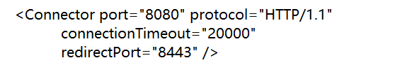
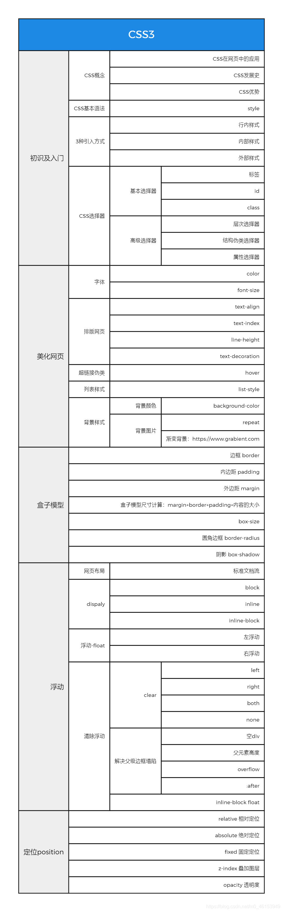

Java Web

---

## 1.基本概念

### 1.1前言

---

web开发：

- web ,网页的意思
- 静态web
  - html css
  - 提供给所有人看的数据书中不会发生变化！

- 动态web
  - 提供给所有人看的数据会发生变化，每个人在不同的时间，不同的地点看到的信息各不相同！
  - 淘宝，几乎所有的网站；
  - 技术栈：Servlet , ASP ,PHP

在java中，动态web资源的开发的技术统称为javaweb

### 1.2 web应用程序

---

web应用程序：可以提供浏览器访问的程序；

- a.html 、b.html ......多个资源可以被外界访问，对外界进行访问
- 你们能访问的任何一个页面或者资源，都存在这个世界的某一个角落的计算机上
- URL:
- 这些统一的web资源会被放在同一个文件夹下，web应用程序-->Tomcat:服务器
- 一个web应用由多部份组成（静态web，动态web）
  - html ,css ,js
  - jsp , servlet
  - java程序
  - jar包
  - 配置文件（Properties）

web应用程序编写完毕后，若想提供给外界访问：需要一个服务器来统一管理

### 1.3 静态web

---

- *.htm , *.html.这些都是网页的后缀，如果服务器上一直存在这些东西，我们就可以直接进行读取。（通网络）
- 静态web存在的缺点
  - Web页面无法动态更新，所有用户看到的都是同一个页面
    - 轮播图 ，点击特效：伪动态
    - JavaScript [实际开发中，他用的最多]
    - VBScript
  - 他无法和数据库交互（数据无法持久化，用户无法交互）

### 1.4 动态web

页面会动态显示：“web的页面展示效果因人而异”

缺点：

- 假如服务器的动态web出了错误，我们需要重新编写**后台程序**，重新发布
  - 停机维护

优点：

- web页面可以动态更新，所有用户看到的都不是一个页面
- 它可以与数据库交互（数据持久化：注册，商品信息，用户信息....）

新手村：（看源码）

## 2.web服务器

### 2.1技术详解

ASP:

- 微软：国内最早流行的就是asp
- 在HTML中嵌入了VB的脚本，asp+com
- 在asp开发中，基本每一个页面都有几千行的业务代码，页面及其混乱
- 维护成本高
- C#
- IS

php:

- php开发速度快，功能很轻大，跨平台，代码很简单（70%，wp）
- 无法承载大访问量的情况（局限性）

JSP/Servlet

B/S:浏览和服务器

C/S:客户端和服务器

- sun公司主推的B/S架构
- 基于java语言（所有的大公司，或者一些开源的组件，都是java写的）
- 可以承载三高带来的问题
- 语法像ASP ,ASP->JSP，加强市场强度

### 2.2 web服务器

服务器是一种被动的操作，用来处理用户的一些请求和用户的一些响应信息；

**IIS**

微软的；ASP ...,Windows中自带的

**Tomcat**

面向百度编程

工作3-5年后，可以尝试手写Tomact服务器；

...

下载tomcat:

- 1.安装 or 解压
- 2.了解配置文件及目录结构
- 这个东西的作用

## 3.tomcat

### 3.1安装

### 3.2启动 关闭

测试访问：127.0.0.1:8080


### 3.3配置

可能遇到的问题：

- java环境变量没有配置
- 闪退问题：需要配置兼容性
- 乱码问题：配置文件中修改

可以配置启动的端口号

- tomcat:8080

- mysql: 3306

- http: 80

- https : 443

- 

- 可以配置主机名称

  ``` java
   <Host name="localhost"  appBase="webapps"
              unpackWARs="true" autoDeploy="true">
  ```

  **高难度面试题：**

  请你谈谈网站是如何进行访问的！

  - 1.输入一个域名；回车
  
  - 2.检查本机的C:\windows\system32\drivers\etc\hosts配置文件下有没有这个域名映射；
    - 有：直接返回对应的ip地址，这个地址中，有我们需要访问的web程序，可以直接访问
    
    - 没有：去DNS服务器找，找到的话就返回，找不到就返回找不到
    

可以配置环境变量（可选）

### 3.4 发布一个网站

不会就先模仿

- 将自己写的网站，放到服务器（Tomcat）中指定的web应用的文件夹下（webapps）下，就可以访问了
  网站应该有的结构

  ```java
  --webapps: Tomcat服务器的web目录
      -root
      -ruobing 网站的目录名
      	-WEB-INF
      		-WEB.XML
      		-classes: Java程序
      		-lib ：web应用所依赖的jar包
      		-web.xml :网站配置文件
      	-index.jsp  :默认的首页
      	-static
      		-css
      			-style.css
      		-js
      		-img
      	-...
  ```

  


## 4 http

### 4.1 什么是HTTP

HTTP(超文本传输协议)是一个简单的请求-响应协议，它通常运行在TCP之上。

- 文本：html 字符串 ~
- 超文本： 图片 音乐 视频 定位 地图.....
- 80

HTTPS:安全的

- 443

### 4.2 两个时代

- http 1.0
  - http/1.0: 客户端可以与web服务器连接后，只能获得一个web资源，断开连接

- http2.0
  - http/1.1: 客户端可以与服务器连接后，可以获得多个web资源

### 4.3Http请求

- 客户端--发请求 （Request）---服务器

  ```java
  Request URL: https://i0.hdslb.com/bfs/banner   请求地址
  Request Method: GET                get/post方法
  Status Code: 200                   状态码：200
  Remote （远程）Address: 127.0.0.1:7890     
  
  ```

  ```java
  Accept: text/html 
  Accept-Encoding: gzip, deflate, br
  Accept-Language: zh-CN,zh;q=0.9    语言
  Cache-Control: max-age=0
  Connection: keep-alive
  ```

#### 1、请求行

  - 请求行中的请求方式：GET
  - 请求方式：GET/POST,HEAD,DELETE,PUT,TRACT...
    - GET:请求能够携带的参数比较少，大小有限制，会在浏览器的URL地址栏显示，不安全，但高效
    - POST:请求能够携带的参数没有限制，大小没有限制，不会在浏览器的URL地址栏显示，安全，但不高效

#### 2、消息头

  ```java
  Accept   告诉浏览器，它所支持的数据类型
  Accept-Encoding  支持哪种编码格式 GBK UTF-8 GB2312 ISO8859-1
  Accept-Language   语言环境
  Cache-Control   缓存控制
  Connection  告诉浏览器，请求完成是断开还是保持连接
  HOST:  主机.../.
  ```

  

### 4.4Http响应

- 服务器--响应----客户端

百度：

```java
Cache-Control:private       缓存控制
Connection: keep-alive      连接
Content-Encoding: gzip      编码
Content-Type: text/html; charset=utf-8 类型
```

#### 1.响应体

```java
Accept   告诉浏览器，它所支持的数据类型
Accept-Encoding  支持哪种编码格式 GBK UTF-8 GB2312 ISO8859-1
Accept-Language   语言环境
Cache-Control   缓存控制
Connection  告诉浏览器，请求完成是断开还是保持连接
HOST:  主机.../.
Refresh:告诉客户端，多久刷新一次
Location: 让网页重新定位；
```

#### 2.响应状态码

200： 请求响应成功

3**：请求重定向

- 重定向：你重新给我到你新位置去；

4**：找不到资源 404

- 资源不存在

5**：服务器代码错误 500  502：网关错误

**常见面试题：**

- 当你的浏览器中地址栏输入地址的一瞬间到页面能够展示回来，经历了什么？

## 5.Maven

**我为什么要学习这个技术？**

1. 在javaweb开发中，需要大量使用jar包，我们手动去导入。
2. 如何能让一个东西自动帮我导入和配置这个jar包

### 5.1maven项目架构管理工具

我们目前用来就是方便导入jar包的！

maven的核心思想： **约定大于配置**

- 有约束，不要去违反。

maven会规定好你该如何去编写我们的java代码，必须要按照这个规范来；

### 5.2下载和安装

### 5.3配置环境变量

### 5.4阿里云镜像

```xml
  <!-- 阿里云仓库，个人配置 -->
    <mirror>
      <id>aliyunmaven</id>
      <mirrorOf>*</mirrorOf>
      <name>阿里云公共仓库</name>
      <url>https://maven.aliyun.com/repository/public</url>
    </mirror>

```

### 5.5本地仓库

### 5.6 Maven在idea中的操作

# 6. HTML

## 6.1 初识HTML

- **HyperTextMarkupLanguage（超文本标记语言）**
  - 超文本包括：文字、图片、音频、视频、动画。

- **HTML5的优势**
  - 世界知名浏览器厂商对HTML5的支持
  - 市场的需求
  - 跨平台
- **W3C标准**
  - W3C
    - 万维网联盟 **（World Wide Web Consortium）** 。
    - 成立于1994年，Web领域最权威和最具影响力的国际中立性技术标准机构。
    - https://www.w3.org/
    - https://www.chinaw3c.org/
  - W3C标准包括
    - 结构化标准语言(HTML、XML)
    - 表现标准语言(CSS)
    - 行为标准语言(DOM、ECMAScript)

- **常见IDE**
  - 记事本
  - Dreamweaver
  - IDEA
  - WebStorm
  - ……
- **< body >、< /body>等成对的标签，分别叫做开放标签和闭合标签。**
- **单独呈现的标签（空元素），如< hr/ >;意为用/来关闭空元素。**

## 6.2 网页基本标签

- 标题标签
- 段落标签
- 换行标签
- 水平线标签
- 字体样式标签
- 注释和特殊符号

```html
<!DOCTYPE html>
<html lang="en">
<head>
    <meta charset="UTF-8">
    <title>基本标签</title>
</head>
<body>
<!--标题标签 -->
<h1>一级标签</h1>
<h2>二级标签</h2>
<h3>三级标签</h3>
<h4>四级标签</h4>
<h5>五级标签</h5>
<h6>六级标签</h6>

<!--段落标签-->
<p>p换行1</p>
<p>p换行2</p>

<!--水平线标签-->
<hr/>

<!--换行标签-->
换行1 <br/>
换行2 <br/>
<!--换行标签比较紧凑，段落标签有明显段间距-->

<!--粗体 斜体-->
<h1>字体样式标签</h1>
粗体:<strong>I am CSS. </strong><br/>
斜体:<em>HTML5 and CSS3 </em><br/>

<!--特殊符号-->
空格:1&nbsp;2&nbsp;&nbsp;3&nbsp;&nbsp;&nbsp;4<br/>
空格:1 2  3   4<br/>
大于号:&gt;<br/>
小于号:&lt;<br/>
版权符号:&copy;<br/>
<!--特殊符号记忆：'&'开头;结尾，只要在idea中&敲出后就有提示-->

</body>
</html>

```

## 6.3 图像，超链接，网页布局

- 图像标签

  ```html
  
  ```

- 链接标签

  - **href**： 必填，表示要跳转到那个页面；
  - **target**：表示窗口在哪里打开；
  - **_blank**：在新标签中打开；
  - **_self**： 在自己的网页中打开；

```html
<!DOCTYPE html>
<html lang="en">
<head>
    <meta charset="UTF-8">
    <title>Title</title>
</head>
<body>
<!--img学习
    src:资源地址
    相对地址(推荐使用，绝对地址
    ../     --上级地址
    alt：在图片加载失败的时候，就会用文字代替
    title:鼠标悬停在图片上时，所显示的名字
    width height 图片的高和宽-->


<br/>
<!--href：跳转页面的地址
    a标签内文字：即显示的文字
    可以把图片放在a标签内，点击图片跳转网页
    target:表示在哪打开新网页
	_self:当前标签打开 
	_blank:新的页面中打开-->
<a href="https://www.baidu.com" target="_blank" title="123">请咨询百度</a>
<br/>

<!--锚链接
    1.需要一个标记锚
    2.跳转到标记
    #页面内跳转-->
<a name="top"></a>
<a href="#top">回到顶部</a>
<br/>

<!--可以在网址后添加#号跳到对应网站的对应位置-->
<a href="https://www.baidu.com#down">百度底部</a> <br/>

<!--功能性链接
    邮箱链接：mailto
    qq链接
-->
<a href="mailto:qq.com">点击联系我</a>
<a target="_blank"
   href="http://wpa.qq.com/msgrd?v=xxx&uin=&site=qq&menu=yes"/>


<a target="_blank" href="http://wpa.qq.com/msgrd?v=3&uin=&site=qq&menu=yes">
    
</a>

</body>
</html>

```

**行内元素和块元素**

- 块元素

  - 无论内容多少，该元素独占一行。

  ```html
  <p></p><hr/> <h1>...<h6>
  ```

  - 行内元素：内容撑开宽度，左右都是行内元素的可以排在一行。

  ```html
  <a><strong><em>
  ```

## 6.4.列表、表格、媒体元素

### 1.列表

> 什么是列表

- 列表就是信息资源的一种展示形式。它可以使信息结构化和条理化，并以列表的样式显示出来，以便浏览者能更快捷地获得相应的信息。

> 列表的分类

- 无序列表
- 有序列表
- 自定义列表

```html
<!DOCTYPE html>
<html lang="en">
<head>
    <meta charset="UTF-8">
    <title>列表学习</title>
</head>
<body>
<!--
    有序列表
    应用范围:试卷,问答……
-->
<ol>
    <li>Java</li>
    <li>Python</li>
    <li>前端</li>
    <li>运维</li>
    <li>C/C++</li>
    <li>Android</li>
</ol>

<hr/>

<!--
    无序列表
    应用范围:导航,侧边栏……
-->
<ul>
    <li>Java</li>
    <li>Python</li>
    <li>前端</li>
    <li>运维</li>
    <li>C/C++</li>
    <li>Android</li>
</ul>

<hr/>

<!--
    自定义列表
    dl:标签
    dt:列表名称
    dd:列表内容
-->
<dl>
    <dt>dt</dt>

    <dd>dd1</dd>
    <dd>dd2</dd>
    <dd>dd3</dd>
    <dd>dd4</dd>
    <dd>dd5</dd>
</dl>

</body>
</html>
```

### 2.表格

表格的基本结构：

- 单元格
- 行
- 列
- 跨行
- 跨列

```html
<!DOCTYPE html>
<html lang="en">
<head>
    <meta charset="UTF-8">
    <title>表格学习</title>
</head>
<body>
<!--
    表格table
    行:tr
    列:td
-->

<table border="1px">
    <tr><!--colspan 跨列-->
        <td colspan="5">1-1</td>
        <td>1-2</td>
        <td>1-3</td>
        <td>1-4</td>
    </tr>
    <tr><!--rowspan 跨行-->
        <td rowspan="2">2-1</td>
        <td>2-2</td>
        <td>2-3</td>
        <td>2-4</td>
    </tr>
    <tr>
        <td>3-1</td>
        <td>3-2</td>
        <td>3-3</td>
        <td>3-4</td>
    </tr>
</table>

</body>
</html>

```

### 3.媒体元素

```html
<!DOCTYPE html>
<html lang="en">
<head>
    <meta charset="UTF-8">
    <title>媒体元素的学习</title>
</head>
<body>
<!--
    视频
    src:资源路径
    controls:控制面板
    autoplay:自动播放
-->
<video src="xxx/xxx/xxx" controls autoplay></video>

<!--音频-->
<audio src="xxx/xxx/xxx" controls autoplay></audio>

</body>
</html>

```

> 页面结构

| 元素名  | 描述                                               |
| ------- | -------------------------------------------------- |
| header  | 标题头部区域的内容（用于页面或者页面中的一块区域） |
| footer  | 标记脚部区域的内容（用于整个页面或页面的一块区域） |
| section | Web页面中的一块独立区域                            |
| article | 独立的文章内容                                     |
| aside   | 相关内容或应用                                     |
| nav     | 导航类辅助内容                                     |

```html
<!DOCTYPE html>
<html lang="en">
<head>
    <meta charset="UTF-8">
    <title>页面结构</title>
</head>
<body>
<!--页面结构-->
<head>
    <h2>页面头部</h2>
</head>

<section>
    <h2>页面主体</h2>
</section>

<footer>
    <h2>页面脚部</h2>
</footer>
</body>
</html>

```

iframe内联框架

- ifram标签，必须要有src属性即引用页面的地址。
- 给标签加上name属性后，可以做a标签的target属性，即在内联窗口中打开链接。

```html
<!DOCTYPE html>
<html lang="en">
<head>
    <meta charset="UTF-8">
    <title>iframe内联框架</title>
</head>
<body>

<iframe src="path" name="mainFrame"></iframe>

<hr/>

<iframe src="" scrolling="no" border="0" frameborder="no" framespacing="0" allowfullscreen="true"> </iframe>

</body>
</html>

```

## 6.5.表单及表单应用

| 标签     | 说明                                                         |
| -------- | ------------------------------------------------------------ |
| input    | 大部分表单元素对应的标签有text、password、checkbox、radio、submit、reset、file、hidden、image和button，**默认为text**，可以提交用户名、密码等等 |
| select   | 下拉选择框                                                   |
| textarea | 文本域                                                       |

- from标签，action属性为所提交的目的地址，method选择提交方式，可以选择使用post或者get方式提交。
  - get效率高，但在url中可以看到提交的内容，不安全，不能提交大文件；
  - post比较安全且可以提交大文件。

```html
<!DOCTYPE html>
<html lang="en">
<head>
    <meta charset="UTF-8">
    <title>登陆注册</title>
</head>
<body>
<h1>注册</h1>

<!--
    form表单
    action:表单提交的动作，可以是交给一个网址，也可以是交给一个请求处理地址
    method:post / get 请求方式
        get方式提交：我们可以在ur1中看到我们提交的信息，不安全，高效
        post：比较安全，可以传输大文件
-->
<form action="DemoHtml01.html" method="get">
    <!--文本输入框:input type="text" -->
    <p>名字:<input type="text" name="username"> </p>
    <!--密码框:input type="pwd" -->
    <p>密码:<input type="password" name="password"> </p>

    <p>
        <input type="submit">   <!--提交-->
        <input type="reset">    <!--重置-->
    </p>

</form>

</body>
</html>

```

> 文本框和单选框

| 属性      | 说明                                                         |
| --------- | ------------------------------------------------------------ |
| type      | 指定元素的类型。text、password、checkbox、radio、submit、reset、file、hidden、image和button，默认为text。 |
| name      | 指定表单元素的名称（提交时所对应的key）。                    |
| value     | 元素的初始值，radio必须提供。                                |
| size      | 指定表单元素的初始宽度。当type为text或者password时，以字符为单位；其他type以像素为单位。 |
| maxlength | type为text或者password时，输入的最大字符数。                 |
| check     | type为radio或者checkbox时，指定按钮是否被选中。              |

```html
<!DOCTYPE html>
<html lang="en">
<head>
    <meta charset="UTF-8">
    <title>登陆注册</title>
</head>
<body>
<h1>注册</h1>

<!--
    form表单
    action:表单提交的动作，可以是交给一个网址，也可以是交给一个请求处理地址
    method:post / get 请求方式
        get方式提交：我们可以在ur1中看到我们提交的信息，不安全，高效
        post：比较安全，可以传输大文件
-->
<form action="DemoHtml01.html" method="post">
    <!--
        文本输入框:input type="text"
        value="前端" 默认初始值
        maxlength="8" 最长能写几个字符
        size="30" 文本框的长度
    -->
    <p>名字:<input type="text" name="username"> </p>
    <!--
        密码框:input type="pwd"
    -->
    <p>密码:<input type="password" name="password"> </p>

    <!--
        单选框标签:input type="radio"
        value:单选框的值
        name:表示组
    -->
    <p>性别:
        <input type="radio" value="man" name="sex">男
        <input type="radio" value="woman" name="sex">女
    </p>

    <p>
        <input type="submit">   <!--提交-->
        <input type="reset">    <!--重置-->
    </p>

</form>


</body>
</html>

```

按钮和多选框

```html
<!DOCTYPE html>
<html lang="en">
<head>
    <meta charset="UTF-8">
    <title>登陆注册</title>
</head>
<body>
<h1>注册</h1>

<!--
    form表单
    action:表单提交的动作，可以是交给一个网址，也可以是交给一个请求处理地址
    method:post / get 请求方式
        get方式提交：我们可以在ur1中看到我们提交的信息，不安全，高效
        post：比较安全，可以传输大文件
-->
<form action="DemoHtml01.html" method="post">
    <!--
        文本输入框:input type="text"
        value="前端" 默认初始值
        maxlength="8" 最长能写几个字符
        size="30" 文本框的长度
    -->
    <p>名字:<input type="text" name="username"> </p>
    <!--
        密码框:input type="pwd"
    -->
    <p>密码:<input type="password" name="password"> </p>

    <!--
        单选框标签:input type="radio"
        value:单选框的值
        name:表示组
    -->
    <p>性别:
        <input type="radio" value="man" name="sex">男
        <input type="radio" value="woman" name="sex">女
    </p>

    <!--
        多选框:input type="checkbox"
    -->
    <p>爱好:
        <input type="checkbox" value="sleep" name="hobby">睡觉
        <input type="checkbox" value="code" name="hobby">敲代码
        <input type="checkbox" value="chat" name="hobby">聊天
        <input type="checkbox" value="game" name="hobby">游戏
    </p>

    <!--
        按钮:
        input type="button" 普通按钮
        input type="image"  图像按钮
        input type="submit" 提交按钮
        input type="reset" 重置按钮
    -->
    <p>
        <input type="button" name="btn" value="点击变长">
        <input type="image" src="../resources/image/02.jpg" width="200px" height="200px">
    </p>

    <p>
        <input type="submit">   <!--提交-->
        <input type="reset">    <!--重置-->
    </p>

</form>

</body>
</html>

```

列表文本框和文件域

```html
<!DOCTYPE html>
<html lang="en">
<head>
    <meta charset="UTF-8">
    <title>登陆注册</title>
</head>
<body>
<h1>注册</h1>

<!--
    form表单
    action:表单提交的动作，可以是交给一个网址，也可以是交给一个请求处理地址
    method:post / get 请求方式
        get方式提交：我们可以在ur1中看到我们提交的信息，不安全，高效
        post：比较安全，可以传输大文件
-->
<form action="DemoHtml01.html" method="post">
    <!--
        文本输入框:input type="text"
        value="前端" 默认初始值
        maxlength="8" 最长能写几个字符
        size="30" 文本框的长度
    -->
    <p>名字:<input type="text" name="username"> </p>
    <!--
        密码框:input type="pwd"
    -->
    <p>密码:<input type="password" name="password"> </p>

    <!--
        单选框标签:input type="radio"
        value:单选框的值
        name:表示组
        checked:默认选中
    -->
    <p>性别:
        <input type="radio" value="man" name="sex" checked>男
        <input type="radio" value="woman" name="sex">女
    </p>

    <!--
        多选框:input type="checkbox"
    -->
    <p>爱好:
        <input type="checkbox" value="sleep" name="hobby">睡觉
        <input type="checkbox" value="code" name="hobby" checked>敲代码
        <input type="checkbox" value="chat" name="hobby">聊天
        <input type="checkbox" value="game" name="hobby">游戏
    </p>

    <!--
        按钮:
        input type="button" 普通按钮
        input type="image"  图像按钮
        input type="submit" 提交按钮
        input type="reset" 重置按钮
    -->
    <p>
        <input type="button" name="btn" value="点击变长">
        <input type="image" src="../resources/image/02.jpg" width="200px" height="200px">
    </p>

    <!--
        下拉框,列表框
    -->
    <p>国家:
        <select name="列表名称">
            <option value="China">中国</option>
            <option value="USA">美国</option>
            <option value="Russia">俄罗斯</option>
            <option value="UK">英国</option>
            <option value="France">法国</option>
        </select>
    </p>

    <!--
        文本域
        textarea name="textarea"
        cols="40" rows="10"
    -->
    <p>反馈:
        <textarea name="textarea" cols="40" rows="10">文本内容</textarea>
    </p>

    <!--
        文件域
        input type="file" name="files"
    -->
    <p>
        <input type="file" name="files">
        <input type="button" name="upload" value="上传">
    </p>

    <p>
        <input type="submit">   <!--提交-->
        <input type="reset" value="清空表单">    <!--重置-->
    </p>

</form>

</body>
</html>

```

搜索框滑块和简单验证

```html
<!DOCTYPE html>
<html lang="en">
<head>
    <meta charset="UTF-8">
    <title>登陆注册</title>
</head>
<body>
<h1>注册</h1>

<!--
    form表单
    action:表单提交的动作，可以是交给一个网址，也可以是交给一个请求处理地址
    method:post / get 请求方式
        get方式提交：我们可以在ur1中看到我们提交的信息，不安全，高效
        post：比较安全，可以传输大文件
-->
<form action="DemoHtml01.html" method="post">
    <!--
        文本输入框:input type="text"
        value="前端" 默认初始值
        maxlength="8" 最长能写几个字符
        size="30" 文本框的长度
    -->
    <p>名字:<input type="text" name="username"> </p>
    <!--
        密码框:input type="pwd"
    -->
    <p>密码:<input type="password" name="password"> </p>

    <!--
        单选框标签:input type="radio"
        value:单选框的值
        name:表示组
        checked:默认选中
    -->
    <p>性别:
        <input type="radio" value="man" name="sex" checked>男
        <input type="radio" value="woman" name="sex">女
    </p>

    <!--
        多选框:input type="checkbox"
    -->
    <p>爱好:
        <input type="checkbox" value="sleep" name="hobby">睡觉
        <input type="checkbox" value="code" name="hobby" checked>敲代码
        <input type="checkbox" value="chat" name="hobby">聊天
        <input type="checkbox" value="game" name="hobby">游戏
    </p>

    <!--
        按钮:
        input type="button" 普通按钮
        input type="image"  图像按钮
        input type="submit" 提交按钮
        input type="reset" 重置按钮
    -->
    <p>
        <input type="button" name="btn" value="点击变长">
        <input type="image" src="../resources/image/02.jpg" width="200px" height="200px">
    </p>

    <!--
        下拉框,列表框
    -->
    <p>国家:
        <select name="列表名称">
            <option value="China">中国</option>
            <option value="USA">美国</option>
            <option value="Russia">俄罗斯</option>
            <option value="UK">英国</option>
            <option value="France">法国</option>
        </select>
    </p>

    <!--
        文本域
        textarea name="textarea"
        cols="40" rows="10"
    -->
    <p>反馈:
        <textarea name="textarea" cols="40" rows="10">文本内容</textarea>
    </p>

    <!--
        文件域
        input type="file" name="files"
    -->
    <p>
        <input type="file" name="files">
        <input type="button" name="upload" value="上传">
    </p>

    <!--
        邮件: 会简单验证是否是邮箱地址
		url: 会简单验证是否是网络地址
        number: 数字验证
    -->
    <p>
        邮箱：<input type="email" name="email">
        url：<input type="url">
    </p>

    <!--
        数字验证
        max: 最大数量
        min: 最小数量
        step: 每次点击增加或减少的数量
    -->
    <p>
        商品数量:<input type="number" name="数量" max="100" min="1" step="1">
    </p>

    <!--滑块-->
    <p>
        音量:<input type="range" min="0" max="100" name="voice" step="2">
    </p>
    
    <!--搜索框-->
    <p>
        搜索:<input type="search">
    </p>

    <p>
        <input type="submit">   <!--提交-->
        <input type="reset" value="清空表单">    <!--重置-->
    </p>

</form>

</body>
</html>

```

> 表单的应用

| 属性       | 说明                                           |
| ---------- | ---------------------------------------------- |
| readonly   | 只读，不可更改                                 |
| disable    | 禁用                                           |
| hidden     | 隐藏，虽然不可见但是会提交                     |
| id         | 标识符，可以配合label的for属性增加鼠标的可用性 |
| placehoder | text 文字域等输入框内的提示信息                |
| required   | 不能为空                                       |
| patten     | 正则表达式验证                                 |

```html
<!DOCTYPE html>
<html lang="en">
<head>
    <meta charset="UTF-8">
    <title>登陆注册</title>
</head>
<body>
<h1>注册</h1>

<!--
    form表单
    action:表单提交的动作，可以是交给一个网址，也可以是交给一个请求处理地址
    method:post / get 请求方式
        get方式提交：我们可以在ur1中看到我们提交的信息，不安全，高效
        post：比较安全，可以传输大文件
-->
<form action="DemoHtml01.html" method="post">
    <!--
        文本输入框:input type="text"
        value="前端" 默认初始值
        maxlength="8" 最长能写几个字符
        size="30" 文本框的长度
    -->
    <p>名字:<input type="text" name="username"> </p>
    <!--
        密码框:input type="pwd"
    -->
    <p>密码:<input type="password" hidden name="password"> </p>

    <!--
        单选框标签:input type="radio"
        value:单选框的值
        name:表示组
        checked:默认选中
    -->
    <p>性别:
        <input type="radio" value="man" name="sex" checked>男
        <input type="radio" value="woman" name="sex">女
    </p>

    <!--
        多选框:input type="checkbox"
    -->
    <p>爱好:
        <input type="checkbox" value="sleep" name="hobby">睡觉
        <input type="checkbox" value="code" name="hobby" checked>敲代码
        <input type="checkbox" value="chat" name="hobby">聊天
        <input type="checkbox" value="game" name="hobby">游戏
    </p>

    <!--
        按钮:
        input type="button" 普通按钮
        input type="image"  图像按钮
        input type="submit" 提交按钮
        input type="reset" 重置按钮
    -->
    <p>
        <input type="button" name="btn" value="点击变长">
        <input type="image" src="../resources/image/02.jpg" width="200px" height="200px">
    </p>

    <!--
        下拉框,列表框
    -->
    <p>国家:
        <select name="列表名称">
            <option value="China">中国</option>
            <option value="USA">美国</option>
            <option value="Russia">俄罗斯</option>
            <option value="UK">英国</option>
            <option value="France">法国</option>
        </select>
    </p>

    <!--
        文本域
        textarea name="textarea"
        cols="40" rows="10"
    -->
    <p>反馈:
        <textarea name="textarea" cols="40" rows="10">文本内容</textarea>
    </p>

    <!--
        文件域
        input type="file" name="files"
    -->
    <p>
        <input type="file" name="files">
        <input type="button" name="upload" value="上传">
    </p>

    <!--
        邮件: 会简单验证是否是邮箱地址
		url: 会简单验证是否是网络地址
        number: 数字验证
    -->
    <p>
        邮箱：<input type="email" name="email">
        url：<input type="url">
    </p>

    <!--
        数字验证
        max: 最大数量
        min: 最小数量
        step: 每次点击增加或减少的数量
    -->
    <p>
        商品数量:<input type="number" name="数量" max="100" min="1" step="1">
    </p>

    <!--滑块-->
    <p>
        音量:<input type="range" min="0" max="100" name="voice" step="2">
    </p>

    <!--搜索框-->
    <p>
        搜索:<input type="search">
    </p>

    <!--增强鼠标可用性-->
    <p>
        <label for="mark">你点我试试!</label>
        <input type="text" id="mark">
    </p>

    <p>
        <input type="submit">   <!--提交-->
        <input type="reset" value="清空表单">    <!--重置-->
    </p>

</form>

</body>
</html>

```

## 6.6.表单初级验证

- 常用方式
  - placeholder 提示信息
  - required 非空判断
  - pattern 正则表达式

# 7. CSS3

## 7.1 什么是CSS

### 7.1.1 什么是CSS

- Cascading Style Sheet 层叠样式表。
- CSS：表现（美化网页）。
  - 字体，颜色，边距，高度，宽度，背景图片，网页定位，网页浮动。

### 7.1.2 CSS发展史

- CSS 1.0：1994年 10月提出；
- CSS 2.0：DIV（块）+CSS，HTML与CSS结构分离的思想，网页变得简单，SEO；
- CSS 2.1：浮动，定位；
- CSS 3.0：圆角、阴影、动画…浏览器兼容性。

```css
<!DOCTYPE html>
<html lang="en">
<head>
    <meta charset="UTF-8">
    <title>CSS3快速入门</title>
    <!-- 规范:<style>可以编写CSS的代码，每一个声明最好以“;”结尾
            语法:
                选择器{
                    声明1;
                    声明2;
                    声明3;
                }
    -->
    <style>
        h1{
            color: blue;
        }
    </style>
</head>
<body>

<h1>CSS3测试</h1>

</body>
</html>

```

- 建议使用这种规范（单独写一个css文件，用link标签引入css文件效果） 。

- 

- > CSS的优势：
  >
  > - 内容和表现分离；
  > - 网页结构表现统一，可以实现复用；
  > - 样式十分的丰富；
  > - 建议使用独立于html的css文件；
  > - 利用SEO，容易被搜索引擎收录！

  > CSS的3种常用导入方式。

- 拓展：外部样式两种方法。

  - 链接式——HTML

    ```html
    	<!--外部样式-->
        <link rel="stylesheet" href="css/style.css">
    ```

  - 导入式—— @import是CSS2.1特有的！

    ```html
    	<!--导入式-->
        <style>
            @import url("css/style.css");
        </style>
    ```

## 7.2 CSS选择器

- 作用：选择页面上的某一个后者某一类元素。

### 1.基本选择器

> 1. 标签选择器——选择一类标签。
>    - 格式：标签名{}

```html
<!DOCTYPE html>
<html lang="en">
<head>
    <meta charset="UTF-8">
    <title>标签</title>
    <style>
        h1{
            color: orange;
            background: beige;
            border-radius: 10px;
        }
        h3{
            color: aquamarine;
            background: chocolate;
            border-radius: 10px;
        }
        p{
            font-size: 80px;
        }
    </style>
</head>
<body>

<h1>标签选择器</h1>
<p>Android</p>
<h3>前端-CSS3</h3>

</body>
</html>

```

> 2.类选择器class——选择所有class一致的标签，跨标签。

   - 格式：.类名{}

```html
<!DOCTYPE html>
<html lang="en">
<head>
    <meta charset="UTF-8">
    <title>类选择器</title>
    <style>
        /*
        类选择器的格式: .class的名称{}
        好处:可以多个标签归类,是同一个class,可以复用！
         */
        .test01{
            color: darkorange;
        }
        .test02{
            color: cadetblue;
        }
        .test03{
            color: cornflowerblue;
        }
    </style>
</head>
<body>

<h1 class="test01">类选择器:Test01</h1>
<h1 class="test02">类选择器:Test02</h1>
<h1 class="test03">类选择器:Test03</h1>
<p class="test03">类选择器:Test04</p>

</body>
</html>

```

> 3. id选择器——全局唯一
   - 格式：#id名{}

```html
<!DOCTYPE html>
<html lang="en">
<head>
    <meta charset="UTF-8">
    <title>Title</title>
    <style>
        /*
        id选择器: id必须保证全局唯一
        #id名称{}
        不遵循就近原则,优先级是固定的
        id选择器 > class类选择器 > 标签选择器
         */
        #git02{
            color: darkorange;
        }
        #git03{
            color: cadetblue;
        }
        #git01{
            color: cornflowerblue;
        }
        h1{
            color: darkseagreen;
        }
    </style>
</head>
<body>

<h1 id="git01" class="git02">id选择器:git01</h1>
<h1 id="git02" class="git02">id选择器:git02</h1>
<h1 class="git03">id选择器:git03</h1>
<h1 id="git03" class="git01">id选择器:git01</h1>
<h1>id选择器:git03</h1>

</body>
</html>

```

### 2.层次选择器

- 后代选择器：在某个元素的后面。
- 子选择器：一代。
- 相邻的兄弟选择器：同辈。
- 通用选择器。

```html
<!DOCTYPE html>
<html lang="en">
<head>
    <meta charset="UTF-8">
    <title>Title</title>
    <style>
        /*
        后代选择器
         */
        body p{
            background: deeppink;
        }
        /*
        子选择器
         */
        /*body>p{*/
        /*    background: olive;*/
        /*}*/
        /*
        相邻兄弟选择器:只选择一个,相邻向下
         */
        .active+p{
            background: blueviolet;
        }
        /*
        通用兄弟选择器，当前选中元素的向下的所有兄弟元素
         */
        .active2~p{
            background: dodgerblue;
        }
    </style>
</head>
<body>

<p>后代选择器p1</p>
<p class="active">子选择器p2</p>
<p>相邻兄弟选择器p3</p>
<p class="active2">通用兄弟选择器p4</p>
<p>通用兄弟选择器p5</p>

</body>
</html>

```

### 3.结构伪类选择器

```html
<!DOCTYPE html>
<html lang="en">
<head>
    <meta charset="UTF-8">
    <title>伪类选择器</title>
    <style>
        ul li:first-child{
            /*
            ul的第一个子元素
            */
            background: mediumaquamarine;
        }
        ul li:last-child{
            /*
            ul的最后一个子元素
            */
            background: lightpink;
        }
        /*
        选中p1:定位到父元素,选择当前的第一个元素
            选择当前P元素的父级元素，选中父级元素的第一个，并且是当前元素才生效！
         */
        p:nth-child(1){
            background: greenyellow;
        }
        p:nth-of-type(2){
            /*
            选中父元素下的第二个p元素
            */
            background: lightseagreen;
        }
        a:hover{
            color: royalblue;
        }
    </style>
</head>
<body>

<a href="">9521</a>
<p>p1</p>
<p>p2</p>
<p>p3</p>
<h3>h3</h3>
<ul>
    <li>1li01</li>
    <li>1li02</li>
    <li>1li03</li>
    <li>1li04</li>
</ul>
<ul>
    <li>2li01</li>
    <li>2li02</li>
    <li>2li03</li>
    <li>2li04</li>
</ul>
<a href="https://www.taobao.com/">淘宝</a>

</body>
</html>

```

### 4.属性选择器(常用)

> - id + class 结合

```html
<!DOCTYPE html>
<html lang="en">
<head>
    <meta charset="UTF-8">
    <title>属性选择器</title>
    <style>
        .demo a{
            float: left;
            display: block;
            height: 50px;
            width: 50px;
            border-radius: 10px;
            background: aquamarine;
            text-align: center;
            color: gray;
            text-decoration: none;
            margin-right: 5px;
            line-height:50px;
            font: bold 20px/50px Arial;
        }
        /*
        属性名,属性名 = 属性值（正则）
              = 表示绝对等于
             *= 表示包含
             ^= 表示以...开头
             $= 表示以...结尾
             存在id属性的元素
                a[]{}
         */
        a[id]{
            background: deeppink;
        }
        a[id=first]{
            /*
            id=first的元素
            */
            background: greenyellow;
        }

        a[class*="links"]{
            /*
            class 中有links的元素
            */
            background: green;
        }

        a[href^=http]{
            /*
            选中href中以http开头的元素
            */
            background: aquamarine;
        }
        a[href$=pdf]{
            /*
            选中href中以http开头的元素
            */
            background: aquamarine;
        }
    </style>
</head>
<body>

<p class="demo">
    <a href="https://www.taobao.com/" class="links item first" id="first">淘宝</a>
    <a href="" class="links item active" target="_blank " title="test">链接</a>
    <a href="img/hello.html" class="links item">网页</a>
    <a href="img/str1.png" class="links item">png</a>
    <a href="img/str2.jpg" class="links item">jpg</a>
    <a href="abc" class="links item">链2</a>
    <a href="/fy.pdf" class="links item">pdf</a>
    <a href="/quit.pdf" class="links item">pdf2</a>
    <a href="dump.doc" class="links item">doc</a>
    <a href="kiko.doc" class="links item last">doc2</a>
</p>

</body>
</html>

```

## 7.3 美化网页

**span标签**：重点要突出的字，使用span标签套起来

```html
<!DOCTYPE html>
<html lang="en">
<head>
    <meta charset="UTF-8">
    <title>美化网页</title>
    <style>
        #title{
            font-size: 25px;
        }
    </style>
</head>
<body>

编程语言:<span id="title">Java</span>

</body>
</html>

```

### 7.3.1.字体样式

- font-family：字体
- font-size：字体大小
- font-weight：字体粗细
- color：字体颜色

```html
<!DOCTYPE html>
<html lang="en">
<head>
    <meta charset="UTF-8">
    <title>Title</title>
    <style>
        body{
            font-family: "Arial Black";
            color: dodgerblue;
        }
        h1{
            font-size: 25px;
        }
        .p1{
            font-weight: 600;
            color: chocolate;
        }
    </style>
</head>
<body>

<h1>标题</h1>
<p>正文6699</p>
<p class="p1">正文4444444</p>
<p>Study English and Computer</p>

</body>
</html>

```

- 常用写法。

```css
/* 也可以填px，但不能超过900,相当于bloder */
font-weight:bolder;
/*常用写法：*/
font:oblique bloder 12px "楷体"
```

### 7.3.2.文本样式

- 颜色–>color:agb / rgba()
- 文本对齐方式–>text-align：center;
- 首行缩进–>text-indent：2em;
- 行高–>line-height：300px;
- 下划线–>text-decoration;

```css
/*下划线*/
text-decoration:underline
/*中划线*/
text-decoration:line-through
/*上划线*/
text-decoration:overline
/*超链接去下划线*/
text-decoration:none
<!DOCTYPE html>
<html lang="en">
<head>
    <meta charset="UTF-8">
    <title>Title</title>
    <style>
        h1{
            color: rgba(0,255,255,0.9);
            text-align: center;
        }
        .p1{
            text-indent:2em;

        }
        .p3{
            line-height:300px;
            background: mediumaquamarine;
            height: 300px;
        }
        /*下划线*/
        .l1{
            text-decoration: underline;
        }
        /*中划线*/
        .l2{
            text-decoration: line-through;
        }
        /*上划线*/
        .l3{
            text-decoration: overline;
        }
        /*超链接去下划线*/
        a{
            text-decoration: none;
        }
    </style>
</head>
<body>

<a href="">4399-7k7k</a>

<p class="l1">123123123</p>
<p class="l2">123123123</p>
<p class="l3">123123123</p>

<h1>概述</h1>
<p class="p1">
    夸克一词是盖尔曼取自詹姆斯·乔伊斯的小说《芬尼根的守灵夜》的词句“向麦克老人三呼夸克（Three quarks for Muster Mark）”。无非是指一个质子中有三个夸克。另外夸克在该书中具有多种含义，其
    中之一是一种海鸟的叫声。他认为，这适合他最初认为“基本粒子不基本、基本电荷非整数”的奇特想法，同时他也指出这只是一个笑话，这是对矫饰的科学语言的反抗。另外，也可能是出于他对鸟类的喜爱。 [7]
    盖尔曼原本想用鸭的叫声来命名夸克。开始时他并不太确定自己这个新词的实际拼法，直到他在詹姆斯·乔伊斯小说《芬尼根守灵夜》里面找到“夸克”这个词

</p>
<p>
    在1963年，我把核子的基本构成命名为“夸克”（quark），我先有的是声音，而没有拼法，所以当时也可以写成“郭克”（kwork）。不久之后，在我偶尔翻阅詹姆斯·乔伊斯所著的《芬尼根守灵夜》时，我在“向麦克老大三呼夸克”这句中看到夸克这个词。由于“夸克”（字面上意为海鸥的叫声）很明显是要跟“麦克”及其他这样的词押韵，所以我要找个借口让它读起来像“郭克”。但是书中代表的是酒馆老板伊厄威克的梦，词源多是同时有好几种。书中的词很多时候是酒馆点酒用的词。所以我认为或许“向麦克老大三呼夸克”源头可能是“敬麦克老大三个夸脱”，那么我要它读“郭克”也不是完全没根据。再怎么样，字句里的三跟自然中夸克的性质完全不谋而合。
</p>
<p class="p3">
    茨威格则用“埃斯”（Ace）来称呼他所理论化的粒子，但是在夸克模型被广泛接纳时，盖尔曼的用词就变得很有名。很多中国物理学家则称夸克为“层子”，在台湾地区亦曾翻译“亏子”，但并不普遍使用。
</p>


</body>
</html>
```

- 图片、文字水平对齐。

```css
img,span{
    vertical-align: middle;
}
```

### 7.3.3 文本阴影和超链接伪类

```html
<!DOCTYPE html>
<html lang="en">
<head>
    <meta charset="UTF-8">
    <title>Title</title>
    <style>
        /*超链接有默认的颜色*/
        a{
            text-decoration: hotpink;
            color: #000000;
        }
        /*鼠标悬浮的状态*/
        a:hover{
            color: dodgerblue;
        }
        /*鼠标按住未释放的状态*/
        a:active{
            color:green
        }
        /*点击之后的状态*/
        a:visited{
            color:mediumpurple;
        }
        /*
            text-shadow:5px 5px 5px 颜色

            第一个参数：表示水平偏移
	        第二个参数：表示垂直偏移
	        第三个参数：表示模糊半径
	        第四个参数：表示颜色
        */
        #price{
            text-shadow: #eaff29 5px 5px 5px;
        }
        /*固定阴影*/
        a:link{
            background: bisque;
        }
    </style>
</head>
<body>

<a href="#">
    
</a>
<p>
    <a href="#">Java博客</a>
</p>
<p id="price">
    <a href="#">哇哈哈</a>
</p>

</body>
</html>
```

### 7.3.4 列表ul、li

```html
<!DOCTYPE html>
<html lang="en">
<head>
    <meta charset="UTF-8">
    <title>Title</title>
    <link href="css/style.css" rel="stylesheet" type="text/css">
    <style>

    </style>
</head>
<body>
<div id="nav">
    <h2 class="title">全部商品分类</h2>
    <ul>
        <li>
            <a href="#">图书</a>
            <a href="#">影视</a>
            <a href="#">家电</a>
        </li>
        <li>
            <a href="#">配件</a>
            <a href="#">手机</a>
            <a href="#">数码</a>
        </li>
        <li>
            <a href="#">电脑</a>
            <a href="#">办公</a>
        </li>
        <li>
            <a href="#">家居</a>
            <a href="#">家装</a>
            <a href="#">厨具</a>
        </li>
        <li>
            <a href="#">服饰鞋帽</a>
            <a href="#">个性化妆</a>
        </li>
        <li>
            <a href="#">礼品箱包</a>
            <a href="#">钟表</a>
            <a href="#">珠宝</a>
        </li>
        <li>
            <a href="#">食品饮料</a>
            <a href="#">保健食品</a>
        </li>
        <li>
            <a href="#">彩票</a>
            <a href="#">旅行</a>
            <a href="#">充值</a>
            <a href="#">票务</a>
        </li>
    </ul>
</div>
</body>
</html>
```

- CSS规则。

```css
#nav{
    width: 300px;
    background: beige;
}
.title{
    font-size: 18px;
    font-weight: bold;
    text-indent: 2em;/*缩进*/
    line-height: 35px;
    background: gold;
}
/*ul li*/
/*
list-style:
    non 去掉实心圆
    circle 空心圆
    square 正方形
*/
/*nav替换效果*/
/*ul{
    background: antiquewhite;
}*/
ul li{
    height: 30px;
    list-style: none;
    text-indent: 1em;
}
a{
    text-decoration: none;
    font-size: 14px;
    color: darkorange;
}
a:hover{
    color: dodgerblue;
    text-decoration: underline;
}
```

### 7.3.5 背景

- 背景颜色：background

- 背景图片。

  ```css
  background-image:url(""); /* 默认是全部平铺的 */
  background-repeat:repeat-x; /* 水平平铺 */
  background-repeat:repeat-y; /* 垂直平铺 */
  background-repeat:no-repeat; /* 不平铺 */
  ```

```html
<!DOCTYPE html>
<html lang="en">
<head>
    <meta charset="UTF-8">
    <title>背景</title>
    <style>
        div{
            width: 500px;
            height: 200px;
            border: 1px solid mediumaquamarine;
            background-image: url("img/str.png");
            /* 默认是全部平铺的 */
        }
        /*水平平铺*/
        .div1{
            background-repeat: repeat-x;
        }
        /*垂直平铺*/
        .div2{
            background-repeat: repeat-y;
        }
        /*不平铺*/
        .div3{
            background-repeat: no-repeat;
        }
    </style>
</head>
<body>

<div class="div1"></div>
<div class="div2"></div>
<div class="div3"></div>

</body>
</html>
```

### 7.3.6 渐变

- 渐变背景网址：[https://www.grabient.com](https://www.grabient.com/)
- 径向渐变、圆形渐变。

```css
body{
     background-color: #0cd7f3;
     background-image: linear-gradient(43deg, #0093E9 0%, #80D0C7 46%, #23F549 100%);
}
<!DOCTYPE html>
<html lang="en">
<head>
    <meta charset="UTF-8">
    <title>背景</title>
    <style>
       body{
            background-color: #08AEEA;
            background-image: linear-gradient(0deg, #08AEEA 0%, #2AF598 100%);
        }
        div{
            width: 500px;
            height: 200px;
            border: 1px solid mediumaquamarine;
            background-image: url("img/str.png");
            /* 默认是全部平铺的 */
        }
        /*水平平铺*/
        .div1{
            background-repeat: repeat-x;
        }
        /*垂直平铺*/
        .div2{
            background-repeat: repeat-y;
        }
        /*不平铺*/
        .div3{
            background-repeat: no-repeat;
        }
    </style>
</head>
<body>

<div class="div1"></div>
<div class="div2"></div>
<div class="div3"></div>

</body>
</html>
```

## 7.4 盒子模型

### 7.4.1 什么是盒子模型

- margin：外边距；
- padding：内边框；
- border：边框；

### 7.4.2 边框

- border：粗细 样式 颜色

  - 边框的粗细；
  - 边框的样式；
  - 边框的颜色。

- html空格代码

  | 名称      | 描述                      |
  | --------- | ------------------------- |
  | &nbsp ;   | 不断行的空白(1个字符宽度) |
  | &ensp ;   | 半个空白(1字符宽度)       |
  | &emsp ;   | 一个空白(2个字符宽度)     |
  | &thinsp ; | 窄空白(小于1个字符宽度)   |

```html
<!DOCTYPE html>
<html lang="en">
<head>
    <meta charset="UTF-8">
    <title>盒子</title>
    <style>
        /*body总有一个默认的外边距为0*/
        /*h1,ul,li,a,body{*/
        /*    margin: 0;*/
        /*    padding: 0;*/
        /*    text-decoration: none;*/
        /*}*/
        /*border：粗细 样式 颜色*/
        #box{
            width: 300px;
            border: 1px solid peru;
        }
        h2{
            font-size: 16px;
            background-color: antiquewhite;
            line-height: 30px;
            margin: 0;
            color: hotpink;

        }
        form{
            background: khaki;
        }
        div:nth-of-type(1) input{
            border: 3px solid seagreen;
        }
        div:nth-of-type(2) input{
            border: 3px dashed gray;
        }
        div:nth-of-type(3) input{
            border: 2px solid royalblue;
        }
    </style>
</head>
<body>

<div id="box">
    <h2>会员登陆</h2>
    <form action="#">
        <div>
            <span>用户名:</span>
            <input type="text">
        </div>
        <div>
            <span>密&emsp;码:</span>
            <input type="text">
        </div>
        <div>
            <span>邮&emsp;箱:</span>
            <input type="text">
        </div>
    </form>
</div>

</body>
</html>
```

### 7.4.3 外边距

- margin-left/right/top/bottom–>表示四边，可分别设置，也可以同时设置如下 .

```css
/* 分别表示上、右、下、左；从上开始顺时针 */
margin:0 0 0 0 
/* 例1: 居中 auto表示左右自动 */
margin:0 auto 
/* 例2：表示上、右、下、左都为4px */
margin:4px 
/* 例3: 表示上为10px，左右为20px，下为30px */
margin:10px 20px 30px 
<!DOCTYPE html>
<html lang="en">
<head>
    <meta charset="UTF-8">
    <title>外边距</title>
    <style>
        #box{
            width: 300px;
            border: 1px solid peru;
            margin: 0 auto;
        }
        h2{
            font-size: 16px;
            background-color: antiquewhite;
            line-height: 30px;
            margin: 0;
            color: hotpink;
        }
        form{
            background: khaki;
        }
        input{
            border: 1px solid tomato;
        }
        div:nth-of-type(1){
            padding: 10px; /* 内边距10px */
        }
    </style>
</head>
<body>

<div id="box">
    <h2>会员登陆</h2>
    <form action="#">
        <div>
            <span>用户名:</span>
            <input type="text">
        </div>
        <div>
            <span>密&emsp;码:</span>
            <input type="text">
        </div>
        <div>
            <span>邮&emsp;箱:</span>
            <input type="text">
        </div>
    </form>
</div>

</body>
</html>
```

- 盒子的计算方式：
  - margin+border+padding+内容的大小。
- 总结：
  - body总有一个默认的外边距 margin:0
  - 常见操作：初始化。

### 7.4.4 圆角边框

```css
<!DOCTYPE html>
<html lang="en">
<head>
    <meta charset="UTF-8">
    <title>边框</title>
    <style>
        div{
            width: 100px;
            height: 100px;
            border: 10px solid mediumpurple;
            /* 一个border-radius只管一个圆的1/4 */
            border-radius: 50px 20px 20px 30px;
            /* 左上 右上 右下 左下 ,顺时针方向 */
        }
    </style>
</head>
<body>

<div></div>

</body>
</html>
```

```html
<!DOCTYPE html>
<html lang="en">
<head>
    <meta charset="UTF-8">
    <title>头像</title>
    <style>
        img{
            border-radius: 25px; /*圆角矩形25px*/
            width: 64px;
            height: 64px;
        }
    </style>
</head>
<body>


</body>
</html>

```

### 7.4.5 盒子阴影

```css
box-shodow:10px 10px 1px black;
<!DOCTYPE html>
<html lang="en">
<head>
    <meta charset="UTF-8">
    <title>边框</title>
    <style>
        div{
            width: 100px;
            height: 100px;
            border: 10px solid mediumpurple;
            /* 一个border-radius只管一个圆的1/4 */
            border-radius: 50px 20px 20px 30px;
            /* 左上 右上 右下 左下 ,顺时针方向 */
        }
        #box{
            box-shadow: 10px 10px 1px black;
        }
    </style>
</head>
<body>

<div id="box"></div>

</body>
</html>
```

## 7.5 浮动

### 7.51 标准文档流

- 块级元素：独占一行

```css
h1~h6 、p、div、 列表…
```

- 行内元素：不独占一行

```css
span、a、img、strong
```

- 注： 行内元素可以包含在块级元素中，反之则不可以。

### 7.5.2 dispaly

- block：块元素；
- inline：行内元素；
- inline-block：是块元素，但是可以内联，在一行；
- 这也是一种实现行内元素排列的方式，但是我们很多情况用float。

```html
<!DOCTYPE html>
<html lang="en">
<head>
    <meta charset="UTF-8">
    <title>dispaly</title>
    <style>
        /*
        block: 块元素
        inline: 行内元素
        inline-block: 块元素，但是可以内联
        none: 隐藏
        */
        div{
            width: 100px;
            height: 100px;
            border: 1px solid darkorange;
            display: inline-block;
        }
        span{
            width: 100px;
            height: 100px;
            border: 1px solid darkorange;
            display: inline-block;
        }
    </style>
</head>
<body>

<div>div块元素</div>
<span>span行内元素</span>

</body>
</html>
```


### 7.5.3 float:left/right

```html
<!DOCTYPE html>
<html lang="en">
<head>
    <meta charset="UTF-8">
    <title>浮动</title>
    <link href="css/style.css" rel="stylesheet" type="text/css">
</head>
<body>

<div id="father">
    <div class="layer01"></div>
    <div class="layer02"></div>
    <div class="layer03"></div>
    <div class="layer04">
        浮动的盒子可以向左浮动，也可以向右浮动，知道他的外边缘碰到包含框或另一个浮动盒子为止。
    </div>
</div>

</body>
</html>
div{
    margin: 10px;
    padding: 5px;
}
#father{
    border: 1px #000 solid;
}
.layer01{
    border: 1px #F00 dashed;
    display: inline-block;
    float: left;
}
.layer02{
    border: 1px #00F dashed;
    display: inline-block;
    float: right;
}
.layer03{
    border: 1px #060 dashed;
    display: inline-block;
}
.layer04{
    border: 1px #666 dashed;
    font-size: 12px;
    line-height: 23px;
    display: inline-block;
    clear: both;
}
```

### 7.5.4 父级边框塌陷的问题

- clear：

  - right：右侧不允许有浮动元素；
  - left：左侧不允许有浮动元素；
  - both：两侧不允许有浮动元素；
  - none：

- 解决塌陷问题方案：

  - 方案一：增加父级元素的高度；

  ```css
  #father{
      border:1px #000 solid;
      height:800px;
  }
  ```

  - 方案二：增加一个空的div标签，清除浮动。

```html
<div class = "clear"></div>

<style>
    .clear{
        clear:both;
        margin:0;
        padding:0;
    }
</style>
```

- 方案三：在父级元素中增加一个overflow属性。

```css
    overflow:hidden; /* 隐藏超出部分 */
    overflow:scroll; /* 滚动 */
```


- 方案四：父类添加一个伪类:after。

```css
#father:after{
    content:'';
    display:block;
    clear:both;
}
```

- 小结：

  - 浮动元素增加空div----> 简单、代码尽量避免空div；
  - 设置父元素的高度-----> 简单，但是元素假设有了固定的高度，可能就会超出范围；
  - overflow----> 简单，下拉的一些场景避免使用；
  - 父类添加一个伪类:after（推荐）----> 写法稍微复杂，但是没有副作用，推荐使；

  > display与float对比：

  - display：方向不可以控制；
  - float：浮动起来的话会脱离标准文档流，所以要解决父级边框塌陷的问题。。

## 7.6 定位

### 7.6.1 相对定位

- 相对定位：positon：relstive；
- 相对于原来的位置，进行指定的偏移，相对定位的话，它仍然在标准文档流中！原来的位置会被保留。

```css
top:-20px; /* 向上偏移20px */
left:20px; /* 向右偏移20px */
bottom:10px; /* 向上偏移10px */
right:20px; /* 向左偏移20px */
```

- 案例

```html
<!DOCTYPE html>
<html lang="en">
<head>
    <meta charset="UTF-8">
    <title>路径</title>
    <style>
        /* 相对路径: 相对于自己原来的位置进行偏移 */
        body{
            padding: 20px;
        }
        div{
            margin: 10px;
            padding: 5px;
            font-size: 12px;
            line-height: 25px;
        }
        #father{
            border: #6646f3 1px solid;
            padding: 0;
        }
        #first{
            border: #ff38f5 1px solid;
            background-color: #e83970;
            position: relative; /* 相对定位：上下左右*/
            top: -20px; /* 向上偏移20px */
            left: 20px; /* 向右偏移20px */
        }
        #second{
            border: #3ad518 1px solid;
            background-color: #08e0fc;
        }
        #third{
            background-color: #5075f8;
            border: #fcb346 1px solid;
            position: relative;
            bottom: 10px;   /* 向上偏移10px */
        }
    </style>
</head>
<body>

<div id="father">
    <div id="first">第一个盒子</div>
    <div id="second">第二个盒子</div>
    <div id="third">第三个盒子</div>
</div>

</body>
</html>
```


### 7.6.2 绝对定位与固定定位

- 定位：基于xxx定位，上下左右；
  1. 没有父级元素定位的前提下，相对于浏览器定位；
  2. 假设父级元素存在定位，我们通常会相对于父级元素进行偏移；
  3. 在父级元素范围内移动。
- 总结：相对一父级或浏览器的位置，进行指定的偏移，绝对定位的话，它不在标准文档流中，原来的位置不会被保留。

```html
<!DOCTYPE html>
<html lang="en">
<head>
    <meta charset="UTF-8">
    <title>绝对定位</title>
    <style>
        body{
            height: 1000px;
        }
        div:nth-of-type(1){
            width: 600px;
            height: 600px;
            background-color: #4a77d4;
            position: absolute; /* absolute 绝对定位 */
            right: 0;
            bottom: 0;
        }
        div:nth-of-type(2){
            width: 400px;
            height: 400px;
            background-color: #fcb346;
            position: fixed; /* fixed 固定定位 */
            right: 0;
            bottom: 0;
        }
    </style>
</head>
<body>

<div>div1</div>
<div>div2</div>

</body>
</html>
```

### 7.6.3 z-index及透明度


- 图层-z-index：默认是0，最高无限~999。

```html
<!DOCTYPE html>
<html lang="en">
<head>
    <meta charset="UTF-8">
    <title>透明度</title>
    <link rel="stylesheet" href="css/style.css" type="text/css">
    <style>

    </style>
</head>
<body>

<div id="content">
    <ul>
        <li></li>
        <li class="tipText">Java后端学习</li>
        <li class="tipBg"></li>
        <li>时间:1202-06-15</li>
        <li>地点:水星基地核心仓</li>
    </ul>
</div>

</body>
</html>
```

- CSS源码

```css
#content{
    width: 450px;
    padding: 0px;
    margin: 0px;
    overflow: hidden;
    font-size: 12px;
    line-height: 25px;
    border: 1px solid #1079f6;
}
ul,li{
    padding: 0px;
    margin: 0px;
    list-style: none;
}
/* 父级元素相对定位 */
#content ul{
    position: relative;
}
.tipText,.tipBg{
    position: absolute;
    width: 380px;
    height: 25px;
    top:216px
}
.tipText{
    color: #ffffff;
    z-index: 999;
}
.tipBg{
    background: #33f13d;
    opacity: 0.5; /* 背景透明度 */
    filter: alpha(opacity=50);
}
```

## 7.7 网页动画

- css做动画过于繁琐，已有很多工具间接性做出；
- 百度搜索[canvas动画](https://www.html5tricks.com/tag/html5-canvas/)、[卡巴斯基监控站](https://cybermap.kaspersky.com/cn)（仅作了解）。
- 案例

```html
<!doctype html>
<html>
<head>
    <meta charset="utf-8">
    <title>HTML5 Canvas模拟飞机航班线路动画DEMO演示</title>

    <style>
        *{margin:0;padding:0;}
        canvas {
            background:#111;
            background-size:cover;
            display:block;
        }
        body{overflow: hidden;}
    </style>

</head>
<body>

<div></div>

<script>

    window.requestAnimFrame=function(){return window.requestAnimationFrame||window.webkitRequestAnimationFrame||window.mozRequestAnimationFrame||function(a){window.setTimeout(a,1E3/60)}}();

    $ = {};

    $.util = {
        rand: function( min, max ) {
            return Math.random() * ( max - min ) + min;
        },
        randInt: function( min, max ) {
            return Math.floor( Math.random() * ( max - min + 1 ) ) + min;
        },
        norm: function( val, min, max ) {
            return ( val - min ) / ( max - min );
        },
        lerp: function( norm, min, max ) {
            return ( max - min ) * norm + min;
        },
        map: function( val, sMin, sMax, dMin, dMax ) {
            return $.util.lerp( $.util.norm( val, sMin, sMax), dMin, dMax );
        },
        clamp: function( val, min, max ) {
            return Math.min( Math.max( val, Math.min( min, max ) ), Math.max( min, max ) );
        },
        distance: function( p1, p2 ) {
            var dx = p1.x - p2.x,
                dy = p1.y - p2.y;
            return Math.sqrt( dx * dx + dy * dy );
        },
        angle: function( p1, p2 ) {
            return Math.atan2( p1.y - p2.y, p1.x - p2.x );
        },
        inRange: function( val, min, max ) {
            return val >= Math.min( min, max ) && val <= Math.max( min, max );
        },
        pointInRect: function( x, y, rect ) {
            return $.util.inRange( x, rect.x, rect.x + rect.width ) &&
                $.util.inRange( y, rect.y, rect.y + rect.height );
        },
        pointInArc: function( p, a ) {
            return distance( p, a ) <= a.radius;
        },
        setProps: function( obj, props ) {
            for( var k in props ) {
                obj[ k ] = props[ k ];
            }
        },
        multicurve: function( points, ctx ) {
            var p0, p1, midx, midy;
            ctx.moveTo(points[0].x, points[0].y);
            for(var i = 1; i < points.length - 2; i += 1) {
                p0 = points[i];
                p1 = points[i + 1];
                midx = (p0.x + p1.x) / 2;
                midy = (p0.y + p1.y) / 2;
                ctx.quadraticCurveTo(p0.x, p0.y, midx, midy);
            }
            p0 = points[points.length - 2];
            p1 = points[points.length - 1];
            ctx.quadraticCurveTo(p0.x, p0.y, p1.x, p1.y);
        }
    };

    $.init = function() {
        // setup
        $.c = document.createElement( 'canvas' );
        $.ctx = $.c.getContext( '2d' );
        document.body.appendChild( $.c );

        // collections
        $.ports = [];
        $.planes = [];

        // events
        window.addEventListener( 'resize', $.reset, false );
        window.addEventListener( 'click', $.reset, false );
        $.reset();
        $.step();
    };

    $.reset = function() {
        // dimensions
        $.cw = $.c.width = window.innerWidth;
        $.ch = $.c.height = window.innerHeight;
        $.dimAvg = ( $.cw + $.ch ) / 2;

        // type / font
        $.ctx.textAlign = 'center';
        $.ctx.textBaseline = 'middle';
        $.ctx.font = '16px monospace';

        // options / settings
        $.opt = {};
        $.opt.portCount = 6;
        $.opt.planeCount = 80;
        $.opt.portSpacingDist = $.dimAvg / $.opt.portCount;
        $.opt.holdingDist = 5;
        $.opt.approachDist = 80;
        $.opt.planeDist = 20;
        $.opt.pathSpacing = 15;
        $.opt.pathCount = 40;
        $.opt.avoidRadius = 30;
        $.opt.avoidMult = 0.025;

        // collections
        $.ports.length = 0;
        $.planes.length = 0;

        // delta
        $.lt = Date.now();
        $.dt = 1;
        $.et = 0;
        $.tick = 0;

        // setup ports
        for( var i = 0; i < $.opt.portCount; i++ ) {
            $.ports.push( new $.Port() );
        }

        // setup planes
        for( var i = 0; i < $.opt.planeCount; i++ ) {
            $.planes.push( new $.Plane() );
        }
    };

    $.Port = function() {
        this.x = $.util.rand( $.cw * 0.1, $.cw * 0.9 );
        this.y = $.util.rand( $.ch * 0.1, $.ch * 0.9 );
        while( !this.validSpacing() ) {
            this.x = $.util.rand( $.cw * 0.1, $.cw * 0.9 );
            this.y = $.util.rand( $.ch * 0.1, $.ch * 0.9 );
        }
    };

    $.Port.prototype.validSpacing = function() {
        var spaced = true,
            i = $.ports.length;
        while( i-- ) {
            var otherPort = $.ports[ i ];
            if( $.util.distance( otherPort, this ) < $.opt.portSpacingDist ) {
                spaced = false;
                break;
            }
        }
        return spaced;
    };

    $.Port.prototype.update = function( i ) {
        var j = $.planes.length;
        this.approachingCount = 0;
        while( j-- ) {
            var plane = $.planes[ j ];
            if( plane.destIndex == i && plane.approaching ) {
                this.approachingCount++;
            }
        }
    };

    $.Port.prototype.render = function( i ) {
        $.ctx.beginPath();
        $.ctx.arc( this.x, this.y, 3 + ( this.approachingCount + 5 ), 0, Math.PI * 2 );
        $.ctx.fillStyle = 'hsla(120, 90%, 80%, ' + ( 0.35 + Math.sin( $.et / 20 ) * 0.2 ) + ')';
        $.ctx.fill();

        $.ctx.fillStyle = '#fff';
        $.ctx.fillText( this.approachingCount, this.x, this.y - 30 );
    };

    $.Plane = function( opt ) {
        this.originIndex = $.util.randInt( 0, $.ports.length - 1 );
        this.origin = $.ports[ this.originIndex ];
        this.path = [];
        this.x = this.origin.x;
        this.y = this.origin.y;
        this.vx = $.util.rand( -0.35, 0.35 );
        this.vy = $.util.rand( -0.35, 0.35 );
        this.vmax = 1;
        this.accel = 0.01;
        this.decel = 0.96;
        this.angle = 0;
        this.approaching = false;
        this.holding = false;
        this.setDest();
    };

    $.Plane.prototype.setDest = function() {
        if( this.destIndex != undefined ) {
            this.originIndex = this.destIndex;
            this.origin = $.ports[ this.originIndex ];
        }
        this.destIndex = $.util.randInt( 0, $.ports.length - 1 );
        while( this.destIndex == this.originIndex ) {
            this.destIndex = $.util.randInt( 0, $.ports.length - 1 );
        }
        this.dest = $.ports[ this.destIndex ];
        this.approaching = false;
        this.holding = false;
    }

    $.Plane.prototype.update = function( i ) {
        this.ox = this.x;
        this.oy = this.y;
        if( $.tick % $.opt.pathSpacing == 0 ) {
            this.path.push( { x: this.x, y: this.y } );
        }
        if( this.path.length > $.opt.pathCount ) {
            this.path.shift();
        }

        this.angle = $.util.angle( this.dest, this );
        this.speed = ( Math.abs( this.vx ) + Math.abs( this.vy ) ) / 2;

        if( !$.util.pointInRect( this.x, this.y, { x: 0, y: 0, width: $.cw, height: $.ch } ) ) {
            this.vx *= this.decel;
            this.vy *= this.decel;
        }

        if( this.speed > 0.1 ) {
            if( $.util.distance( this.dest, this ) < $.opt.approachDist ) {
                this.vx *= this.decel;
                this.vy *= this.decel;
                this.approaching = true;
            }
        }

        if( $.util.distance( this.dest, this ) < $.opt.holdingDist ) {
            this.holding = true;
            this.setDest();
        }

        this.vx += Math.cos( this.angle ) * this.accel;
        this.vy += Math.sin( this.angle ) * this.accel;
        if( this.speed > this.vmax ) {
            this.vx *= this.decel;
            this.vy *= this.decel;
        }

        this.x += this.vx * $.dt;
        this.y += this.vy * $.dt;
    };

    $.Plane.prototype.render = function( i ) {
        if( this.approaching ) {
            $.ctx.strokeStyle = 'hsla(0, 80%, 50%, 1)';
        } else {
            $.ctx.strokeStyle = 'hsla(180, 80%, 50%, 1)';
        }

        $.ctx.beginPath();
        $.ctx.moveTo( this.x, this.y );
        var angle = $.util.angle( { x: this.ox, y: this.oy }, this );
        $.ctx.lineWidth = 2;
        $.ctx.lineTo(
            this.x - Math.cos( angle ) * ( 3 + this.speed * 2 ),
            this.y - Math.sin( angle ) * ( 3 + this.speed * 2 )
        );
        $.ctx.stroke();

        var pathLength = this.path.length;
        if( pathLength > 1) {
            $.ctx.strokeStyle = 'hsla(0, 0%, 100%, 0.15)';
            $.ctx.lineWidth = 1;
            $.ctx.beginPath();

            if( pathLength >= $.opt.pathCount ) {
                var angle = $.util.angle( this.path[ 1 ], this.path[ 0 ] ),
                    dx = this.path[ 0 ].x - this.path[ 1 ].x,
                    dy = this.path[ 0 ].y - this.path[ 1 ].y,
                    dist = Math.sqrt( dx * dx + dy * dy ),
                    x = this.path[ 0 ].x + Math.cos( angle ) * ( dist * ( ( $.tick % $.opt.pathSpacing ) / $.opt.pathSpacing ) ),
                    y = this.path[ 0 ].y + Math.sin( angle ) * ( dist * ( ( $.tick % $.opt.pathSpacing ) / $.opt.pathSpacing ) );
            } else {
                var x = this.path[ 0 ].x,
                    y = this.path[ 0 ].y
            }

            $.ctx.moveTo( x, y );
            for( var i = 1; i < pathLength; i++ ) {
                var point = this.path[ i ];
                $.ctx.lineTo( point.x, point.y );
            }
            $.ctx.lineTo( this.x, this.y );
            $.ctx.stroke();
        }
    };

    $.step = function() {
        requestAnimFrame( $.step );

        // clear
        $.ctx.globalCompositeOperation = 'destination-out';
        $.ctx.fillStyle = 'hsla(0, 0%, 0%, 1)';
        $.ctx.fillRect( 0, 0, $.cw, $.ch );
        $.ctx.globalCompositeOperation = 'lighter';

        // collections
        var i;
        i = $.ports.length; while( i-- ) { $.ports[ i ].update( i ) }
        i = $.planes.length; while( i-- ) { $.planes[ i ].update( i ) }
        i = $.ports.length; while( i-- ) { $.ports[ i ].render( i ) }
        i = $.planes.length; while( i-- ) { $.planes[ i ].render( i ) }

        // delta
        var now = Date.now();
        $.dt = $.util.clamp( ( now - $.lt ) / ( 1000 / 60 ), 0.001, 10 );
        $.lt = now;
        $.et += $.dt;
        $.tick++;
    };

    $.init();
</script>

</body>
</html>
```


## 7.8 总结



