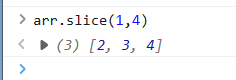
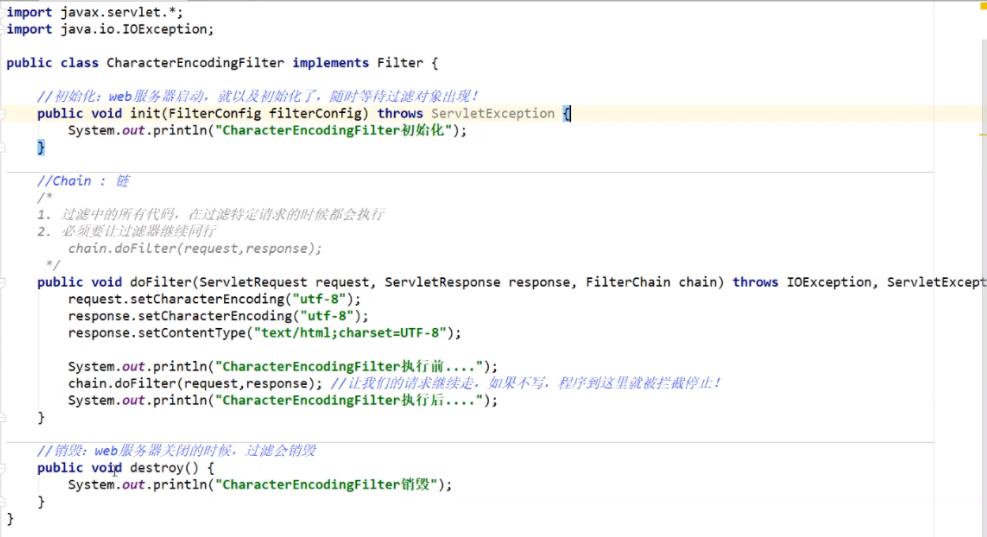

Java Web

---

## 1.基本概念

### 1.1前言

---

web开发：

- web ,网页的意思
- 静态web
  - html css
  - 提供给所有人看的数据书中不会发生变化！

- 动态web
  - 提供给所有人看的数据会发生变化，每个人在不同的时间，不同的地点看到的信息各不相同！
  - 淘宝，几乎所有的网站；
  - 技术栈：Servlet , ASP ,PHP

在java中，动态web资源的开发的技术统称为javaweb

### 1.2 web应用程序

---

web应用程序：可以提供浏览器访问的程序；

- a.html 、b.html ......多个资源可以被外界访问，对外界进行访问
- 你们能访问的任何一个页面或者资源，都存在这个世界的某一个角落的计算机上
- URL:
- 这些统一的web资源会被放在同一个文件夹下，web应用程序-->Tomcat:服务器
- 一个web应用由多部份组成（静态web，动态web）
  - html ,css ,js
  - jsp , servlet
  - java程序
  - jar包
  - 配置文件（Properties）

web应用程序编写完毕后，若想提供给外界访问：需要一个服务器来统一管理

### 1.3 静态web

---

- *.htm , *.html.这些都是网页的后缀，如果服务器上一直存在这些东西，我们就可以直接进行读取。（通网络）
- 静态web存在的缺点
  - Web页面无法动态更新，所有用户看到的都是同一个页面
    - 轮播图 ，点击特效：伪动态
    - JavaScript [实际开发中，他用的最多]
    - VBScript
  - 他无法和数据库交互（数据无法持久化，用户无法交互）

### 1.4 动态web

页面会动态显示：“web的页面展示效果因人而异”

缺点：

- 假如服务器的动态web出了错误，我们需要重新编写**后台程序**，重新发布
  - 停机维护

优点：

- web页面可以动态更新，所有用户看到的都不是一个页面
- 它可以与数据库交互（数据持久化：注册，商品信息，用户信息....）

新手村：（看源码）

## 2.web服务器

### 2.1技术详解

ASP:

- 微软：国内最早流行的就是asp
- 在HTML中嵌入了VB的脚本，asp+com
- 在asp开发中，基本每一个页面都有几千行的业务代码，页面及其混乱
- 维护成本高
- C#
- IS

php:

- php开发速度快，功能很轻大，跨平台，代码很简单（70%，wp）
- 无法承载大访问量的情况（局限性）

JSP/Servlet

B/S:浏览和服务器

C/S:客户端和服务器

- sun公司主推的B/S架构
- 基于java语言（所有的大公司，或者一些开源的组件，都是java写的）
- 可以承载三高带来的问题
- 语法像ASP ,ASP->JSP，加强市场强度

### 2.2 web服务器

服务器是一种被动的操作，用来处理用户的一些请求和用户的一些响应信息；

**IIS**

微软的；ASP ...,Windows中自带的

**Tomcat**

面向百度编程

工作3-5年后，可以尝试手写Tomact服务器；

...

下载tomcat:

- 1.安装 or 解压
- 2.了解配置文件及目录结构
- 这个东西的作用

## 3.tomcat

### 3.1安装

### 3.2启动 关闭

测试访问：127.0.0.1:8080


### 3.3配置

可能遇到的问题：

- java环境变量没有配置
- 闪退问题：需要配置兼容性
- 乱码问题：配置文件中修改

可以配置启动的端口号

- tomcat:8080

- mysql: 3306

- http: 80

- https : 443

- 

- 可以配置主机名称

  ``` java
   <Host name="localhost"  appBase="webapps"
              unpackWARs="true" autoDeploy="true">
  ```

  **高难度面试题：**

  请你谈谈网站是如何进行访问的！

  - 1.输入一个域名；回车
  
  - 2.检查本机的C:\windows\system32\drivers\etc\hosts配置文件下有没有这个域名映射；
    - 有：直接返回对应的ip地址，这个地址中，有我们需要访问的web程序，可以直接访问
    
    - 没有：去DNS服务器找，找到的话就返回，找不到就返回找不到
    

可以配置环境变量（可选）

### 3.4 发布一个网站

不会就先模仿

- 将自己写的网站，放到服务器（Tomcat）中指定的web应用的文件夹下（webapps）下，就可以访问了
  网站应该有的结构

  ```java
  --webapps: Tomcat服务器的web目录
      -root
      -ruobing 网站的目录名
      	-WEB-INF
      		-WEB.XML
      		-classes: Java程序
      		-lib ：web应用所依赖的jar包
      		-web.xml :网站配置文件
      	-index.jsp  :默认的首页
      	-static
      		-css
      			-style.css
      		-js
      		-img
      	-...
  ```

  


## 4 http

### 4.1 什么是HTTP

HTTP(超文本传输协议)是一个简单的请求-响应协议，它通常运行在TCP之上。

- 文本：html 字符串 ~
- 超文本： 图片 音乐 视频 定位 地图.....
- 80

HTTPS:安全的

- 443

### 4.2 两个时代

- http 1.0
  - http/1.0: 客户端可以与web服务器连接后，只能获得一个web资源，断开连接

- http2.0
  - http/1.1: 客户端可以与服务器连接后，可以获得多个web资源

### 4.3Http请求

- 客户端--发请求 （Request）---服务器

  ```java
  Request URL: https://i0.hdslb.com/bfs/banner   请求地址
  Request Method: GET                get/post方法
  Status Code: 200                   状态码：200
  Remote （远程）Address: 127.0.0.1:7890     
  
  ```

  ```java
  Accept: text/html 
  Accept-Encoding: gzip, deflate, br
  Accept-Language: zh-CN,zh;q=0.9    语言
  Cache-Control: max-age=0
  Connection: keep-alive
  ```

#### 1、请求行

  - 请求行中的请求方式：GET
  - 请求方式：GET/POST,HEAD,DELETE,PUT,TRACT...
    - GET:请求能够携带的参数比较少，大小有限制，会在浏览器的URL地址栏显示，不安全，但高效
    - POST:请求能够携带的参数没有限制，大小没有限制，不会在浏览器的URL地址栏显示，安全，但不高效

#### 2、消息头

  ```java
  Accept   告诉浏览器，它所支持的数据类型
  Accept-Encoding  支持哪种编码格式 GBK UTF-8 GB2312 ISO8859-1
  Accept-Language   语言环境
  Cache-Control   缓存控制
  Connection  告诉浏览器，请求完成是断开还是保持连接
  HOST:  主机.../.
  ```

  

### 4.4Http响应

- 服务器--响应----客户端

百度：

```java
Cache-Control:private       缓存控制
Connection: keep-alive      连接
Content-Encoding: gzip      编码
Content-Type: text/html; charset=utf-8 类型
```

#### 1.响应体

```java
Accept   告诉浏览器，它所支持的数据类型
Accept-Encoding  支持哪种编码格式 GBK UTF-8 GB2312 ISO8859-1
Accept-Language   语言环境
Cache-Control   缓存控制
Connection  告诉浏览器，请求完成是断开还是保持连接
HOST:  主机.../.
Refresh:告诉客户端，多久刷新一次
Location: 让网页重新定位；
```

#### 2.响应状态码

200： 请求响应成功

3**：请求重定向

- 重定向：你重新给我到你新位置去；

4**：找不到资源 404

- 资源不存在

5**：服务器代码错误 500  502：网关错误

**常见面试题：**

- 当你的浏览器中地址栏输入地址的一瞬间到页面能够展示回来，经历了什么？

## 5.Maven

**我为什么要学习这个技术？**

1. 在javaweb开发中，需要大量使用jar包，我们手动去导入。
2. 如何能让一个东西自动帮我导入和配置这个jar包

### 5.1maven项目架构管理工具

我们目前用来就是方便导入jar包的！

maven的核心思想： **约定大于配置**

- 有约束，不要去违反。

maven会规定好你该如何去编写我们的java代码，必须要按照这个规范来；

### 5.2下载和安装

### 5.3配置环境变量

### 5.4阿里云镜像

```xml
  <!-- 阿里云仓库，个人配置 -->
    <mirror>
      <id>aliyunmaven</id>
      <mirrorOf>*</mirrorOf>
      <name>阿里云公共仓库</name>
      <url>https://maven.aliyun.com/repository/public</url>
    </mirror>

```

### 5.5本地仓库

### 5.6 Maven在idea中的操作

# 6. HTML

## 6.1 初识HTML

- **HyperTextMarkupLanguage（超文本标记语言）**
  - 超文本包括：文字、图片、音频、视频、动画。

- **HTML5的优势**
  - 世界知名浏览器厂商对HTML5的支持
  - 市场的需求
  - 跨平台
- **W3C标准**
  - W3C
    - 万维网联盟 **（World Wide Web Consortium）** 。
    - 成立于1994年，Web领域最权威和最具影响力的国际中立性技术标准机构。
    - https://www.w3.org/
    - https://www.chinaw3c.org/
  - W3C标准包括
    - 结构化标准语言(HTML、XML)
    - 表现标准语言(CSS)
    - 行为标准语言(DOM、ECMAScript)

- **常见IDE**
  - 记事本
  - Dreamweaver
  - IDEA
  - WebStorm
  - ……
- **< body >、< /body>等成对的标签，分别叫做开放标签和闭合标签。**
- **单独呈现的标签（空元素），如< hr/ >;意为用/来关闭空元素。**

## 6.2 网页基本标签

- 标题标签
- 段落标签
- 换行标签
- 水平线标签
- 字体样式标签
- 注释和特殊符号

```html
<!DOCTYPE html>
<html lang="en">
<head>
    <meta charset="UTF-8">
    <title>基本标签</title>
</head>
<body>
<!--标题标签 -->
<h1>一级标签</h1>
<h2>二级标签</h2>
<h3>三级标签</h3>
<h4>四级标签</h4>
<h5>五级标签</h5>
<h6>六级标签</h6>

<!--段落标签-->
<p>p换行1</p>
<p>p换行2</p>

<!--水平线标签-->
<hr/>

<!--换行标签-->
换行1 <br/>
换行2 <br/>
<!--换行标签比较紧凑，段落标签有明显段间距-->

<!--粗体 斜体-->
<h1>字体样式标签</h1>
粗体:<strong>I am CSS. </strong><br/>
斜体:<em>HTML5 and CSS3 </em><br/>

<!--特殊符号-->
空格:1&nbsp;2&nbsp;&nbsp;3&nbsp;&nbsp;&nbsp;4<br/>
空格:1 2  3   4<br/>
大于号:&gt;<br/>
小于号:&lt;<br/>
版权符号:&copy;<br/>
<!--特殊符号记忆：'&'开头;结尾，只要在idea中&敲出后就有提示-->

</body>
</html>

```

## 6.3 图像，超链接，网页布局

- 图像标签

  ```html
  
  ```

- 链接标签

  - **href**： 必填，表示要跳转到那个页面；
  - **target**：表示窗口在哪里打开；
  - **_blank**：在新标签中打开；
  - **_self**： 在自己的网页中打开；

```html
<!DOCTYPE html>
<html lang="en">
<head>
    <meta charset="UTF-8">
    <title>Title</title>
</head>
<body>
<!--img学习
    src:资源地址
    相对地址(推荐使用，绝对地址
    ../     --上级地址
    alt：在图片加载失败的时候，就会用文字代替
    title:鼠标悬停在图片上时，所显示的名字
    width height 图片的高和宽-->


<br/>
<!--href：跳转页面的地址
    a标签内文字：即显示的文字
    可以把图片放在a标签内，点击图片跳转网页
    target:表示在哪打开新网页
	_self:当前标签打开 
	_blank:新的页面中打开-->
<a href="https://www.baidu.com" target="_blank" title="123">请咨询百度</a>
<br/>

<!--锚链接
    1.需要一个标记锚
    2.跳转到标记
    #页面内跳转-->
<a name="top"></a>
<a href="#top">回到顶部</a>
<br/>

<!--可以在网址后添加#号跳到对应网站的对应位置-->
<a href="https://www.baidu.com#down">百度底部</a> <br/>

<!--功能性链接
    邮箱链接：mailto
    qq链接
-->
<a href="mailto:qq.com">点击联系我</a>
<a target="_blank"
   href="http://wpa.qq.com/msgrd?v=xxx&uin=&site=qq&menu=yes"/>


<a target="_blank" href="http://wpa.qq.com/msgrd?v=3&uin=&site=qq&menu=yes">
    
</a>

</body>
</html>

```

**行内元素和块元素**

- 块元素

  - 无论内容多少，该元素独占一行。

  ```html
  <p></p><hr/> <h1>...<h6>
  ```

  - 行内元素：内容撑开宽度，左右都是行内元素的可以排在一行。

  ```html
  <a><strong><em>
  ```

## 6.4.列表、表格、媒体元素

### 1.列表

> 什么是列表

- 列表就是信息资源的一种展示形式。它可以使信息结构化和条理化，并以列表的样式显示出来，以便浏览者能更快捷地获得相应的信息。

> 列表的分类

- 无序列表
- 有序列表
- 自定义列表

```html
<!DOCTYPE html>
<html lang="en">
<head>
    <meta charset="UTF-8">
    <title>列表学习</title>
</head>
<body>
<!--
    有序列表
    应用范围:试卷,问答……
-->
<ol>
    <li>Java</li>
    <li>Python</li>
    <li>前端</li>
    <li>运维</li>
    <li>C/C++</li>
    <li>Android</li>
</ol>

<hr/>

<!--
    无序列表
    应用范围:导航,侧边栏……
-->
<ul>
    <li>Java</li>
    <li>Python</li>
    <li>前端</li>
    <li>运维</li>
    <li>C/C++</li>
    <li>Android</li>
</ul>

<hr/>

<!--
    自定义列表
    dl:标签
    dt:列表名称
    dd:列表内容
-->
<dl>
    <dt>dt</dt>

    <dd>dd1</dd>
    <dd>dd2</dd>
    <dd>dd3</dd>
    <dd>dd4</dd>
    <dd>dd5</dd>
</dl>

</body>
</html>
```

### 2.表格

表格的基本结构：

- 单元格
- 行
- 列
- 跨行
- 跨列

```html
<!DOCTYPE html>
<html lang="en">
<head>
    <meta charset="UTF-8">
    <title>表格学习</title>
</head>
<body>
<!--
    表格table
    行:tr
    列:td
-->

<table border="1px">
    <tr><!--colspan 跨列-->
        <td colspan="5">1-1</td>
        <td>1-2</td>
        <td>1-3</td>
        <td>1-4</td>
    </tr>
    <tr><!--rowspan 跨行-->
        <td rowspan="2">2-1</td>
        <td>2-2</td>
        <td>2-3</td>
        <td>2-4</td>
    </tr>
    <tr>
        <td>3-1</td>
        <td>3-2</td>
        <td>3-3</td>
        <td>3-4</td>
    </tr>
</table>

</body>
</html>

```

### 3.媒体元素

```html
<!DOCTYPE html>
<html lang="en">
<head>
    <meta charset="UTF-8">
    <title>媒体元素的学习</title>
</head>
<body>
<!--
    视频
    src:资源路径
    controls:控制面板
    autoplay:自动播放
-->
<video src="xxx/xxx/xxx" controls autoplay></video>

<!--音频-->
<audio src="xxx/xxx/xxx" controls autoplay></audio>

</body>
</html>

```

> 页面结构

| 元素名  | 描述                                               |
| ------- | -------------------------------------------------- |
| header  | 标题头部区域的内容（用于页面或者页面中的一块区域） |
| footer  | 标记脚部区域的内容（用于整个页面或页面的一块区域） |
| section | Web页面中的一块独立区域                            |
| article | 独立的文章内容                                     |
| aside   | 相关内容或应用                                     |
| nav     | 导航类辅助内容                                     |

```html
<!DOCTYPE html>
<html lang="en">
<head>
    <meta charset="UTF-8">
    <title>页面结构</title>
</head>
<body>
<!--页面结构-->
<head>
    <h2>页面头部</h2>
</head>

<section>
    <h2>页面主体</h2>
</section>

<footer>
    <h2>页面脚部</h2>
</footer>
</body>
</html>

```

iframe内联框架

- ifram标签，必须要有src属性即引用页面的地址。
- 给标签加上name属性后，可以做a标签的target属性，即在内联窗口中打开链接。

```html
<!DOCTYPE html>
<html lang="en">
<head>
    <meta charset="UTF-8">
    <title>iframe内联框架</title>
</head>
<body>

<iframe src="path" name="mainFrame"></iframe>

<hr/>

<iframe src="" scrolling="no" border="0" frameborder="no" framespacing="0" allowfullscreen="true"> </iframe>

</body>
</html>

```

## 6.5.表单及表单应用

| 标签     | 说明                                                         |
| -------- | ------------------------------------------------------------ |
| input    | 大部分表单元素对应的标签有text、password、checkbox、radio、submit、reset、file、hidden、image和button，**默认为text**，可以提交用户名、密码等等 |
| select   | 下拉选择框                                                   |
| textarea | 文本域                                                       |

- from标签，action属性为所提交的目的地址，method选择提交方式，可以选择使用post或者get方式提交。
  - get效率高，但在url中可以看到提交的内容，不安全，不能提交大文件；
  - post比较安全且可以提交大文件。

```html
<!DOCTYPE html>
<html lang="en">
<head>
    <meta charset="UTF-8">
    <title>登陆注册</title>
</head>
<body>
<h1>注册</h1>

<!--
    form表单
    action:表单提交的动作，可以是交给一个网址，也可以是交给一个请求处理地址
    method:post / get 请求方式
        get方式提交：我们可以在ur1中看到我们提交的信息，不安全，高效
        post：比较安全，可以传输大文件
-->
<form action="DemoHtml01.html" method="get">
    <!--文本输入框:input type="text" -->
    <p>名字:<input type="text" name="username"> </p>
    <!--密码框:input type="pwd" -->
    <p>密码:<input type="password" name="password"> </p>

    <p>
        <input type="submit">   <!--提交-->
        <input type="reset">    <!--重置-->
    </p>

</form>

</body>
</html>

```

> 文本框和单选框

| 属性      | 说明                                                         |
| --------- | ------------------------------------------------------------ |
| type      | 指定元素的类型。text、password、checkbox、radio、submit、reset、file、hidden、image和button，默认为text。 |
| name      | 指定表单元素的名称（提交时所对应的key）。                    |
| value     | 元素的初始值，radio必须提供。                                |
| size      | 指定表单元素的初始宽度。当type为text或者password时，以字符为单位；其他type以像素为单位。 |
| maxlength | type为text或者password时，输入的最大字符数。                 |
| check     | type为radio或者checkbox时，指定按钮是否被选中。              |

```html
<!DOCTYPE html>
<html lang="en">
<head>
    <meta charset="UTF-8">
    <title>登陆注册</title>
</head>
<body>
<h1>注册</h1>

<!--
    form表单
    action:表单提交的动作，可以是交给一个网址，也可以是交给一个请求处理地址
    method:post / get 请求方式
        get方式提交：我们可以在ur1中看到我们提交的信息，不安全，高效
        post：比较安全，可以传输大文件
-->
<form action="DemoHtml01.html" method="post">
    <!--
        文本输入框:input type="text"
        value="前端" 默认初始值
        maxlength="8" 最长能写几个字符
        size="30" 文本框的长度
    -->
    <p>名字:<input type="text" name="username"> </p>
    <!--
        密码框:input type="pwd"
    -->
    <p>密码:<input type="password" name="password"> </p>

    <!--
        单选框标签:input type="radio"
        value:单选框的值
        name:表示组
    -->
    <p>性别:
        <input type="radio" value="man" name="sex">男
        <input type="radio" value="woman" name="sex">女
    </p>

    <p>
        <input type="submit">   <!--提交-->
        <input type="reset">    <!--重置-->
    </p>

</form>


</body>
</html>

```

按钮和多选框

```html
<!DOCTYPE html>
<html lang="en">
<head>
    <meta charset="UTF-8">
    <title>登陆注册</title>
</head>
<body>
<h1>注册</h1>

<!--
    form表单
    action:表单提交的动作，可以是交给一个网址，也可以是交给一个请求处理地址
    method:post / get 请求方式
        get方式提交：我们可以在ur1中看到我们提交的信息，不安全，高效
        post：比较安全，可以传输大文件
-->
<form action="DemoHtml01.html" method="post">
    <!--
        文本输入框:input type="text"
        value="前端" 默认初始值
        maxlength="8" 最长能写几个字符
        size="30" 文本框的长度
    -->
    <p>名字:<input type="text" name="username"> </p>
    <!--
        密码框:input type="pwd"
    -->
    <p>密码:<input type="password" name="password"> </p>

    <!--
        单选框标签:input type="radio"
        value:单选框的值
        name:表示组
    -->
    <p>性别:
        <input type="radio" value="man" name="sex">男
        <input type="radio" value="woman" name="sex">女
    </p>

    <!--
        多选框:input type="checkbox"
    -->
    <p>爱好:
        <input type="checkbox" value="sleep" name="hobby">睡觉
        <input type="checkbox" value="code" name="hobby">敲代码
        <input type="checkbox" value="chat" name="hobby">聊天
        <input type="checkbox" value="game" name="hobby">游戏
    </p>

    <!--
        按钮:
        input type="button" 普通按钮
        input type="image"  图像按钮
        input type="submit" 提交按钮
        input type="reset" 重置按钮
    -->
    <p>
        <input type="button" name="btn" value="点击变长">
        <input type="image" src="../resources/image/02.jpg" width="200px" height="200px">
    </p>

    <p>
        <input type="submit">   <!--提交-->
        <input type="reset">    <!--重置-->
    </p>

</form>

</body>
</html>

```

列表文本框和文件域

```html
<!DOCTYPE html>
<html lang="en">
<head>
    <meta charset="UTF-8">
    <title>登陆注册</title>
</head>
<body>
<h1>注册</h1>

<!--
    form表单
    action:表单提交的动作，可以是交给一个网址，也可以是交给一个请求处理地址
    method:post / get 请求方式
        get方式提交：我们可以在ur1中看到我们提交的信息，不安全，高效
        post：比较安全，可以传输大文件
-->
<form action="DemoHtml01.html" method="post">
    <!--
        文本输入框:input type="text"
        value="前端" 默认初始值
        maxlength="8" 最长能写几个字符
        size="30" 文本框的长度
    -->
    <p>名字:<input type="text" name="username"> </p>
    <!--
        密码框:input type="pwd"
    -->
    <p>密码:<input type="password" name="password"> </p>

    <!--
        单选框标签:input type="radio"
        value:单选框的值
        name:表示组
        checked:默认选中
    -->
    <p>性别:
        <input type="radio" value="man" name="sex" checked>男
        <input type="radio" value="woman" name="sex">女
    </p>

    <!--
        多选框:input type="checkbox"
    -->
    <p>爱好:
        <input type="checkbox" value="sleep" name="hobby">睡觉
        <input type="checkbox" value="code" name="hobby" checked>敲代码
        <input type="checkbox" value="chat" name="hobby">聊天
        <input type="checkbox" value="game" name="hobby">游戏
    </p>

    <!--
        按钮:
        input type="button" 普通按钮
        input type="image"  图像按钮
        input type="submit" 提交按钮
        input type="reset" 重置按钮
    -->
    <p>
        <input type="button" name="btn" value="点击变长">
        <input type="image" src="../resources/image/02.jpg" width="200px" height="200px">
    </p>

    <!--
        下拉框,列表框
    -->
    <p>国家:
        <select name="列表名称">
            <option value="China">中国</option>
            <option value="USA">美国</option>
            <option value="Russia">俄罗斯</option>
            <option value="UK">英国</option>
            <option value="France">法国</option>
        </select>
    </p>

    <!--
        文本域
        textarea name="textarea"
        cols="40" rows="10"
    -->
    <p>反馈:
        <textarea name="textarea" cols="40" rows="10">文本内容</textarea>
    </p>

    <!--
        文件域
        input type="file" name="files"
    -->
    <p>
        <input type="file" name="files">
        <input type="button" name="upload" value="上传">
    </p>

    <p>
        <input type="submit">   <!--提交-->
        <input type="reset" value="清空表单">    <!--重置-->
    </p>

</form>

</body>
</html>

```

搜索框滑块和简单验证

```html
<!DOCTYPE html>
<html lang="en">
<head>
    <meta charset="UTF-8">
    <title>登陆注册</title>
</head>
<body>
<h1>注册</h1>

<!--
    form表单
    action:表单提交的动作，可以是交给一个网址，也可以是交给一个请求处理地址
    method:post / get 请求方式
        get方式提交：我们可以在ur1中看到我们提交的信息，不安全，高效
        post：比较安全，可以传输大文件
-->
<form action="DemoHtml01.html" method="post">
    <!--
        文本输入框:input type="text"
        value="前端" 默认初始值
        maxlength="8" 最长能写几个字符
        size="30" 文本框的长度
    -->
    <p>名字:<input type="text" name="username"> </p>
    <!--
        密码框:input type="pwd"
    -->
    <p>密码:<input type="password" name="password"> </p>

    <!--
        单选框标签:input type="radio"
        value:单选框的值
        name:表示组
        checked:默认选中
    -->
    <p>性别:
        <input type="radio" value="man" name="sex" checked>男
        <input type="radio" value="woman" name="sex">女
    </p>

    <!--
        多选框:input type="checkbox"
    -->
    <p>爱好:
        <input type="checkbox" value="sleep" name="hobby">睡觉
        <input type="checkbox" value="code" name="hobby" checked>敲代码
        <input type="checkbox" value="chat" name="hobby">聊天
        <input type="checkbox" value="game" name="hobby">游戏
    </p>

    <!--
        按钮:
        input type="button" 普通按钮
        input type="image"  图像按钮
        input type="submit" 提交按钮
        input type="reset" 重置按钮
    -->
    <p>
        <input type="button" name="btn" value="点击变长">
        <input type="image" src="../resources/image/02.jpg" width="200px" height="200px">
    </p>

    <!--
        下拉框,列表框
    -->
    <p>国家:
        <select name="列表名称">
            <option value="China">中国</option>
            <option value="USA">美国</option>
            <option value="Russia">俄罗斯</option>
            <option value="UK">英国</option>
            <option value="France">法国</option>
        </select>
    </p>

    <!--
        文本域
        textarea name="textarea"
        cols="40" rows="10"
    -->
    <p>反馈:
        <textarea name="textarea" cols="40" rows="10">文本内容</textarea>
    </p>

    <!--
        文件域
        input type="file" name="files"
    -->
    <p>
        <input type="file" name="files">
        <input type="button" name="upload" value="上传">
    </p>

    <!--
        邮件: 会简单验证是否是邮箱地址
		url: 会简单验证是否是网络地址
        number: 数字验证
    -->
    <p>
        邮箱：<input type="email" name="email">
        url：<input type="url">
    </p>

    <!--
        数字验证
        max: 最大数量
        min: 最小数量
        step: 每次点击增加或减少的数量
    -->
    <p>
        商品数量:<input type="number" name="数量" max="100" min="1" step="1">
    </p>

    <!--滑块-->
    <p>
        音量:<input type="range" min="0" max="100" name="voice" step="2">
    </p>
    
    <!--搜索框-->
    <p>
        搜索:<input type="search">
    </p>

    <p>
        <input type="submit">   <!--提交-->
        <input type="reset" value="清空表单">    <!--重置-->
    </p>

</form>

</body>
</html>

```

> 表单的应用

| 属性       | 说明                                           |
| ---------- | ---------------------------------------------- |
| readonly   | 只读，不可更改                                 |
| disable    | 禁用                                           |
| hidden     | 隐藏，虽然不可见但是会提交                     |
| id         | 标识符，可以配合label的for属性增加鼠标的可用性 |
| placehoder | text 文字域等输入框内的提示信息                |
| required   | 不能为空                                       |
| patten     | 正则表达式验证                                 |

```html
<!DOCTYPE html>
<html lang="en">
<head>
    <meta charset="UTF-8">
    <title>登陆注册</title>
</head>
<body>
<h1>注册</h1>

<!--
    form表单
    action:表单提交的动作，可以是交给一个网址，也可以是交给一个请求处理地址
    method:post / get 请求方式
        get方式提交：我们可以在ur1中看到我们提交的信息，不安全，高效
        post：比较安全，可以传输大文件
-->
<form action="DemoHtml01.html" method="post">
    <!--
        文本输入框:input type="text"
        value="前端" 默认初始值
        maxlength="8" 最长能写几个字符
        size="30" 文本框的长度
    -->
    <p>名字:<input type="text" name="username"> </p>
    <!--
        密码框:input type="pwd"
    -->
    <p>密码:<input type="password" hidden name="password"> </p>

    <!--
        单选框标签:input type="radio"
        value:单选框的值
        name:表示组
        checked:默认选中
    -->
    <p>性别:
        <input type="radio" value="man" name="sex" checked>男
        <input type="radio" value="woman" name="sex">女
    </p>

    <!--
        多选框:input type="checkbox"
    -->
    <p>爱好:
        <input type="checkbox" value="sleep" name="hobby">睡觉
        <input type="checkbox" value="code" name="hobby" checked>敲代码
        <input type="checkbox" value="chat" name="hobby">聊天
        <input type="checkbox" value="game" name="hobby">游戏
    </p>

    <!--
        按钮:
        input type="button" 普通按钮
        input type="image"  图像按钮
        input type="submit" 提交按钮
        input type="reset" 重置按钮
    -->
    <p>
        <input type="button" name="btn" value="点击变长">
        <input type="image" src="../resources/image/02.jpg" width="200px" height="200px">
    </p>

    <!--
        下拉框,列表框
    -->
    <p>国家:
        <select name="列表名称">
            <option value="China">中国</option>
            <option value="USA">美国</option>
            <option value="Russia">俄罗斯</option>
            <option value="UK">英国</option>
            <option value="France">法国</option>
        </select>
    </p>

    <!--
        文本域
        textarea name="textarea"
        cols="40" rows="10"
    -->
    <p>反馈:
        <textarea name="textarea" cols="40" rows="10">文本内容</textarea>
    </p>

    <!--
        文件域
        input type="file" name="files"
    -->
    <p>
        <input type="file" name="files">
        <input type="button" name="upload" value="上传">
    </p>

    <!--
        邮件: 会简单验证是否是邮箱地址
		url: 会简单验证是否是网络地址
        number: 数字验证
    -->
    <p>
        邮箱：<input type="email" name="email">
        url：<input type="url">
    </p>

    <!--
        数字验证
        max: 最大数量
        min: 最小数量
        step: 每次点击增加或减少的数量
    -->
    <p>
        商品数量:<input type="number" name="数量" max="100" min="1" step="1">
    </p>

    <!--滑块-->
    <p>
        音量:<input type="range" min="0" max="100" name="voice" step="2">
    </p>

    <!--搜索框-->
    <p>
        搜索:<input type="search">
    </p>

    <!--增强鼠标可用性-->
    <p>
        <label for="mark">你点我试试!</label>
        <input type="text" id="mark">
    </p>

    <p>
        <input type="submit">   <!--提交-->
        <input type="reset" value="清空表单">    <!--重置-->
    </p>

</form>

</body>
</html>

```

## 6.6.表单初级验证

- 常用方式
  - placeholder 提示信息
  - required 非空判断
  - pattern 正则表达式

# 7. CSS3

## 7.1 什么是CSS

### 7.1.1 什么是CSS

- Cascading Style Sheet 层叠样式表。
- CSS：表现（美化网页）。
  - 字体，颜色，边距，高度，宽度，背景图片，网页定位，网页浮动。

### 7.1.2 CSS发展史

- CSS 1.0：1994年 10月提出；
- CSS 2.0：DIV（块）+CSS，HTML与CSS结构分离的思想，网页变得简单，SEO；
- CSS 2.1：浮动，定位；
- CSS 3.0：圆角、阴影、动画…浏览器兼容性。

```css
<!DOCTYPE html>
<html lang="en">
<head>
    <meta charset="UTF-8">
    <title>CSS3快速入门</title>
    <!-- 规范:<style>可以编写CSS的代码，每一个声明最好以“;”结尾
            语法:
                选择器{
                    声明1;
                    声明2;
                    声明3;
                }
    -->
    <style>
        h1{
            color: blue;
        }
    </style>
</head>
<body>

<h1>CSS3测试</h1>

</body>
</html>

```

- 建议使用这种规范（单独写一个css文件，用link标签引入css文件效果） 。

- 

- > CSS的优势：
  >
  > - 内容和表现分离；
  > - 网页结构表现统一，可以实现复用；
  > - 样式十分的丰富；
  > - 建议使用独立于html的css文件；
  > - 利用SEO，容易被搜索引擎收录！

  > CSS的3种常用导入方式。

- 拓展：外部样式两种方法。

  - 链接式——HTML

    ```html
    	<!--外部样式-->
        <link rel="stylesheet" href="css/style.css">
    ```

  - 导入式—— @import是CSS2.1特有的！

    ```html
    	<!--导入式-->
        <style>
            @import url("css/style.css");
        </style>
    ```

## 7.2 CSS选择器

- 作用：选择页面上的某一个后者某一类元素。

### 1.基本选择器

> 1. 标签选择器——选择一类标签。
>    - 格式：标签名{}

```html
<!DOCTYPE html>
<html lang="en">
<head>
    <meta charset="UTF-8">
    <title>标签</title>
    <style>
        h1{
            color: orange;
            background: beige;
            border-radius: 10px;
        }
        h3{
            color: aquamarine;
            background: chocolate;
            border-radius: 10px;
        }
        p{
            font-size: 80px;
        }
    </style>
</head>
<body>

<h1>标签选择器</h1>
<p>Android</p>
<h3>前端-CSS3</h3>

</body>
</html>

```

> 2.类选择器class——选择所有class一致的标签，跨标签。

   - 格式：.类名{}

```html
<!DOCTYPE html>
<html lang="en">
<head>
    <meta charset="UTF-8">
    <title>类选择器</title>
    <style>
        /*
        类选择器的格式: .class的名称{}
        好处:可以多个标签归类,是同一个class,可以复用！
         */
        .test01{
            color: darkorange;
        }
        .test02{
            color: cadetblue;
        }
        .test03{
            color: cornflowerblue;
        }
    </style>
</head>
<body>

<h1 class="test01">类选择器:Test01</h1>
<h1 class="test02">类选择器:Test02</h1>
<h1 class="test03">类选择器:Test03</h1>
<p class="test03">类选择器:Test04</p>

</body>
</html>

```

> 3. id选择器——全局唯一
   - 格式：#id名{}

```html
<!DOCTYPE html>
<html lang="en">
<head>
    <meta charset="UTF-8">
    <title>Title</title>
    <style>
        /*
        id选择器: id必须保证全局唯一
        #id名称{}
        不遵循就近原则,优先级是固定的
        id选择器 > class类选择器 > 标签选择器
         */
        #git02{
            color: darkorange;
        }
        #git03{
            color: cadetblue;
        }
        #git01{
            color: cornflowerblue;
        }
        h1{
            color: darkseagreen;
        }
    </style>
</head>
<body>

<h1 id="git01" class="git02">id选择器:git01</h1>
<h1 id="git02" class="git02">id选择器:git02</h1>
<h1 class="git03">id选择器:git03</h1>
<h1 id="git03" class="git01">id选择器:git01</h1>
<h1>id选择器:git03</h1>

</body>
</html>

```

### 2.层次选择器

- 后代选择器：在某个元素的后面。
- 子选择器：一代。
- 相邻的兄弟选择器：同辈。
- 通用选择器。

```html
<!DOCTYPE html>
<html lang="en">
<head>
    <meta charset="UTF-8">
    <title>Title</title>
    <style>
        /*
        后代选择器
         */
        body p{
            background: deeppink;
        }
        /*
        子选择器
         */
        /*body>p{*/
        /*    background: olive;*/
        /*}*/
        /*
        相邻兄弟选择器:只选择一个,相邻向下
         */
        .active+p{
            background: blueviolet;
        }
        /*
        通用兄弟选择器，当前选中元素的向下的所有兄弟元素
         */
        .active2~p{
            background: dodgerblue;
        }
    </style>
</head>
<body>

<p>后代选择器p1</p>
<p class="active">子选择器p2</p>
<p>相邻兄弟选择器p3</p>
<p class="active2">通用兄弟选择器p4</p>
<p>通用兄弟选择器p5</p>

</body>
</html>

```

### 3.结构伪类选择器

```html
<!DOCTYPE html>
<html lang="en">
<head>
    <meta charset="UTF-8">
    <title>伪类选择器</title>
    <style>
        ul li:first-child{
            /*
            ul的第一个子元素
            */
            background: mediumaquamarine;
        }
        ul li:last-child{
            /*
            ul的最后一个子元素
            */
            background: lightpink;
        }
        /*
        选中p1:定位到父元素,选择当前的第一个元素
            选择当前P元素的父级元素，选中父级元素的第一个，并且是当前元素才生效！
         */
        p:nth-child(1){
            background: greenyellow;
        }
        p:nth-of-type(2){
            /*
            选中父元素下的第二个p元素
            */
            background: lightseagreen;
        }
        a:hover{
            color: royalblue;
        }
    </style>
</head>
<body>

<a href="">9521</a>
<p>p1</p>
<p>p2</p>
<p>p3</p>
<h3>h3</h3>
<ul>
    <li>1li01</li>
    <li>1li02</li>
    <li>1li03</li>
    <li>1li04</li>
</ul>
<ul>
    <li>2li01</li>
    <li>2li02</li>
    <li>2li03</li>
    <li>2li04</li>
</ul>
<a href="https://www.taobao.com/">淘宝</a>

</body>
</html>

```

### 4.属性选择器(常用)

> - id + class 结合

```html
<!DOCTYPE html>
<html lang="en">
<head>
    <meta charset="UTF-8">
    <title>属性选择器</title>
    <style>
        .demo a{
            float: left;
            display: block;
            height: 50px;
            width: 50px;
            border-radius: 10px;
            background: aquamarine;
            text-align: center;
            color: gray;
            text-decoration: none;
            margin-right: 5px;
            line-height:50px;
            font: bold 20px/50px Arial;
        }
        /*
        属性名,属性名 = 属性值（正则）
              = 表示绝对等于
             *= 表示包含
             ^= 表示以...开头
             $= 表示以...结尾
             存在id属性的元素
                a[]{}
         */
        a[id]{
            background: deeppink;
        }
        a[id=first]{
            /*
            id=first的元素
            */
            background: greenyellow;
        }

        a[class*="links"]{
            /*
            class 中有links的元素
            */
            background: green;
        }

        a[href^=http]{
            /*
            选中href中以http开头的元素
            */
            background: aquamarine;
        }
        a[href$=pdf]{
            /*
            选中href中以http开头的元素
            */
            background: aquamarine;
        }
    </style>
</head>
<body>

<p class="demo">
    <a href="https://www.taobao.com/" class="links item first" id="first">淘宝</a>
    <a href="" class="links item active" target="_blank " title="test">链接</a>
    <a href="img/hello.html" class="links item">网页</a>
    <a href="img/str1.png" class="links item">png</a>
    <a href="img/str2.jpg" class="links item">jpg</a>
    <a href="abc" class="links item">链2</a>
    <a href="/fy.pdf" class="links item">pdf</a>
    <a href="/quit.pdf" class="links item">pdf2</a>
    <a href="dump.doc" class="links item">doc</a>
    <a href="kiko.doc" class="links item last">doc2</a>
</p>

</body>
</html>

```

## 7.3 美化网页

**span标签**：重点要突出的字，使用span标签套起来

```html
<!DOCTYPE html>
<html lang="en">
<head>
    <meta charset="UTF-8">
    <title>美化网页</title>
    <style>
        #title{
            font-size: 25px;
        }
    </style>
</head>
<body>

编程语言:<span id="title">Java</span>

</body>
</html>

```

### 7.3.1.字体样式

- font-family：字体
- font-size：字体大小
- font-weight：字体粗细
- color：字体颜色

```html
<!DOCTYPE html>
<html lang="en">
<head>
    <meta charset="UTF-8">
    <title>Title</title>
    <style>
        body{
            font-family: "Arial Black";
            color: dodgerblue;
        }
        h1{
            font-size: 25px;
        }
        .p1{
            font-weight: 600;
            color: chocolate;
        }
    </style>
</head>
<body>

<h1>标题</h1>
<p>正文6699</p>
<p class="p1">正文4444444</p>
<p>Study English and Computer</p>

</body>
</html>

```

- 常用写法。

```css
/* 也可以填px，但不能超过900,相当于bloder */
font-weight:bolder;
/*常用写法：*/
font:oblique bloder 12px "楷体"
```

### 7.3.2.文本样式

- 颜色–>color:agb / rgba()
- 文本对齐方式–>text-align：center;
- 首行缩进–>text-indent：2em;
- 行高–>line-height：300px;
- 下划线–>text-decoration;

```css
/*下划线*/
text-decoration:underline
/*中划线*/
text-decoration:line-through
/*上划线*/
text-decoration:overline
/*超链接去下划线*/
text-decoration:none
<!DOCTYPE html>
<html lang="en">
<head>
    <meta charset="UTF-8">
    <title>Title</title>
    <style>
        h1{
            color: rgba(0,255,255,0.9);
            text-align: center;
        }
        .p1{
            text-indent:2em;

        }
        .p3{
            line-height:300px;
            background: mediumaquamarine;
            height: 300px;
        }
        /*下划线*/
        .l1{
            text-decoration: underline;
        }
        /*中划线*/
        .l2{
            text-decoration: line-through;
        }
        /*上划线*/
        .l3{
            text-decoration: overline;
        }
        /*超链接去下划线*/
        a{
            text-decoration: none;
        }
    </style>
</head>
<body>

<a href="">4399-7k7k</a>

<p class="l1">123123123</p>
<p class="l2">123123123</p>
<p class="l3">123123123</p>

<h1>概述</h1>
<p class="p1">
    夸克一词是盖尔曼取自詹姆斯·乔伊斯的小说《芬尼根的守灵夜》的词句“向麦克老人三呼夸克（Three quarks for Muster Mark）”。无非是指一个质子中有三个夸克。另外夸克在该书中具有多种含义，其
    中之一是一种海鸟的叫声。他认为，这适合他最初认为“基本粒子不基本、基本电荷非整数”的奇特想法，同时他也指出这只是一个笑话，这是对矫饰的科学语言的反抗。另外，也可能是出于他对鸟类的喜爱。 [7]
    盖尔曼原本想用鸭的叫声来命名夸克。开始时他并不太确定自己这个新词的实际拼法，直到他在詹姆斯·乔伊斯小说《芬尼根守灵夜》里面找到“夸克”这个词

</p>
<p>
    在1963年，我把核子的基本构成命名为“夸克”（quark），我先有的是声音，而没有拼法，所以当时也可以写成“郭克”（kwork）。不久之后，在我偶尔翻阅詹姆斯·乔伊斯所著的《芬尼根守灵夜》时，我在“向麦克老大三呼夸克”这句中看到夸克这个词。由于“夸克”（字面上意为海鸥的叫声）很明显是要跟“麦克”及其他这样的词押韵，所以我要找个借口让它读起来像“郭克”。但是书中代表的是酒馆老板伊厄威克的梦，词源多是同时有好几种。书中的词很多时候是酒馆点酒用的词。所以我认为或许“向麦克老大三呼夸克”源头可能是“敬麦克老大三个夸脱”，那么我要它读“郭克”也不是完全没根据。再怎么样，字句里的三跟自然中夸克的性质完全不谋而合。
</p>
<p class="p3">
    茨威格则用“埃斯”（Ace）来称呼他所理论化的粒子，但是在夸克模型被广泛接纳时，盖尔曼的用词就变得很有名。很多中国物理学家则称夸克为“层子”，在台湾地区亦曾翻译“亏子”，但并不普遍使用。
</p>


</body>
</html>
```

- 图片、文字水平对齐。

```css
img,span{
    vertical-align: middle;
}
```

### 7.3.3 文本阴影和超链接伪类

```html
<!DOCTYPE html>
<html lang="en">
<head>
    <meta charset="UTF-8">
    <title>Title</title>
    <style>
        /*超链接有默认的颜色*/
        a{
            text-decoration: hotpink;
            color: #000000;
        }
        /*鼠标悬浮的状态*/
        a:hover{
            color: dodgerblue;
        }
        /*鼠标按住未释放的状态*/
        a:active{
            color:green
        }
        /*点击之后的状态*/
        a:visited{
            color:mediumpurple;
        }
        /*
            text-shadow:5px 5px 5px 颜色

            第一个参数：表示水平偏移
	        第二个参数：表示垂直偏移
	        第三个参数：表示模糊半径
	        第四个参数：表示颜色
        */
        #price{
            text-shadow: #eaff29 5px 5px 5px;
        }
        /*固定阴影*/
        a:link{
            background: bisque;
        }
    </style>
</head>
<body>

<a href="#">
    
</a>
<p>
    <a href="#">Java博客</a>
</p>
<p id="price">
    <a href="#">哇哈哈</a>
</p>

</body>
</html>
```

### 7.3.4 列表ul、li

```html
<!DOCTYPE html>
<html lang="en">
<head>
    <meta charset="UTF-8">
    <title>Title</title>
    <link href="css/style.css" rel="stylesheet" type="text/css">
    <style>

    </style>
</head>
<body>
<div id="nav">
    <h2 class="title">全部商品分类</h2>
    <ul>
        <li>
            <a href="#">图书</a>
            <a href="#">影视</a>
            <a href="#">家电</a>
        </li>
        <li>
            <a href="#">配件</a>
            <a href="#">手机</a>
            <a href="#">数码</a>
        </li>
        <li>
            <a href="#">电脑</a>
            <a href="#">办公</a>
        </li>
        <li>
            <a href="#">家居</a>
            <a href="#">家装</a>
            <a href="#">厨具</a>
        </li>
        <li>
            <a href="#">服饰鞋帽</a>
            <a href="#">个性化妆</a>
        </li>
        <li>
            <a href="#">礼品箱包</a>
            <a href="#">钟表</a>
            <a href="#">珠宝</a>
        </li>
        <li>
            <a href="#">食品饮料</a>
            <a href="#">保健食品</a>
        </li>
        <li>
            <a href="#">彩票</a>
            <a href="#">旅行</a>
            <a href="#">充值</a>
            <a href="#">票务</a>
        </li>
    </ul>
</div>
</body>
</html>
```

- CSS规则。

```css
#nav{
    width: 300px;
    background: beige;
}
.title{
    font-size: 18px;
    font-weight: bold;
    text-indent: 2em;/*缩进*/
    line-height: 35px;
    background: gold;
}
/*ul li*/
/*
list-style:
    non 去掉实心圆
    circle 空心圆
    square 正方形
*/
/*nav替换效果*/
/*ul{
    background: antiquewhite;
}*/
ul li{
    height: 30px;
    list-style: none;
    text-indent: 1em;
}
a{
    text-decoration: none;
    font-size: 14px;
    color: darkorange;
}
a:hover{
    color: dodgerblue;
    text-decoration: underline;
}
```

### 7.3.5 背景

- 背景颜色：background

- 背景图片。

  ```css
  background-image:url(""); /* 默认是全部平铺的 */
  background-repeat:repeat-x; /* 水平平铺 */
  background-repeat:repeat-y; /* 垂直平铺 */
  background-repeat:no-repeat; /* 不平铺 */
  ```

```html
<!DOCTYPE html>
<html lang="en">
<head>
    <meta charset="UTF-8">
    <title>背景</title>
    <style>
        div{
            width: 500px;
            height: 200px;
            border: 1px solid mediumaquamarine;
            background-image: url("img/str.png");
            /* 默认是全部平铺的 */
        }
        /*水平平铺*/
        .div1{
            background-repeat: repeat-x;
        }
        /*垂直平铺*/
        .div2{
            background-repeat: repeat-y;
        }
        /*不平铺*/
        .div3{
            background-repeat: no-repeat;
        }
    </style>
</head>
<body>

<div class="div1"></div>
<div class="div2"></div>
<div class="div3"></div>

</body>
</html>
```

### 7.3.6 渐变

- 渐变背景网址：[https://www.grabient.com](https://www.grabient.com/)
- 径向渐变、圆形渐变。

```css
body{
     background-color: #0cd7f3;
     background-image: linear-gradient(43deg, #0093E9 0%, #80D0C7 46%, #23F549 100%);
}
<!DOCTYPE html>
<html lang="en">
<head>
    <meta charset="UTF-8">
    <title>背景</title>
    <style>
       body{
            background-color: #08AEEA;
            background-image: linear-gradient(0deg, #08AEEA 0%, #2AF598 100%);
        }
        div{
            width: 500px;
            height: 200px;
            border: 1px solid mediumaquamarine;
            background-image: url("img/str.png");
            /* 默认是全部平铺的 */
        }
        /*水平平铺*/
        .div1{
            background-repeat: repeat-x;
        }
        /*垂直平铺*/
        .div2{
            background-repeat: repeat-y;
        }
        /*不平铺*/
        .div3{
            background-repeat: no-repeat;
        }
    </style>
</head>
<body>

<div class="div1"></div>
<div class="div2"></div>
<div class="div3"></div>

</body>
</html>
```

## 7.4 盒子模型

### 7.4.1 什么是盒子模型

- margin：外边距；
- padding：内边框；
- border：边框；

### 7.4.2 边框

- border：粗细 样式 颜色

  - 边框的粗细；
  - 边框的样式；
  - 边框的颜色。

- html空格代码

  | 名称      | 描述                      |
  | --------- | ------------------------- |
  | &nbsp ;   | 不断行的空白(1个字符宽度) |
  | &ensp ;   | 半个空白(1字符宽度)       |
  | &emsp ;   | 一个空白(2个字符宽度)     |
  | &thinsp ; | 窄空白(小于1个字符宽度)   |

```html
<!DOCTYPE html>
<html lang="en">
<head>
    <meta charset="UTF-8">
    <title>盒子</title>
    <style>
        /*body总有一个默认的外边距为0*/
        /*h1,ul,li,a,body{*/
        /*    margin: 0;*/
        /*    padding: 0;*/
        /*    text-decoration: none;*/
        /*}*/
        /*border：粗细 样式 颜色*/
        #box{
            width: 300px;
            border: 1px solid peru;
        }
        h2{
            font-size: 16px;
            background-color: antiquewhite;
            line-height: 30px;
            margin: 0;
            color: hotpink;

        }
        form{
            background: khaki;
        }
        div:nth-of-type(1) input{
            border: 3px solid seagreen;
        }
        div:nth-of-type(2) input{
            border: 3px dashed gray;
        }
        div:nth-of-type(3) input{
            border: 2px solid royalblue;
        }
    </style>
</head>
<body>

<div id="box">
    <h2>会员登陆</h2>
    <form action="#">
        <div>
            <span>用户名:</span>
            <input type="text">
        </div>
        <div>
            <span>密&emsp;码:</span>
            <input type="text">
        </div>
        <div>
            <span>邮&emsp;箱:</span>
            <input type="text">
        </div>
    </form>
</div>

</body>
</html>
```

### 7.4.3 外边距

- margin-left/right/top/bottom–>表示四边，可分别设置，也可以同时设置如下 .

```css
/* 分别表示上、右、下、左；从上开始顺时针 */
margin:0 0 0 0 
/* 例1: 居中 auto表示左右自动 */
margin:0 auto 
/* 例2：表示上、右、下、左都为4px */
margin:4px 
/* 例3: 表示上为10px，左右为20px，下为30px */
margin:10px 20px 30px 
<!DOCTYPE html>
<html lang="en">
<head>
    <meta charset="UTF-8">
    <title>外边距</title>
    <style>
        #box{
            width: 300px;
            border: 1px solid peru;
            margin: 0 auto;
        }
        h2{
            font-size: 16px;
            background-color: antiquewhite;
            line-height: 30px;
            margin: 0;
            color: hotpink;
        }
        form{
            background: khaki;
        }
        input{
            border: 1px solid tomato;
        }
        div:nth-of-type(1){
            padding: 10px; /* 内边距10px */
        }
    </style>
</head>
<body>

<div id="box">
    <h2>会员登陆</h2>
    <form action="#">
        <div>
            <span>用户名:</span>
            <input type="text">
        </div>
        <div>
            <span>密&emsp;码:</span>
            <input type="text">
        </div>
        <div>
            <span>邮&emsp;箱:</span>
            <input type="text">
        </div>
    </form>
</div>

</body>
</html>
```

- 盒子的计算方式：
  - margin+border+padding+内容的大小。
- 总结：
  - body总有一个默认的外边距 margin:0
  - 常见操作：初始化。

### 7.4.4 圆角边框

```css
<!DOCTYPE html>
<html lang="en">
<head>
    <meta charset="UTF-8">
    <title>边框</title>
    <style>
        div{
            width: 100px;
            height: 100px;
            border: 10px solid mediumpurple;
            /* 一个border-radius只管一个圆的1/4 */
            border-radius: 50px 20px 20px 30px;
            /* 左上 右上 右下 左下 ,顺时针方向 */
        }
    </style>
</head>
<body>

<div></div>

</body>
</html>
```

```html
<!DOCTYPE html>
<html lang="en">
<head>
    <meta charset="UTF-8">
    <title>头像</title>
    <style>
        img{
            border-radius: 25px; /*圆角矩形25px*/
            width: 64px;
            height: 64px;
        }
    </style>
</head>
<body>


</body>
</html>

```

### 7.4.5 盒子阴影

```css
box-shodow:10px 10px 1px black;
<!DOCTYPE html>
<html lang="en">
<head>
    <meta charset="UTF-8">
    <title>边框</title>
    <style>
        div{
            width: 100px;
            height: 100px;
            border: 10px solid mediumpurple;
            /* 一个border-radius只管一个圆的1/4 */
            border-radius: 50px 20px 20px 30px;
            /* 左上 右上 右下 左下 ,顺时针方向 */
        }
        #box{
            box-shadow: 10px 10px 1px black;
        }
    </style>
</head>
<body>

<div id="box"></div>

</body>
</html>
```

## 7.5 浮动

### 7.51 标准文档流

- 块级元素：独占一行

```css
h1~h6 、p、div、 列表…
```

- 行内元素：不独占一行

```css
span、a、img、strong
```

- 注： 行内元素可以包含在块级元素中，反之则不可以。

### 7.5.2 dispaly

- block：块元素；
- inline：行内元素；
- inline-block：是块元素，但是可以内联，在一行；
- 这也是一种实现行内元素排列的方式，但是我们很多情况用float。

```html
<!DOCTYPE html>
<html lang="en">
<head>
    <meta charset="UTF-8">
    <title>dispaly</title>
    <style>
        /*
        block: 块元素
        inline: 行内元素
        inline-block: 块元素，但是可以内联
        none: 隐藏
        */
        div{
            width: 100px;
            height: 100px;
            border: 1px solid darkorange;
            display: inline-block;
        }
        span{
            width: 100px;
            height: 100px;
            border: 1px solid darkorange;
            display: inline-block;
        }
    </style>
</head>
<body>

<div>div块元素</div>
<span>span行内元素</span>

</body>
</html>
```


### 7.5.3 float:left/right

```html
<!DOCTYPE html>
<html lang="en">
<head>
    <meta charset="UTF-8">
    <title>浮动</title>
    <link href="css/style.css" rel="stylesheet" type="text/css">
</head>
<body>

<div id="father">
    <div class="layer01"></div>
    <div class="layer02"></div>
    <div class="layer03"></div>
    <div class="layer04">
        浮动的盒子可以向左浮动，也可以向右浮动，知道他的外边缘碰到包含框或另一个浮动盒子为止。
    </div>
</div>

</body>
</html>
div{
    margin: 10px;
    padding: 5px;
}
#father{
    border: 1px #000 solid;
}
.layer01{
    border: 1px #F00 dashed;
    display: inline-block;
    float: left;
}
.layer02{
    border: 1px #00F dashed;
    display: inline-block;
    float: right;
}
.layer03{
    border: 1px #060 dashed;
    display: inline-block;
}
.layer04{
    border: 1px #666 dashed;
    font-size: 12px;
    line-height: 23px;
    display: inline-block;
    clear: both;
}
```

### 7.5.4 父级边框塌陷的问题

- clear：

  - right：右侧不允许有浮动元素；
  - left：左侧不允许有浮动元素；
  - both：两侧不允许有浮动元素；
  - none：

- 解决塌陷问题方案：

  - 方案一：增加父级元素的高度；

  ```css
  #father{
      border:1px #000 solid;
      height:800px;
  }
  ```

  - 方案二：增加一个空的div标签，清除浮动。

```html
<div class = "clear"></div>

<style>
    .clear{
        clear:both;
        margin:0;
        padding:0;
    }
</style>
```

- 方案三：在父级元素中增加一个overflow属性。

```css
    overflow:hidden; /* 隐藏超出部分 */
    overflow:scroll; /* 滚动 */
```


- 方案四：父类添加一个伪类:after。

```css
#father:after{
    content:'';
    display:block;
    clear:both;
}
```

- 小结：

  - 浮动元素增加空div----> 简单、代码尽量避免空div；
  - 设置父元素的高度-----> 简单，但是元素假设有了固定的高度，可能就会超出范围；
  - overflow----> 简单，下拉的一些场景避免使用；
  - 父类添加一个伪类:after（推荐）----> 写法稍微复杂，但是没有副作用，推荐使；

  > display与float对比：

  - display：方向不可以控制；
  - float：浮动起来的话会脱离标准文档流，所以要解决父级边框塌陷的问题。。

## 7.6 定位

### 7.6.1 相对定位

- 相对定位：positon：relstive；
- 相对于原来的位置，进行指定的偏移，相对定位的话，它仍然在标准文档流中！原来的位置会被保留。

```css
top:-20px; /* 向上偏移20px */
left:20px; /* 向右偏移20px */
bottom:10px; /* 向上偏移10px */
right:20px; /* 向左偏移20px */
```

- 案例

```html
<!DOCTYPE html>
<html lang="en">
<head>
    <meta charset="UTF-8">
    <title>路径</title>
    <style>
        /* 相对路径: 相对于自己原来的位置进行偏移 */
        body{
            padding: 20px;
        }
        div{
            margin: 10px;
            padding: 5px;
            font-size: 12px;
            line-height: 25px;
        }
        #father{
            border: #6646f3 1px solid;
            padding: 0;
        }
        #first{
            border: #ff38f5 1px solid;
            background-color: #e83970;
            position: relative; /* 相对定位：上下左右*/
            top: -20px; /* 向上偏移20px */
            left: 20px; /* 向右偏移20px */
        }
        #second{
            border: #3ad518 1px solid;
            background-color: #08e0fc;
        }
        #third{
            background-color: #5075f8;
            border: #fcb346 1px solid;
            position: relative;
            bottom: 10px;   /* 向上偏移10px */
        }
    </style>
</head>
<body>

<div id="father">
    <div id="first">第一个盒子</div>
    <div id="second">第二个盒子</div>
    <div id="third">第三个盒子</div>
</div>

</body>
</html>
```


### 7.6.2 绝对定位与固定定位

- 定位：基于xxx定位，上下左右；
  1. 没有父级元素定位的前提下，相对于浏览器定位；
  2. 假设父级元素存在定位，我们通常会相对于父级元素进行偏移；
  3. 在父级元素范围内移动。
- 总结：相对一父级或浏览器的位置，进行指定的偏移，绝对定位的话，它不在标准文档流中，原来的位置不会被保留。

```html
<!DOCTYPE html>
<html lang="en">
<head>
    <meta charset="UTF-8">
    <title>绝对定位</title>
    <style>
        body{
            height: 1000px;
        }
        div:nth-of-type(1){
            width: 600px;
            height: 600px;
            background-color: #4a77d4;
            position: absolute; /* absolute 绝对定位 */
            right: 0;
            bottom: 0;
        }
        div:nth-of-type(2){
            width: 400px;
            height: 400px;
            background-color: #fcb346;
            position: fixed; /* fixed 固定定位 */
            right: 0;
            bottom: 0;
        }
    </style>
</head>
<body>

<div>div1</div>
<div>div2</div>

</body>
</html>
```

### 7.6.3 z-index及透明度


- 图层-z-index：默认是0，最高无限~999。

```html
<!DOCTYPE html>
<html lang="en">
<head>
    <meta charset="UTF-8">
    <title>透明度</title>
    <link rel="stylesheet" href="css/style.css" type="text/css">
    <style>

    </style>
</head>
<body>

<div id="content">
    <ul>
        <li></li>
        <li class="tipText">Java后端学习</li>
        <li class="tipBg"></li>
        <li>时间:1202-06-15</li>
        <li>地点:水星基地核心仓</li>
    </ul>
</div>

</body>
</html>
```

- CSS源码

```css
#content{
    width: 450px;
    padding: 0px;
    margin: 0px;
    overflow: hidden;
    font-size: 12px;
    line-height: 25px;
    border: 1px solid #1079f6;
}
ul,li{
    padding: 0px;
    margin: 0px;
    list-style: none;
}
/* 父级元素相对定位 */
#content ul{
    position: relative;
}
.tipText,.tipBg{
    position: absolute;
    width: 380px;
    height: 25px;
    top:216px
}
.tipText{
    color: #ffffff;
    z-index: 999;
}
.tipBg{
    background: #33f13d;
    opacity: 0.5; /* 背景透明度 */
    filter: alpha(opacity=50);
}
```

## 7.7 网页动画

- css做动画过于繁琐，已有很多工具间接性做出；
- 百度搜索[canvas动画](https://www.html5tricks.com/tag/html5-canvas/)、[卡巴斯基监控站](https://cybermap.kaspersky.com/cn)（仅作了解）。
- 案例

```html
<!doctype html>
<html>
<head>
    <meta charset="utf-8">
    <title>HTML5 Canvas模拟飞机航班线路动画DEMO演示</title>

    <style>
        *{margin:0;padding:0;}
        canvas {
            background:#111;
            background-size:cover;
            display:block;
        }
        body{overflow: hidden;}
    </style>

</head>
<body>

<div></div>

<script>

    window.requestAnimFrame=function(){return window.requestAnimationFrame||window.webkitRequestAnimationFrame||window.mozRequestAnimationFrame||function(a){window.setTimeout(a,1E3/60)}}();

    $ = {};

    $.util = {
        rand: function( min, max ) {
            return Math.random() * ( max - min ) + min;
        },
        randInt: function( min, max ) {
            return Math.floor( Math.random() * ( max - min + 1 ) ) + min;
        },
        norm: function( val, min, max ) {
            return ( val - min ) / ( max - min );
        },
        lerp: function( norm, min, max ) {
            return ( max - min ) * norm + min;
        },
        map: function( val, sMin, sMax, dMin, dMax ) {
            return $.util.lerp( $.util.norm( val, sMin, sMax), dMin, dMax );
        },
        clamp: function( val, min, max ) {
            return Math.min( Math.max( val, Math.min( min, max ) ), Math.max( min, max ) );
        },
        distance: function( p1, p2 ) {
            var dx = p1.x - p2.x,
                dy = p1.y - p2.y;
            return Math.sqrt( dx * dx + dy * dy );
        },
        angle: function( p1, p2 ) {
            return Math.atan2( p1.y - p2.y, p1.x - p2.x );
        },
        inRange: function( val, min, max ) {
            return val >= Math.min( min, max ) && val <= Math.max( min, max );
        },
        pointInRect: function( x, y, rect ) {
            return $.util.inRange( x, rect.x, rect.x + rect.width ) &&
                $.util.inRange( y, rect.y, rect.y + rect.height );
        },
        pointInArc: function( p, a ) {
            return distance( p, a ) <= a.radius;
        },
        setProps: function( obj, props ) {
            for( var k in props ) {
                obj[ k ] = props[ k ];
            }
        },
        multicurve: function( points, ctx ) {
            var p0, p1, midx, midy;
            ctx.moveTo(points[0].x, points[0].y);
            for(var i = 1; i < points.length - 2; i += 1) {
                p0 = points[i];
                p1 = points[i + 1];
                midx = (p0.x + p1.x) / 2;
                midy = (p0.y + p1.y) / 2;
                ctx.quadraticCurveTo(p0.x, p0.y, midx, midy);
            }
            p0 = points[points.length - 2];
            p1 = points[points.length - 1];
            ctx.quadraticCurveTo(p0.x, p0.y, p1.x, p1.y);
        }
    };

    $.init = function() {
        // setup
        $.c = document.createElement( 'canvas' );
        $.ctx = $.c.getContext( '2d' );
        document.body.appendChild( $.c );

        // collections
        $.ports = [];
        $.planes = [];

        // events
        window.addEventListener( 'resize', $.reset, false );
        window.addEventListener( 'click', $.reset, false );
        $.reset();
        $.step();
    };

    $.reset = function() {
        // dimensions
        $.cw = $.c.width = window.innerWidth;
        $.ch = $.c.height = window.innerHeight;
        $.dimAvg = ( $.cw + $.ch ) / 2;

        // type / font
        $.ctx.textAlign = 'center';
        $.ctx.textBaseline = 'middle';
        $.ctx.font = '16px monospace';

        // options / settings
        $.opt = {};
        $.opt.portCount = 6;
        $.opt.planeCount = 80;
        $.opt.portSpacingDist = $.dimAvg / $.opt.portCount;
        $.opt.holdingDist = 5;
        $.opt.approachDist = 80;
        $.opt.planeDist = 20;
        $.opt.pathSpacing = 15;
        $.opt.pathCount = 40;
        $.opt.avoidRadius = 30;
        $.opt.avoidMult = 0.025;

        // collections
        $.ports.length = 0;
        $.planes.length = 0;

        // delta
        $.lt = Date.now();
        $.dt = 1;
        $.et = 0;
        $.tick = 0;

        // setup ports
        for( var i = 0; i < $.opt.portCount; i++ ) {
            $.ports.push( new $.Port() );
        }

        // setup planes
        for( var i = 0; i < $.opt.planeCount; i++ ) {
            $.planes.push( new $.Plane() );
        }
    };

    $.Port = function() {
        this.x = $.util.rand( $.cw * 0.1, $.cw * 0.9 );
        this.y = $.util.rand( $.ch * 0.1, $.ch * 0.9 );
        while( !this.validSpacing() ) {
            this.x = $.util.rand( $.cw * 0.1, $.cw * 0.9 );
            this.y = $.util.rand( $.ch * 0.1, $.ch * 0.9 );
        }
    };

    $.Port.prototype.validSpacing = function() {
        var spaced = true,
            i = $.ports.length;
        while( i-- ) {
            var otherPort = $.ports[ i ];
            if( $.util.distance( otherPort, this ) < $.opt.portSpacingDist ) {
                spaced = false;
                break;
            }
        }
        return spaced;
    };

    $.Port.prototype.update = function( i ) {
        var j = $.planes.length;
        this.approachingCount = 0;
        while( j-- ) {
            var plane = $.planes[ j ];
            if( plane.destIndex == i && plane.approaching ) {
                this.approachingCount++;
            }
        }
    };

    $.Port.prototype.render = function( i ) {
        $.ctx.beginPath();
        $.ctx.arc( this.x, this.y, 3 + ( this.approachingCount + 5 ), 0, Math.PI * 2 );
        $.ctx.fillStyle = 'hsla(120, 90%, 80%, ' + ( 0.35 + Math.sin( $.et / 20 ) * 0.2 ) + ')';
        $.ctx.fill();

        $.ctx.fillStyle = '#fff';
        $.ctx.fillText( this.approachingCount, this.x, this.y - 30 );
    };

    $.Plane = function( opt ) {
        this.originIndex = $.util.randInt( 0, $.ports.length - 1 );
        this.origin = $.ports[ this.originIndex ];
        this.path = [];
        this.x = this.origin.x;
        this.y = this.origin.y;
        this.vx = $.util.rand( -0.35, 0.35 );
        this.vy = $.util.rand( -0.35, 0.35 );
        this.vmax = 1;
        this.accel = 0.01;
        this.decel = 0.96;
        this.angle = 0;
        this.approaching = false;
        this.holding = false;
        this.setDest();
    };

    $.Plane.prototype.setDest = function() {
        if( this.destIndex != undefined ) {
            this.originIndex = this.destIndex;
            this.origin = $.ports[ this.originIndex ];
        }
        this.destIndex = $.util.randInt( 0, $.ports.length - 1 );
        while( this.destIndex == this.originIndex ) {
            this.destIndex = $.util.randInt( 0, $.ports.length - 1 );
        }
        this.dest = $.ports[ this.destIndex ];
        this.approaching = false;
        this.holding = false;
    }

    $.Plane.prototype.update = function( i ) {
        this.ox = this.x;
        this.oy = this.y;
        if( $.tick % $.opt.pathSpacing == 0 ) {
            this.path.push( { x: this.x, y: this.y } );
        }
        if( this.path.length > $.opt.pathCount ) {
            this.path.shift();
        }

        this.angle = $.util.angle( this.dest, this );
        this.speed = ( Math.abs( this.vx ) + Math.abs( this.vy ) ) / 2;

        if( !$.util.pointInRect( this.x, this.y, { x: 0, y: 0, width: $.cw, height: $.ch } ) ) {
            this.vx *= this.decel;
            this.vy *= this.decel;
        }

        if( this.speed > 0.1 ) {
            if( $.util.distance( this.dest, this ) < $.opt.approachDist ) {
                this.vx *= this.decel;
                this.vy *= this.decel;
                this.approaching = true;
            }
        }

        if( $.util.distance( this.dest, this ) < $.opt.holdingDist ) {
            this.holding = true;
            this.setDest();
        }

        this.vx += Math.cos( this.angle ) * this.accel;
        this.vy += Math.sin( this.angle ) * this.accel;
        if( this.speed > this.vmax ) {
            this.vx *= this.decel;
            this.vy *= this.decel;
        }

        this.x += this.vx * $.dt;
        this.y += this.vy * $.dt;
    };

    $.Plane.prototype.render = function( i ) {
        if( this.approaching ) {
            $.ctx.strokeStyle = 'hsla(0, 80%, 50%, 1)';
        } else {
            $.ctx.strokeStyle = 'hsla(180, 80%, 50%, 1)';
        }

        $.ctx.beginPath();
        $.ctx.moveTo( this.x, this.y );
        var angle = $.util.angle( { x: this.ox, y: this.oy }, this );
        $.ctx.lineWidth = 2;
        $.ctx.lineTo(
            this.x - Math.cos( angle ) * ( 3 + this.speed * 2 ),
            this.y - Math.sin( angle ) * ( 3 + this.speed * 2 )
        );
        $.ctx.stroke();

        var pathLength = this.path.length;
        if( pathLength > 1) {
            $.ctx.strokeStyle = 'hsla(0, 0%, 100%, 0.15)';
            $.ctx.lineWidth = 1;
            $.ctx.beginPath();

            if( pathLength >= $.opt.pathCount ) {
                var angle = $.util.angle( this.path[ 1 ], this.path[ 0 ] ),
                    dx = this.path[ 0 ].x - this.path[ 1 ].x,
                    dy = this.path[ 0 ].y - this.path[ 1 ].y,
                    dist = Math.sqrt( dx * dx + dy * dy ),
                    x = this.path[ 0 ].x + Math.cos( angle ) * ( dist * ( ( $.tick % $.opt.pathSpacing ) / $.opt.pathSpacing ) ),
                    y = this.path[ 0 ].y + Math.sin( angle ) * ( dist * ( ( $.tick % $.opt.pathSpacing ) / $.opt.pathSpacing ) );
            } else {
                var x = this.path[ 0 ].x,
                    y = this.path[ 0 ].y
            }

            $.ctx.moveTo( x, y );
            for( var i = 1; i < pathLength; i++ ) {
                var point = this.path[ i ];
                $.ctx.lineTo( point.x, point.y );
            }
            $.ctx.lineTo( this.x, this.y );
            $.ctx.stroke();
        }
    };

    $.step = function() {
        requestAnimFrame( $.step );

        // clear
        $.ctx.globalCompositeOperation = 'destination-out';
        $.ctx.fillStyle = 'hsla(0, 0%, 0%, 1)';
        $.ctx.fillRect( 0, 0, $.cw, $.ch );
        $.ctx.globalCompositeOperation = 'lighter';

        // collections
        var i;
        i = $.ports.length; while( i-- ) { $.ports[ i ].update( i ) }
        i = $.planes.length; while( i-- ) { $.planes[ i ].update( i ) }
        i = $.ports.length; while( i-- ) { $.ports[ i ].render( i ) }
        i = $.planes.length; while( i-- ) { $.planes[ i ].render( i ) }

        // delta
        var now = Date.now();
        $.dt = $.util.clamp( ( now - $.lt ) / ( 1000 / 60 ), 0.001, 10 );
        $.lt = now;
        $.et += $.dt;
        $.tick++;
    };

    $.init();
</script>

</body>
</html>
```


## 7.8 总结


# 8.JavaScript

## 8.1.行为层（JavaScript）

  JavaScript一门弱类型脚本语言，其源代码在发往客户端运行之前不需要经过编译，而是将文本格式的字符代码发送给浏览器，由浏览器解释运行。

- **JavaScript框架**：
  - JQuery：大家熟知的JavaScript库，优点就是简化了DOM操作，缺点就是DOM操作太频繁，影响前端性能；在前端眼里使用它仅仅是为了兼容IE6，7，8；
  - Angular：Google收购的前端框架，由一群Java程序员开发，其特点是将后台的MVC模式搬到了前端并增加了模块化开发的理念，与微软合作，采用了TypeScript语法开发；对后台程序员友好，对前端程序员不太友好；最大的缺点是版本迭代不合理（如1代–>2 代，除了名字，基本就是两个东西；截止发表博客时已推出了Angular6）；
  - React：Facebook 出品，一款高性能的JS前端框架；特点是提出了新概念 【虚拟DOM】用于减少真实 DOM 操作，在内存中模拟 DOM操作，有效的提升了前端渲染效率；缺点是使用复杂，因为需要额外学习一门【JSX】语言；
  - Vue：一款渐进式 JavaScript 框架，所谓渐进式就是逐步实现新特性的意思，如实现模块化开发、路由、状态管理等新特性。其特点是综合了 Angular（模块化）和React(虚拟 DOM) 的优点；
  - Axios：前端通信框架；因为 Vue 的边界很明确，就是为了处理 DOM，所以并不具备通信能力，此时就需要额外使用一个通信框架与服务器交互；当然也可以直接选择使用jQuery 提供的AJAX 通信功能。
- **UI框架**：
  - Ant-Design：阿里巴巴出品，基于React的UI框架；
  - ElementUI、iview、ice：饿了么出品，基于Vue的UI框架；
  - BootStrap：Teitter推出的一个用于前端开发的开源工具包；
  - AmazeUI：又叫“妹子UI”，一款HTML5跨屏前端框架。
- JavaScript构建工具：
  - Babel：JS编译工具，主要用于浏览器不支持的ES新特性，比如用于编译TypeScript。
  - WebPack：模块打包器，主要作用就是打包、压缩、合并及按序加载。

## 8.2引入JS

- 内部标签

```html
<!DOCTYPE html>
<html lang="en">
<head>
    <meta charset="UTF-8">
    <title>JS01</title>
    <!-- script标签内，写JavaScript代码 -->
    <script>
        alert('hello,world!');
    </script>
</head>
<body>


<!--这里也可以存放JS代码-->
</body>
</html>
```

- 外部引入

```html
<script src="js/...js"></script>
```

## 8.3 基本语法入门

```html
<!DOCTYPE html>
<html lang="en">
<head>
    <meta charset="UTF-8">
    <title>基本语法</title>
    <!-- JavaScript严格区分大小写 -->
    <script>
        // 1. 定义变量   变量类型 变量名 = 变量值
        var score = 46;

        // 2. 条件控制
        // alert(num);
        if (score > 60 && score < 70){
            alert("成绩为:60~70");
        }else if(score > 70 && score < 80){
            alert("成绩为:70~80");
        }else{
            alert("other");
        }

        console.log(score); // 在浏览器的控制台打印输出变量
    </script>
</head>
<body>

</body>
</html>
```

## 8.4 数据类型

> 数值，文本，图形，音频，视频

- 变量：var a
- JS不区分小数和整数，Number。

```js
123 // 整数123
123.1 // 浮点数123.1
1.123e3 // 科学计数法
-99 // 负数
NaN	// not a number
Infinity // 表示无限大
```

- 字符串：‘abc’ “abc”

- 布尔值：true，false

- 逻辑运算符

  - && 两个都为真，结果为真
  - || 一个为真，结果为真
  - ! 真即假，假即真

- 比较运算符

  - =，如：1与"1"
  - == 等于（类型不一样，值一样，也会判断为true）
  - === 绝对等于（类型一样，值一样，结果为true）
  - 尽量不要使用 == 比较，因为：
    - NaN === NaN，这个与所有的数值都不相等，包括自己。
    - 只能通过isNaN（NaN）来判断这个数是否是NaN。

- 浮点数

  - 尽量避免使用浮点数进行运算，存在精度问题！

  ```js
  console.log((1/3) === (1-2/3));
  Math.abs(1/3-(1-2/3))<0.00000001;
  ```

- null 和 undefined
  - null 空；
  - undefined 未定义；
- 数组
  - Java的数组必须是相同类型的对象，JS中不需要这样。

```js
// 保证代码的可读性，尽量使用[]
var arr = [1,2,3,4,5,'hello',null,true];
// 第二种定义方法
new Array(1,2,3,4,5,'hello');
```

- 取数字下标：如果越界了，就会报undefined。

- 对象：是大括号，数组是中括号。
  - 每个属性之间使用逗号隔开，最后一个属性不需要逗号。

```js
// Person person = new Person(1,2,3,4,5);

var person = {
	name:'Tom',
	age:3,
	tags:['js','java','web','...']
}
```

- 取对象值。

```js
person.name
// "Tom"
person.age
// 3
```

## 8.5 数据类型

### 8.5.1 字符串

- 正常字符串我们使用 单引号，或者双引号包裹；
-  

```js
<!DOCTYPE html>
<html lang="en">
<head>
    <meta charset="UTF-8">
    <title>字符串</title>
    <script>
        console.log('Test01\'测试');
        console.log('Test02\n测试');
        console.log('Test03\t测试');
        console.log('Test04\u4e2d测试');
    </script>
</head>
<body>

</body>
</html>
```


- 多行字符串编写

```js
// tab 上面 esc下面
var msg=
    `hello
            world
           你好呀
           JavaScript`;
```

- **模板字符串**

```js
let name='Subei';
let age=6;
var msg=`哇哈哈，${name}`;
```

- **字符串长度**

```js
str.length;
```


- **字符串的可变性，不可变。**


- **大小写转换。**

```js
var str='subeily';
// 注意，这里是方法，不是属性了
str.toUpperCase();
str.toLowerCase();
```

- 
- console.log(str.**indexOf**(‘b’));
- 
- **substring**，从0开始。
- 

```js
str.substring(1); // 从第一个字符串截取到最后一个字符串
str.substring(1,3); // [1,3)

```


### 8.5.2 数组

- Array可以包含任意的数据类型。
  - 长度：arr.length；
  - 
    - 注意：假如给arr.lennth赋值，数组大小就会发生变化，如果赋值过小，元素就会丢失；
    - 
  - indexOf，通过元素获得下标索引；
    - 字符串的"1"和数字 1 是不同的；
    - 
  - slice（）：截取Array的一部分，返回的一个新数组，类似于String中substring；
  - 
  - **push()，pop()尾部**；
  - 
  - **unshift(),shift() 头部**；
  - 
  - 排序：sort()；
  - 元素反转：reverse()；
  - concat()；
    - 注意：concat()并没有修改数组，只是会返回一个新的数组。
  - 连接符：join()；打印拼接数组，使用特定的字符串连接。
  - 多维数组。

```js
var arr = [1,2,3,4,5,6];	// 通过下标取值和赋值
arr.length;	// 长度
arr.indexOf(2);	// 通过元素获得下标索引
arr.slice(2,5);
arr.push(42);
arr;
arr.pop();
arr;
arr.unshift(92);
arr;
arr.concat;
arr;
arr.shift();
arr;
arr.sort();
arr.reverse();
arr.concat(["a","b","c"]);
arr;
arr.join('+');
var arr2 = [[1,2],[3,6],[9,12]];
arr2[1][1];
```

### 8.5.3 对象

```js
var 对象名 = {
	属性名：属性值，
	属性名：属性值，
	属性名：属性值
}
// 定义了一个person对象，它有四个属性
var person = {
	name:"clevermis",
	age:20,
	score:72
};
person.name = "subeiLY";
person.name
person.str;
delete person.name;
person;
person.str = "num23";
person;
'score' in person
// 继承
'toString' in person;
person.hasOwnProperty('toString');
person.hasOwnProperty('age');
```

- JS中对象，{…}表示一个对象，建制对描述属性xxx：xxx，多个属性之间用逗号隔开，最后一个属性不加逗号！
- JavaScript中的所有的键都是字符串，值是任意对象！
- 对象赋值：

- 使用一个不存在的对象属性，不会报错！undefined。
- 动态的删减属性，通过delete删除对象的属性。
- 动态的添加，直接给新的属性添加值即可。
- 判断属性值是否在这个对象中！xxx in xxx。
- 判断一个属性是否是这个对象自身拥有的 hasOwnProperty()。

### 8.5.4 流程控制

- IF判断。

```html
<!DOCTYPE html>
<html lang="en">
<head>
    <meta charset="UTF-8">
    <title>Title01</title>
    <script>
        var age = 12;
        if(age<=12){ // 第一个判断
            alert("subei");
        }else if(age<18){   // 第二个判断
            alert("subeiLY");
        }else{  // 否则
            alert("NULL~~~");
        }
    </script>
</head>
<body>

</body>
</html>
```

- while循环判断，注意避免死循环！

```html
<!DOCTYPE html>
<html lang="en">
<head>
    <meta charset="UTF-8">
    <title>Title</title>
    <script>
        var age = 12;
        while(age<100){
            age = age + 1;
            console.log(age);
        }
        
        do{
            age = age + 1;
            console.log(age);
        }while(age<100);
    </script>
</head>
<body>

</body>
</html>
```

- for循环判断。

```JS
for(let i=0;i<100;i++){
    console.log(i);
}
```

- for-each循环。

  - ES5.1特征：

  ```js
  var age = [12,99,56,34,75,128,69];
  // 函数
  age.forEach(function (value){
  	console.log(value);
  })
  ```

- for……in——下标：

```html
<!DOCTYPE html>
<html lang="en">
<head>
    <meta charset="UTF-8">
    <title>Title</title>
    <script>
        var age = [12,99,56,34,75,128,69];

        for(var num in age){
            if(age.hasOwnProperty(num)){
                console.log("存在！");
                console.log(age[num]);
            }
        }
    </script>
</head>
<body>

</body>
</html>
```

### 8.5.5 Map和Set

- Map

```html
<!DOCTYPE html>
<html lang="en">
<head>
    <meta charset="UTF-8">
    <title>Title</title>
    <script>
        // ES6 Map
        // 学生成绩，学生姓名
        // var names = ["Tone","jay","sony"];
        // var scores = [92,84,96];
        
        var map = new Map([['Tone',92],['jay',84],['sony',96]]);
        var name = map.get('Tone'); // 通过key获得value
        map.set('admin',123456);    // 新增
        map.delete('Tone'); //删除  
        
    </script>
</head>
<body>

</body>
</html>
```

- Set：无序不重复的集合。

```js
var set = new Set([1,2,3,4,5,6,7,8]);
set.add(2); // 添加
set.delete(1);   // 删除
console.log(set.has(3));    // 是否包含某个元素
```

### 8.5.6 iterator

- 使用iterator来遍历迭代我们Map，Set！
- 遍历数组

```js
var arr = [3,4,5,6,7,8,12];
for(var x of arr){
	console.log(x);
}
```

- 遍历Map

```js
var map = new Map([['Tone',92],['jay',84],['sony',96]]);
for (let x of map){
	console.log(x);
}
```

- 遍历Set

```js
var set = new Set([15,66,45,16,72]);
for(let x of set){
	console.log(x);
}
```

## 8.6函数

### 8.6.1 定义函数

> 方式一

- 绝对值函数

```html
<!DOCTYPE html>
<html lang="en">
<head>
    <meta charset="UTF-8">
    <title>函数</title>
    <script>
        function abs(x) {
            if(x>=0){
                return x;
            }else{
                return -x;
            }
        }
    </script>
</head>
<body>

</body>
</html>
```

- 一旦执行到return代表函数结束，返回结果！如果没有执行return，函数执行完也会返回结果，结果就是undefined。

> 方式二

```js
var abs = function (x){
	if(x>=0){
    	return x;
    }else{
        return -x;
    }
}
```

- function(x){…}这是一个匿名函数。但是可以吧结果赋值给abs，通过abs就可以调用函数！
- 方式一和方式二等价！

> 调用函数

```js
abs(12);	// 12
abs(-36);	// 36
```

- 参数问题：javaScript可以传任意个参数，也可以不传递参数。
- 参数进来是否存在问题？假设不存在参数，如何规避？

```js
var abs = function(x){
	// 手动抛出异常来判断
    if(typeof x!== 'number'){
    	throw 'Not a Number';
    }
    if(x>=0){
       return x;
    }else{
    	return -x;
    }
}
```

> arguments

- `arguments`是一个JS免费赠送的关键字；
- 代表：传递进来的所有参数，是一个数组！

```js
var abs = function(x){
    console.log("x=>"+x);
    for (var i = 0; i < arguments.length; i++) {
        console.log(arguments[i]);
    }
    if(x>=0){
        return x;
    }else{
        return -x;
    }
}
```


- 问题：arguments包含所有的参数，我们有时候想使用多余的参数来进行附加操作。需要排除已有参数。

> rest

```js
// 以前
if(arguments.length>2){
    for (var i = 2; i<arguments.length;i++){
        // ....
    }
}

// ES6引入的新特性，获取除了已经定义的参数之外的所有参数
function aaa(a,b,...rest){
    console.log("a=>" + a);
    console.log("b=>" + b);
    console.log(rest);
}

aaa();
```

### 8.6.2 变量的作用域

- 在javascript中，var定义变量实际是有作用域的。假设在函数体重声明，则在函数体外不可以使用。

```js
function str(){
	var x = 1;
    x = x + 1;
}
x = x + 2; // Uncaught ReferenceError: x is not defined
```

- 如果两个函数使用了相同的变量名，只要在函数内部就不冲突。

```js
function str(){
	var x = 1;
    x = x + 1;
}
function str2(){
	var x = 'A';
    x = x + 1;
}
```

- 内部函数可以访问外部函数的成员，反之则不行。

```js
function num() {
    var x = 1;

    // 内部函数可以访问外部函数的成员，反之则不行
    function num2(){
        var y = x + 1;  // 2
    }

    var z = y + 1;  // Uncaught ReferenceError: y is not defined
}
console.log(z);
```

- 假设，内部函数变量和外部函数变量，重名！

```js
function num(){
    var x=1;
    function num2(){
        var x = 'A';
        console.log('inner' + x);
    }
    console.log('outer' + x);
    num2();
}

num();
```


- 假设在JavaScript中，函数查找变量从自身函数开始~， 由“内”向“外”查找，假设外部存在这个同名的函数变量，则内部函数会屏蔽外部函数的变量。

> 提升变量的作用域

```js
function f2() {
    var y;
    var x = "x"+y;
    console.log(x);
    y = 'y';
}

f2();
// 输出:xundefined
```

- 说明：js执行引擎，自动提升了y的声明，但是不会提升变量y的赋值；

```js
function ft2() {
    var y;
    var x = "x" + y;
    console.log(x);
    y = 'y';
}
```

- 这个是在javascript建立之初就存在的特性。 养成规范：所有 的变量定义都放在函数的头部，不要乱放，便于代码维护；

```js
function de() {
    var x = 1,
    y=x+1,
        z,i,a;
}
```

> 全局变量

```js
// 全局变量
x = 1;
function f() {
    console.log(x);
}
f();
console.log(x);
```


- 全局对象Windows

```js
var x = 'xxx';
alert(x);
alert(window.x);
```

- alert() 这个函数本身也是一个window的变量；

```js
var x = 'xxx';
window.alert(x);
var old_alter = window.alert;
window.alert = function () {
    
};
// alter()失效了
window.alert(123);

// 恢复
window.alert = old_alter;
window.alert(453);
```

- javascript实际上只有一个全局作用域，任何变量（函数也可以视为变量），假设没有在函数作用范围内找到，就会向外查找，如果在全局作用域都没有找到，就会报错 Refrence。

> 规范

- 由于我们的所有变量都会绑定到window上。如果不同的JS文件，使用了相同的全局变量，就会产生冲突—>如何减少这样的冲突？

```js
// 唯一全局变量
var subei = {};

// 定义全局变量
subei.name = 'subeiLY';
subei.add = function (a,b){
    return a+b;
}
```

- 自己的代码全部放入自己定义的唯一空间名字中，降低全局命名冲突问题~
  jQuery中就是使用的该方法：jQuery.name，简便写法：**$()**

> 局部作用域

```js
function bbb() {
    for (var i = 0; i < 100; i++) {
        console.log(i);
    }
    console.log(i+1);
}
bbb();
```

- ES6的let关键字，解决了局部作用域冲突的问题！

```js
function bbb() {
    for (let i = 0; i < 100; i++) {
        console.log(i);
    }
    console.log(i+1);	// Uncaught ReferenceError: i is not defined
}

bbb();
```

- 建议大家都用let去定义局部作用域的变量；

> 常量

- 在ES6之前，怎么定义常量：只有用全部大写字母命名的变量就是常量；建议不要修改这样的值。

```js
var PI='3.14';
console.log(PI);
PI='213';
console.log(PI);
```

- 在ES6引入了常量关键字 `const`。

```js
const PI = '3.14';
console.log(PI);
PI = '123';	// Uncaught SyntaxError: Identifier 'PI' has already been declared
console.log(PI);
```


### 8.6.3 方法

> 定义方法
>
> - 方法就是把函数放在对象的里面，对象只有两个东西：属性和方法。

```js
var subeily = {
    name:'哇哈哈',
    birth:2000,
    // 方法
    age:function () {
        // 今年-出生年
        var now = new Date().getFullYear();
        return now-this.birth;
    }
}
// 属性
subeily.name;
// 方法，注意带()
subeily.age();
```

- this.代表什么？拆开上main的代码看看。

```js
function getAge() {
    // 今年-出生年
    var now = new Date().getFullYear();
    return now -this.birth;
}
var subei = {
    name:'可乐',
    birth: 2002,
    age:getAge
}

subei.age();
getAge();
```


- this是无法指向的，是默认指向调用它的那个对象的；

> apply

- 在JS中可以控制this指向

```js
function getAge() {
    // 今年-出生年
    var now = new Date().getFullYear();
    return now -this.birth;
}
var subei = {
    name:'可乐',
    birth: 2002,
    age:getAge
}

// subei.age();

var xiaosan = {
    name:'xiaosan',
    birth:2001,
    age:getAge
}

getAge.apply(xiaosan,[]);
```


## 8.7内部对象

> 标准对象

```js
typeof 123
typeof '123'
typeof true
typeof NaN
typeof []
typeof {}
typeof Math.abs
typeof undefined
```


### 8.7.1 Date

```js
var now = new Date();
now.getFullYear();  // 年
now.getMonth(); // 月
now.getData();  // 日
now.getDay();   // 星期
now.getHours(); // 时
now.getMinutes();   // 分
now.getSeconds();   // 秒

now.getTime();  // 时间戳
console.log(new Date());    // 时间戳转时间
```

- 转换

```js
now = new Date(1625895623770);
now.toLocaleString;    // 注意：调用是一个方式是，不是一个属性。
now.toLocaleString();
now.toGMTString();
```


### 8.7.2 JSON

> [JSON](https://baike.baidu.com/item/JSON)是什么？
>
> - 早期，所有数据传输习惯使用XML文件！
> - [JSON](https://baike.baidu.com/item/JSON)**(**[JavaScript](https://baike.baidu.com/item/JavaScript) **Object Notation, JS 对象简谱) 是一种轻量级的数据交换格式。**。
> - 简洁和清晰的层次结构使得JSON成为理想的数据交换语言。
> - 易于人阅读和编写，同时也易于机器解析和生成，并有效地提升网络传输效率。

- 在javascript中，一切皆为对象，任何js支持的类型都可以用JSON表示。
- 格式：
  - 对象都用{}
  - 数组都用[]
  - 所有的键值对，都是用key:value
- JSON字符串和js对象转化

```js
var admin = {
    name:"admin",
    age:31,
    sex:'M'
}

// 对象转化为JSON字符
var jsonAdmin = JSON.stringify(admin);

// JSON字符转化为对象，参数为 JSON字符
var obj = JSON.parse('{"name":"subei","age":"22","sex":"W"}');
```


- JSON和JS对象的区别：

```js
var obj = {a:'hello',b:'javaScript'};

var json = '{"a":"hello","b":"javaScript"}';
```

### 8.7.3 AJAX

- 原生的JS写法，xhr异步请求；
- jQuery封装好的方法$(#name).ajax("")；
- axios请求；

## 8.8 面向对象编程

### 8.8.1 什么是面向对象

> javaScript、java、c#------面向对象；但是javaScript有些区别！

- 类：模板
- 对象：具体实例
- 原型：

```js
var Student = {
    name:"subeiLY",
    age:20,
    run:function () {
        console.log(this.name + " run....");
    }
};
var xiaoming = {
    name:"xiaoming",
};

var bird = {
    fly:function (){
        console.log(this.name + " fly....")
    }
}

// 原型对象
// xiaoming.__proto__ = Student;
xiaoming.__proto__ = bird;
```


```js
// ES6之前========================
function Student(name){
    this.name = name;
}
// 给Student新增一个方法
Student.prototype.hello = function () {
    alert('Hello');
}
```

> Typora快速调整代码块格式快捷键：
>
> - 使用 **‘Shift + Tab’** 快速**格式化**代码。

> class集继承

- class关键字，是在ES6引入的
  1. 定义一个类、属性、方法。

```js
<script>
    // ES6之后========================
    // 定义一个学生的类
    class Student{
        constructor(name){
            this.name = name;
        }
        hello(){
            alert('hello');
        }
    }

    var xiaoming = new Student("xiaoming");
    var xiaohong = new Student("xiaohong");
</script>
2. 继承
 - 本质：查看对象原型。
<script>
    // ES6之后========================
    // 定义一个学生的类
    class Student{
        constructor(name){
            this.name = name;
        }
        hello(){
            alert('hello');
        }
    }

    class XStudent extends Student{
        constructor(name,grade) {
            super(name);
            this.grade = grade;
        }
        myGrade(){
            alert('2021级小学生入学');
        }
    }

    var xiaoming = new Student("xiaoming");
    var xiaohong = new XStudent("xiaohong",2);
</script>
```


## 8.9 操作BOM对象

> 浏览器介绍

javaScript和浏览器关系？

- JavaScript的诞生就是为了能在浏览器中运行！！！

BOM：浏览器对象模型

- IE6~**Edge**
- Chrome
- Vivaldi
- FireFox
- Opera

第三方浏览器

- QQ浏览器
- 360浏览器

> window

```js
// window代表浏览器窗口
window.alert(1);
undefined
window.innerHeight;
699
window.innerWidth
158
window.outerHeight
818
window.outerWidth
1065
```

> Navigator（不建议使用）

```js
// Navigator封装了浏览器的信息
navigator.appName

navigator.appVersion

navigator.userAgent

navigator.platform
```


- 大多数时候，不会使用`navigator`对象，因为会被认为修改!
- 不建议使用这些属性来判断和编写代码。

> screen：代表屏幕尺寸。

```js
screen.width

screen.height
```

> location(重要)：代表当前页面的URL 信息。

document（内容DOM）：document代表当前的页面，HTML DOM文档树。

- 获取具体的文档树节点。

```js
<!DOCTYPE html>
<html lang="en">
<head>
    <meta charset="UTF-8">
    <title>DOM</title>
    <script>
        var dl = document.getElementById('app');
    </script>
</head>
<body>

<dl id="app">
    <dt>java</dt>
    <dd>javaSE</dd>
    <dd>javaWeb</dd>
    <dd>javaEE</dd>
</dl>

</body>
</html>
```

- 获取cookie


- 劫持cookie原理：

```js
<script src="str.js"></script>
<!--恶意人员获取本机cookie上传至其私人服务器 -->
```

- 服务器端可以设置cookie为httpOnly。

> history（不建议使用 ）：代表浏览器的历史记录。

```js
history.back();	// 后退
history.forward();	// 前进
```

## 8.10 DOM对象

> 核心

浏览器网页就是一个Dom树形结构！

- 更新：更新Dom节点
- 遍历Dom节点：得到Dom节点
- 删除：删除一个Dom节点
- 添加：添加一个新的节点

要操作一个Dom节点，就必须要先获得这个Dom节点。

> 获得Dom节点

```js
<!DOCTYPE html>
<html lang="en">
<head>
    <meta charset="UTF-8">
    <title>Title</title>
</head>
<body>


<div id="father">
    <h1>标题一</h1>
    <p id="p1">p1</p>
    <p class="p2">p2</p>
</div>


<script>
    // 对应CSS选择器
    var h1 = document.getElementsByTagName('h1');
    var p1 = document.getElementById('p1');
    var p2 = document.getElementsByClassName('p2');
    var father = document.getElementById('father');

    var childerns = father.children;    // 获取父节点下所有的子节点
    father.firstChild;
    father.lastChild;
</script>

</body>
</html>
```

- 之后尽量都使用jQuery();

> 更新节点

```html
<!DOCTYPE html>
<html lang="en">
<head>
    <meta charset="UTF-8">
    <title>Title</title>
</head>
<body>

<div id="id1">
    123
</div>

<script>
    var id1 = document.getElementById('id1');
</script>

</body>
</html>
```

- 操作
  - `id1.innerText='456';` 修改文本的值。
  - `id1.innerHTML='<strong>123</strong>';` 可以解析HTML文本的标签。
- 操作CSS
  - `id1.style.color = 'blue';` 修改文本颜色；
  - `id1.style.fontSize='22px';` 修改文字大小；
  - `id1.style.padding='2em';` 修改文本位置；
  - 


> 删除节点
>
> - 删除节点的步骤：先获取父节点，再通过父节点删除自己。

```html
<!DOCTYPE html>
<html lang="en">
<head>
    <meta charset="UTF-8">
    <title>Title</title>
</head>
<body>

<div id="father">
    <h1>标题一</h1>
    <p id="p1">p1</p>
    <p class="p2">p2</p>
</div>

<script>
    var self = document.getElementById('p1');
    var father = p1.parentElement;
    father.removeChild(self);

    // 删除是一个动态过程
    father.removeChild(father.children[0]);
    // father.removeChild(father.children[1]);
    // father.removeChild(father.children[2]);
</script>

</body>
</html>
```

- 注意：当删除多个节点时，children是在时刻变化的，删除节点的时候一定要注意。

> 插入节点

- 当获得了某个Dom节点，假设这个dom节点是空的，通过innerHTML就可以增加一个元素了，但是这个Dom节点已经存在元素了，就不能这么干了！会产生覆盖。

```html
<!DOCTYPE html>
<html lang="en">
<head>
    <meta charset="UTF-8">
    <title>Title</title>
</head>
<body>

<p id="js">JavaScript</p>
<div id="list">
    <p id="se">javaSE</p>
    <p id="me">javaME</p>
    <p id="ee">javaEE</p>
</div>

<script>
    var js = document.getElementById('js');
    var list = document.getElementById('list');
    list.appendChild(js);   // 追加到最后
</script>

</body>
</html>
```

> 创建一个新的标签

```html
<!DOCTYPE html>
<html lang="en">
<head>
    <meta charset="UTF-8">
    <title>Title</title>
</head>
<body>

<p id="js">JavaScript</p>
<div id="list">
    <p id="se">javaSE</p>
    <p id="me">javaME</p>
    <p id="ee">javaEE</p>
</div>

<script>
    var js = document.getElementById('js'); // 已经存在的节点
    var list = document.getElementById('list');
    // 通过JS创建一个新的节点
    var newP = document.creatElement('p');  // 创建一个p标签
    newP.id = 'newP';
    newP.innerText = 'Hello,subeiLY';
    // 创建一个标签节点
    var myScript = document.creatElement('script');
    myScript.setAttribute('type','text/javascript');

    // 可以创建一个style标签
    var myStyle = document.creatElement('style');   // 创建了一个空style标签
    myStyle.setAttribute('type','text/css');
    myStyle.innerHTML = 'body{background-color:chartreuse;}';   // 设置标签内容

    document.getElementByTagName('head')[0].appendChild(myStyle);
</script>

</body>
</html>
```

> insertBefore

```js
var ee = document.getElementById('ee');
var js = document.getElementById('js');
var list = document.getElementById('list');
// 要包含的节点.insertBefore(newNode,targetNode)
list.insertBefore(js,ee);
```

## 8.11 操作表单

> 表单是什么？
>
> - form-----DOM树

- 文本框----text
- 下拉框----select
- 单选框----radio
- 多选框----checkbox
- 隐藏域----hidden
- 密码框----password
- …
- 表单的目的提交信息

> 获得要提交的信息

```html
<!DOCTYPE html>
<html lang="en">
<head>
    <meta charset="UTF-8">
    <title>Title</title>
</head>
<body>

<form action = "post">
    <p>
        <span>用户名：</span>
        <input type="text" id = "username" />
    </p>
    <!-- 多选框的值就是定义好的value -->
    <p>
        <span>性别：</span>
        <input type = "radio" name = "sex" value = "man" id = "boy"/>男
        <input type = "radio" name = "sex" value = "woman" id = "girl"/>女
    </p>
</form>

<script>
    var input_text = document.getElementById("username");
    var boy_radio = document.getElementById("boy");
    var girl_radio = document.getElementById("girl");
    // 得到输入框的值
    // input_text.value;
    // 修改输入框的值
    input_text.value="admin";

    // 对于单选框，多选框等等固定的值，boy_radio.value只能取到当前的值
    boy_radio.checked = true;  // 赋值
    // girl_radio.checked;  // 查看返回的结果，是否为true，如果为true，则被选中。
</script>

</body>
</html>
```

- 提交表单。md5加密密码，表单优化。

```html
<!DOCTYPE html>
<html lang="en">
<head>
    <meta charset="UTF-8">
    <title>Title</title>
    <!-- MD5加密工具类 -->
    <script src = "https://cdn.bootcss.com/blueimp-md5/2.10.0/js/md5.min.js">

    </script>
</head>
<body>

    <!--
        表达绑定提交事件
		οnsubmit= 绑定一个提交检测的函数，true;false
		将这个结果返回给表单，使用onsubmit接收
	-->
<form action="http://guozhivip.com/" method="post" onsubmit="return aaa()">
    <p>
        <span>用户名：</span>
        <input type="text" id="username" name="username"/>
    </p>
    <p>
        <span>密码：</span>
        <input type="password" id="password" />
    </p>
    <input type="hidden" id="md5-password" name="password">

    <!--绑定事件,onclick被点击-->
    <button type="submit">提交</button>

</form>

<script>
    function aaa(){
        alert(1);
        var username = document.getElementById("username");
        var pwd = document.getElementById("password");
        // console.log(uname.value);
        // console.log(pwd.value);
        var md5pwd = document.getElementById("md5-password");
        // MD5 算法
        // pwd.value = md5(pwd,value);
        md5pwd.value = mad5(pwd.value);
        // console.log(pwd.value);
        // 可以校验判断表单内容，true就是通过提交，false就是阻止提交
        return false;
    }
</script>

</body>
</html>
```

## 8.12 jQuery

JavaScript和jQuery的关系？

- [jQuery](https://baike.baidu.com/item/jQuery)库，里面存在大量的JavaScript函数

- 公式

  ：$(selector).action()

  - jquery-3.5.1.js：官网[获取地址](https://www.jq22.com/jquery-info122)，本地导入CDN。
  - 直接引用[在线CDN](https://www.bootcdn.cn/jquery/)。

```html
<!DOCTYPE html>
<html lang="en">
<head>
    <meta charset="UTF-8">
    <title>Title</title>
    <script src="lib/jquery-3.5.1.js"></script>
<!--    <script src="https://cdn.bootcdn.net/ajax/libs/jquery/3.6.0/jquery.js"></script>-->
</head>
<body>

<a href="" id="test-jquery">点我</a>

<script>
    // document.getElementById('id');
    // 选择器为CSS选择器
    $('#test-jquery').click(function () {
        alert('hello,jQuery!');
    })
</script>

</body>
</html>

```

> 选择器

```js
// 原生JS，选择器少，不方便记忆
// 标签
document.getElementByTagName();
// id
document.getElementById();
// class
document.getElementByClassName();

// jQuery CSS中的选择器它全部都能用！
$('p').click();	// 标签选择器
$('#id1').click();	// id选择器
$('.class1').click;	// class选择器
```

- 文档工具站：http://jquery.cuishifeng.cn/

> 事件：鼠标事件、键盘事件，其他事件。

```js
mousedown()(jQuery) ----按下
mouseenter()(jQuery)
mouseleave()(jQuery)
mousemove()(jQuery) ----移动
mouseout()(jQuery)
mouseover()(jQuery)
mouseup()(jQuery)
<!DOCTYPE html>
<html lang="en">
<head>
    <meta charset="UTF-8">
    <title>Title</title>
    <script src="https://cdn.bootcdn.net/ajax/libs/jquery/3.6.0/jquery.js"></script>
    <style>
        #divMove{
            width: 120px;
            height: 120px;
            border: 1px solid deepskyblue;
        }
    </style>
</head>
<body>

<!--获取当前鼠标坐标-->
mouse:<span id="mouseMove"></span>
<div id="divMove">
    移动一下试试！
</div>

<script>
    // 加载完成后，响应事件
    $(function () {
       $('#divMove').mousemove(function (e) {
           $('#mouseMove').text("x: "+e.pageX + ",y: "+e.pageY);
       });
    });
</script>

</body>
</html>
```

> 操作DOM

- 节点文本操作

```js
<!DOCTYPE html>
<html lang="en">
<head>
    <meta charset="UTF-8">
    <title>Title</title>
    <script src="lib/jquery-3.5.1.js"></script>
</head>
<body>

<ul id="test-ul">
    <li class="js">JavaScript</li>
    <li name="python">Python</li>

</ul>

<script>
    $('#test-ul li[name=python]').text(); // 获得值
    $('#test-ul li[name=python]').text('设置值'); // 设置值
    $('#test-ul').html(); // 获得值
    $('#test-ul').html('<strong>123</strong>'); // 设置值
</script>

</body>
</html>
```

- CSS的操作

```js
$('#test-ul li[name=python]').css("color","red");
```

- 元素的显示和隐藏；本质——display:none;

```js
$('#test-ul li[name=python]').show();
$('#test-ul li[name=python]').hide();
```

- 娱乐测试

```js
$(window).width();
$(window).height();
$('#test-ul li[name=python]').toggle();
```

- 未来ajax()；

```js
$('#form').ajax();

$.ajax({url:"test.html",context:document.body,success:function(){
	$(this).addClass("done");
}});
```


# 9.servlet


## 9.1 servlet简介

- servlet 就是sun公司开发动态web的一门技术
- sun公司在这些api中提供一个接口叫做servlet，如果你想开发一个Servlet程序，只需要完成两个小步骤：

- - 编写一个类，实现servlet接口
  - 把开发好的Java类部署到web服务器中

把实现了servlet接口的java程序叫做，servlet；


## 9.2 HelloServlet

**servlet接口在sun公司有默认的两个实现类：HttpServlet,    GenericServlet**

1. 构建一个普通的maven项目，删掉里面的src目录，这就是maven主工程
2. 关于maven父子工程理解

父项目中：

```java
  <modules>
    <module>servlet01</module>
  </modules>
```

子项目中：

```java
    <parent>
        <artifactId>studyJavaeeCode</artifactId>
        <groupId>org.example</groupId>
        <version>1.0-SNAPSHOT</version>
    </parent>
```

父项目中的java项目可以直接使用

3.maven环境优化

- 修改web.xml为最新
- 将maven结构搭建完整

4.编写servlet程序

1.编写一个类

2.继承httpservlet接口

```java
public class HelloServlet extends HttpServlet {
    //由于get和post只是请求实现方式的不同，可以相互调用，业务逻辑都一样
    @Override
    protected void doGet(HttpServletRequest req, HttpServletResponse resp) throws ServletException, IOException {

        PrintWriter writer = resp.getWriter();

        writer.println("helloservlet");

    }

    @Override
    protected void doPost(HttpServletRequest req, HttpServletResponse resp) throws ServletException, IOException {
        doGet(req,resp);
    }

}
```

5. 编写servlet的映射

为什么需要映射：我们写的是Java程序，但是要通过浏览器访问，而浏览器需要连接web服务器，所以我们需要在web服务中注册我们写的servlet，还需给他一个浏览器能够访问的路径

```java
<!--  注册servlet-->
  <servlet>
    <servlet-name>hello</servlet-name>
    <servlet-class>com.clevermis.servlet.HelloServlet</servlet-class>
  </servlet>
<!--servlet的请求路径-->
，<servlet-mapping>
  <servlet-name>hello</servlet-name>
  <url-pattern>/hello</url-pattern>
</servlet-mapping>

```

6.配置Tomcat

7.启动测试

## 9.3 servlet 原理


## 9.4 Mapping 问题

1.一个servlet可以指定一个映射路径

```xml
<!--servlet的请求路径-->
<servlet-mapping>
  <servlet-name>hello</servlet-name>
  <url-pattern>/hello</url-pattern>
</servlet-mapping>
```


2.一个servlet可以指定多个映射路径

```xml
 <servlet>
    <servlet-name>hello</servlet-name>
    <servlet-class>com.xiaofan.servlet.HelloServlet</servlet-class>
  </servlet>
  <servlet-mapping>
    <servlet-name>hello</servlet-name>
    <url-pattern>/hello</url-pattern>
  </servlet-mapping>
  <servlet-mapping>
    <servlet-name>hello</servlet-name>
    <url-pattern>/hello1</url-pattern>
  </servlet-mapping>
  <servlet-mapping>
    <servlet-name>hello</servlet-name>
    <url-pattern>/hello2</url-pattern>
  </servlet-mapping>
```


3.一个servlet可以指定通用映射路径

```xml
<servlet-mapping>
    <servlet-name>hello</servlet-name>
    <url-pattern>/hello/*</url-pattern>
  </servlet-mapping>
```


6.优先级问题

指定了固有的映射路径优先级最高，如果找不到就会走默认的处理

## 9.5 servletContext

web容器在启动的时候，它会为每个web程序都创建一个对应的servletContext对象，它代表了当前的web应用。

- 共享数据

我在这个servlet中保存的数据，可以在另一个servlet中拿到


- 获取初始化参数

```java
 	String url = this.getServletContext().getInitParameter("url");
```

```XML
  <context-param>
    <param-name>url</param-name>
    <param-value>www.baidu.com</param-value>
  </context-param>
```

- 请求转发

```java
  this.getServletContext().getRequestDispatcher("/index").forward(req, resp);
```

- 读取资源文件Properties

```xml
  <!--静态资源导出-->
  <build>
    <resources>
      <resource>
        <directory>src/main/java</directory>
        <includes>
          <include>**/*.properties</include>
          <include>**/*.xml</include>
        </includes>
        <filtering>false</filtering>
      </resource>
      <resource>
        <directory>src/main/resources</directory>
        <includes>
          <include>**/*.properties</include>
          <include>**/*.xml</include>
        </includes>
        <filtering>false</filtering>
      </resource>
    </resources>
  </build>
```

```java
// 注意路径的取法
InputStream inputStream = this.getServletContext().getResourceAsStream("/WEB-INF/classes/db.properties");
Properties properties = new Properties();
properties.load(inputStream);
String username = properties.getProperty("username");
String password = properties.getProperty("password");
System.out.println("username:" + username + "\npassword: " + password);
```

## 9.6. Response下载文件


```java
public class FileServlet extends HttpServlet {

    @Override
    protected void doGet(HttpServletRequest req, HttpServletResponse resp) throws ServletException, IOException {
        //要获取下载文件的路径
        String realPath = "D:\\JavaWebLocalProject\\javaweb-01-servlet\\servlet-01\\target\\servlet-01-1.0-SNAPSHOT\\WEB-INF\\classes\\abc.jpg";

        System.out.println(realPath);
        //下载的文件名是什么
        String fileName = realPath.substring(realPath.lastIndexOf("\\") + 1);
//想办法让浏览器能够支持下载我们所需要的东西
        resp.setHeader("Content-Disposition","attachment;filename="+ URLEncoder.encode(fileName, "UTF-8"));
//获取下载文件的输入流
        FileInputStream in = new FileInputStream(realPath);
//获取OutputStream对象
        ServletOutputStream out = resp.getOutputStream();
//创建缓冲区
        int len = 0;

        byte[] buffer = new byte[1024];
//将FileInputStream流写入到缓冲区，使用OutputStream将缓冲区的数据输出到客户端
        while ((len = in.read(buffer)) > 0) {
            out.write(buffer, 0, len);
        }

        in.close();
        out.close();

    }

    @Override
    protected void doPost(HttpServletRequest req, HttpServletResponse resp) throws ServletException, IOException {
        doGet(req, resp);
    }
}
```

## 9.7 验证码的生成

```java
package com.xiaofan.servlet;

import javax.imageio.ImageIO;
import javax.servlet.ServletException;
import javax.servlet.http.HttpServlet;
import javax.servlet.http.HttpServletRequest;
import javax.servlet.http.HttpServletResponse;
import java.awt.*;
import java.awt.image.BufferedImage;
import java.io.IOException;
import java.util.Random;

public class ImageServlet extends HttpServlet {
    @Override
    protected void doGet(HttpServletRequest req, HttpServletResponse resp) throws ServletException, IOException {
        //如何让浏览器三秒刷新一次
        resp.setHeader("refresh", "3");
//在内存中创建一个图片
        BufferedImage image = new BufferedImage(80, 20, BufferedImage.TYPE_INT_BGR);
//得到图片
        Graphics2D g = (Graphics2D) image.getGraphics();
//设置图片背景颜色
        g.setColor(Color.white);
        g.fillRect(0,0, 80, 20);
//给图片写数据
        g.setColor(Color.BLUE);
        g.setFont(new Font(null, Font.BOLD, 20));
        g.drawString(makeNum(), 0, 20);
//告诉浏览器，这个请求用图片的方式打开
        resp.setContentType("image/jpeg");
        //网站存在缓存，不让浏览器缓存
        resp.setDateHeader("expires", -1);
        resp.setHeader("Cache-Control", "no-cache");
        resp.setHeader("Pragma", "no-cache");
//把图片写给浏览器
        ImageIO.write(image, "jpeg", resp.getOutputStream());
    }

    @Override
    protected void doPost(HttpServletRequest req, HttpServletResponse resp) throws ServletException, IOException {
        doGet(req, resp);
    }
//生成随机数
    private String makeNum() {
        Random random = new Random();
        String num  = random.nextInt(9999999) + "";
        StringBuffer sb = new StringBuffer();

        for (int i = 0;i < 7-num.length();i ++) {
            sb.append("0");
        }
        num = sb.toString() + num;
        return num;
    }
}

```

## 9.8 实现重定向

在某些情况下，针对客户端的请求，一个 [Servlet](http://c.biancheng.net/servlet/) 类可能无法完成全部工作。这时，可以使用请求重定向完成这一工作。

请求重定向指 Web 服务器接收到客户端的请求后，可能由于某些条件的限制，不能访问当前请求 URL 所指向的 Web 资源，而是指定了一个新的资源路径，让客户端重新发送请求。

为了实现请求重定向，HttpServletResponse 接口定义了一个 sendRedirect() 方法，该方法用于生成 302 响应码和 Location 响应头，从而通知客户端重新访问 Location 响应头中指定的 URL，sendRedirect() 方法的完整语法如下所示：

public void sendRedirect(java.lang.String location) throws java.io.IOException

在上述方法代码中，参数 location 可以使用相对 URL，Web 服务器会自动将相对 URL 翻译成绝对 URL，再生成 Location 头字段。

sendRedirect() 方法的工作原理如图 1 所示。


在图 1 中，当客户端访问 Servlet1 时，由于在 Servlet1 中调用了 sendRedirect() 方法将请求重定向到 Servlet2，因此，浏览器收到 Servlet1 的响应消息后，立刻向 Servlet2 发送请求，Servlet2 对请求处理完毕后，再将响应消息回送给客户端浏览器并显示。

下面通过一个用户登录的案例分步骤讲解 sendRedirect() 方法的使用。

#### 1）创建页面文件

在 servletDemo02 项目的 WebContent 目录下创建一个用户登录的页面 login.html 和登录成功的页面 welcome.html，编辑后如下所示。

#### ① login.html文件

```html
<!DOCTYPE HTML>
<html>
<head>
<meta charset="UTF-8">
<title>用户登录</title>
</head>
<body>
    <!-- 把表单内容提交到 servletDemo02 工程下的 LoginServlet -->
    <form action="/servletDemo02/LoginServlet" method="POST">
        用户名：<input type="text" name="username"><br/>
        密&nbsp;&nbsp;&nbsp;码：<input type="password" name="password"/><br/>
        <br/>
        <input type="submit" value="登录"/>
    </form>
</body>
</html>
```

#### ② welcome.html文件

```html
<!DOCTYPE HTML>
<html>
<head>
<meta charset="UTF-8">
<title>欢迎页面</title>
</head>
<body>
    欢迎你，登陆成功！
</body>
</html>
```

#### 2）创建 Servlet

在 servletDemo02 项目的 com.mengma.response 包中创建一个名为 LoginServlet 的 Servlet 类，用于处理用户登录请求，如下所示。

```java
import java.io.IOException;

import javax.servlet.ServletException;
import javax.servlet.http.HttpServlet;
import javax.servlet.http.HttpServletRequest;
import javax.servlet.http.HttpServletResponse;

public class LoginServlet extends HttpServlet {

    public void doGet(HttpServletRequest request, HttpServletResponse response)throws ServletException, IOException {
        response.setContentType("text/html;charset=utf-8");
        // 用 HttpServletRequest 对象的 getParameter() 方法获取用户名和密码
        String username = request.getParameter("username");
        String password = request.getParameter("password");
        // 假设用户名和密码分别为 admin 和 123456
        if ("admin".equals(username) && ("123456").equals(password)) {
            // 如果用户名和密码正确，重定向到 welcome.html
            response.sendRedirect("/servletDemo02/welcome.html");
        } else {
            // 如果用户名和密码错误，重定向到 login.html
            response.sendRedirect("/servletDemo02/login.html");
        }
    }

    public void doPost(HttpServletRequest request, HttpServletResponse response)throws ServletException, IOException {
        doGet(request, response);
    }
}
```

在上述代码中，首先通过 getParameter() 方法分别获取用户名和密码，然后判断表单中输入的用户名和密码是否为指定的“admin”和“123456”，如果是，则将请求重定向到 welcome.html 页面，否则重定向到 login.html 页面。

#### 3）运行项目并查看结果

启动 Tomcat 服务器，在浏览器的地址栏中输入地址 http://localhost:8080/servletDemo02/login.html 访问 login.html，浏览器的显示结果如图 2 所示。


图 2 运行结果


在图 2 所示的界面中填写用户名“admin”和密码“123456”，单击【登录】按钮，浏览器的显示结果如图 3 所示。


图 3 运行结果


从图 3 中可以看出，当用户名和密码输入正确后，浏览器跳转到了 welcome.html 页面。但是，如果用户名或者密码输入错误，则会跳转到图 2 所示的登录页面。

## 9.10 过滤器

1、Filter:Filter也称之为过滤器，WEB开发人员通过Filter技术，对web服务器管理的所有web资源：例如Jsp, Servlet, 静态图片文件或静态 html 文件等进行拦截，从而实现一些特殊的功能。例如实现URL级别的权限访问控制、过滤敏感词汇、压缩响应信息等一些高级功能。Servlet API中提供了一个Filter接口，开发web应用时，如果编写的Java类实现了这个接口，则把这个java类称之为过滤器Filter。Filter使用户可以改变一个request和修改一个response. Filter 不是一个servlet，它不能产生一个response，它能够在一个request到达servlet之前[预处理](https://baike.baidu.com/item/预处理)request，也可以在response离开servlet时处理response。

　　2、实现Filter的3个方法：

- void init(FilterConfig config);用于完成Filter的初始化。
- void destroy();用于Filter销毁前，完成某些资源的回收。
- void doFilter(ServletRequest request, ServletResponse response, FilterChain chain);实现过滤功能，对每个请求及响应增加的额外处理。




# 10. Session Cookie

### 10.1 什么是session和cookie

回话：用户打开一个浏览器，然后点击了很多超链接，访问了多个web资源，关闭浏览器，这个过程就叫做一个会话

客户端 服务端

 1、服务器给客户端一个新建，客户端下载访问服务端带上新建就可以了； cookie

 2、服务器登记你来过了，下次你来得时候我来匹配你 session

```
 1，session 在服务器端，cookie 在客户端（浏览器）
 2，session 默认被存在在服务器的一个文件里（不是内存）
 3，session 的运行依赖 session id，而 session id 是存在 cookie 中的，也就是说，如果浏览器禁用了 cookie ，同时 session 也会失效（但是可以通过其它方式实现，比如在 url 中传递 session_id）
 4，session 可以放在 文件、数据库、或内存中都可以。
 5，用户验证这种场合一般会用 session 

因此，维持一个会话的核心就是客户端的唯一标识，即 session id
```


### 10.2 保存会话的两种技术

cookie

 - 客户端技术，通过响应和请求

session

```
- 服务器技术，利用这个技术，可以保存用户的会话信息？我们可以吧信息或者数据保存在session
```

常见的用力： 网站登录后，你下次就不用继续登录了

### 10.3 示例代码

```
/*服务器，告诉你，你来得时间，把这个时间封装成为一个新建，你下次带来，我就知道你来了*/
public class CookieDemo01Servlet extends HttpServlet {
    @Override
    protected void doGet(HttpServletRequest req, HttpServletResponse resp) throws ServletException, IOException {
        //解决中文的乱码问题
        req.setCharacterEncoding("utf-8");
        resp.setCharacterEncoding("utf-8");
        resp.setContentType("text/html;charset=utf-8"); //不加这个，在浏览器访问时候会显示为乱码

        PrintWriter out = resp.getWriter();
        //
        Cookie[] cookies = req.getCookies();
        if (cookies!=null){
            //如果存在怎么办？我们取出来数据
            out.write("你上一次访问的时间是：");
            for (int i = 0; i < cookies.length; i++) {
                Cookie cookie = cookies[i];
                if (cookie.getName().equals("lastLoginTime")){
                    //获取cookie的值
                    String value = cookie.getValue(); //拿出来的是字符串，要转换成长整型才能变成时间
                    System.out.println(value);
                    long lastLoginTime = Long.parseLong(value); //使用Long包装类转换成长整型
                    Date date = new Date(lastLoginTime); //使用Date转化为时间 变为date对象
                    out.write(date.toLocaleString());
                }
            }
        }else {
            out.write("你是第一次访问!");
        }

        //服务器给客户端响应一个cookie
        Cookie cookie = new Cookie("lastLoginTime", System.currentTimeMillis()+"");
        cookie.setMaxAge(24*60*60);
        resp.addCookie(cookie);
    }

    @Override
    protected void doPost(HttpServletRequest req, HttpServletResponse resp) throws ServletException, IOException {
        doGet(req, resp);
    }
}
```

1、从请求中获取cookie信息

2、服务器响应诶客户端cookie

```
Cookie[] cookies = req.getCookies();  //获取cookie
cookie.getName()  //获取cookie中的key
cookie.getValue()  //获取cookie中的value
Cookie cookie = new Cookie("lastLoginTime", System.currentTimeMillis()+""); //新建一个cookie
cookie.setMaxAge(24*60*60); //设置cookie的有效期
resp.addCookie(cookie);  //响应给客户端添加一个cookie
```

一个网站cookie是否存在上限!聊聊细节问题

- 一个cookie只能保存一个信息
- 一个web站点可以给浏览器发送多个，最多存20个
- cookie大小限制为4kb
- 300个cookie浏览器上线

删除cookie

- 不设置有效期，关闭浏览器，自动失效，设置有效期为0，就可以实现这个目标

```
/*通过另一个请求删除掉cookie*/
public class CookieDemo02Servlet extends HttpServlet {
    @Override
    protected void doGet(HttpServletRequest req, HttpServletResponse resp) throws ServletException, IOException {

        //创建一个cookie，名字必须和要删除的cookie一样
        Cookie cookie = new Cookie("lastLoginTime", System.currentTimeMillis()+"");
        //将cookie有效期设置为0，立马过期
        cookie.setMaxAge(0);
        resp.addCookie(cookie);
    }

    @Override
    protected void doPost(HttpServletRequest req, HttpServletResponse resp) throws ServletException, IOException {
        doGet(req, resp);
    }
}
```

案例：遇到中文乱码问题如何解决

> ```
> URLDecoder.decode(cookie.getValue(),"utf-8") 解码
> URLEncoder.encode("秦僵","utf-8")  编码
> ```

```
/*服务器，告诉你，你来得时间，把这个时间封装成为一个新建，你下次带来，我就知道你来了*/
public class CookieDemo03Servlet extends HttpServlet {
    @Override
    protected void doGet(HttpServletRequest req, HttpServletResponse resp) throws ServletException, IOException {
        //解决中文的乱码问题
        req.setCharacterEncoding("utf-8");
        resp.setCharacterEncoding("utf-8");
        resp.setContentType("text/html;charset=utf-8"); //不加这个，在浏览器访问时候会显示为乱码

        PrintWriter out = resp.getWriter();
        //
        Cookie[] cookies = req.getCookies();
        if (cookies!=null){
            //如果存在怎么办？我们取出来数据
            out.write("你上一次访问的时间是：");
            for (int i = 0; i < cookies.length; i++) {
                Cookie cookie = cookies[i];
                if (cookie.getName().equals("name")){
                    //获取cookie的值  ,因为读取是乱码，所以先进行解码
                    String value = URLDecoder.decode(cookie.getValue(),"utf-8"); //拿出来的是字符串，要转换成长整型才能变成时间
                    System.out.println(value);
                    out.write(value);
                }
            }
        }else {
            out.write("你是第一次访问!");
        }

        //服务器给客户端响应一个cookie
        Cookie cookie = new Cookie("name", URLEncoder.encode("秦僵","utf-8"));
        cookie.setMaxAge(24*60*60);
        resp.addCookie(cookie);
    }

    @Override
    protected void doPost(HttpServletRequest req, HttpServletResponse resp) throws ServletException, IOException {
        doGet(req, resp);
    }
}
```

### 10.4 session(重点)


什么是session

```
- 服务器会给每一个用户（浏览器）创建一个Session对象
- 一个Session独占一个浏览器，只要浏览器没有关闭，这个Session就存在
- 用户登录之后，整个网站都可以访问他-->保存购物车的信息
```

HttpSession的相关重点方法


Session和cookie的区别：

```
- cookie是把用户数据写给用户的浏览器，浏览器保存(可以保存多个)
- session是把用户的数据写到用户独占的session中，在服务器端保存(保存重要的信息，减少服务器资源浪费)；
- session对象由服务器创建，
```

session使用场景：

 保存用户的登录信息，只要用户不关闭浏览器，信息都存在

 购物车信息也可以保存在session

 经常在整个项目中被使用的数据，我们将它保存在Session中

使用session的示例代码：

```
public class SessionDemoServlet1 extends HttpServlet {
    @Override
    protected void doGet(HttpServletRequest req, HttpServletResponse resp) throws ServletException, IOException {
        //解决乱码
        req.setCharacterEncoding("utf-8");
        resp.setCharacterEncoding("utf-8");
        resp.setContentType("text/html; charset=utf-8");
        //得到session
        HttpSession session = req.getSession();
        //给Session中存东西
        session.setAttribute("name", new Person("秦僵",18));
        //获取session的id
        String sessionId = session.getId();
        //判断是否是新创建的Session
        if (session.isNew()) {
            resp.getWriter().write("Session创建成功了! Session的ID：" + sessionId);
        } else {
            resp.getWriter().write("Session 已经在服务器中存在了!sessionId: " + sessionId);
        }
    }

    @Override
    protected void doPost(HttpServletRequest req, HttpServletResponse resp) throws ServletException, IOException {
        doGet(req, resp);
    }
}
public class SessionDemoServlet2 extends HttpServlet {
    @Override
    protected void doGet(HttpServletRequest req, HttpServletResponse resp) throws ServletException, IOException {
        //解决乱码
        req.setCharacterEncoding("utf-8");
        resp.setCharacterEncoding("utf-8");
        resp.setContentType("text/html; charset=utf-8");
        //得到session
        HttpSession session = req.getSession();
        //给Session中存东西
        Person person = (Person)session.getAttribute("name");
        //获取session的id
        String sessionId = session.getId();
        //判断是否是新创建的Session
        if (session.isNew()) {
            resp.getWriter().write("Session创建成功了! Session的ID：" + sessionId+"\n");
        } else {
            resp.getWriter().write("Session 已经在服务器中存在了!sessionId: " + sessionId);
            resp.getWriter().write("session.getAttribute(\"name\"):"+person.toString());
        }
    }

    @Override
    protected void doPost(HttpServletRequest req, HttpServletResponse resp) throws ServletException, IOException {
        doGet(req, resp);
    }
}
public class SessionDemoServlet3 extends HttpServlet {
    @Override
    protected void doGet(HttpServletRequest req, HttpServletResponse resp) throws ServletException, IOException {
        //解决乱码
        req.setCharacterEncoding("utf-8");
        resp.setCharacterEncoding("utf-8");
        resp.setContentType("text/html; charset=utf-8");
        //得到session
        HttpSession session = req.getSession();
        //移除name这个属性
        session.removeAttribute("name");
        //手动注销session，一旦注销sessionid就么有了，浏览器再访问就是生成新的sessionid
        session.invalidate();
    }

    @Override
    protected void doPost(HttpServletRequest req, HttpServletResponse resp) throws ServletException, IOException {
        doGet(req, resp);
    }
}
```

会话自动过期，Web.xml配置

```
<!--    设置Session默认失效时间-->
    <session-config>
        <!--15分钟后，session自动失效，以分钟为单位  24*60=1440=一天-->
        <session-timeout>15</session-timeout>
    </session-config>
```

