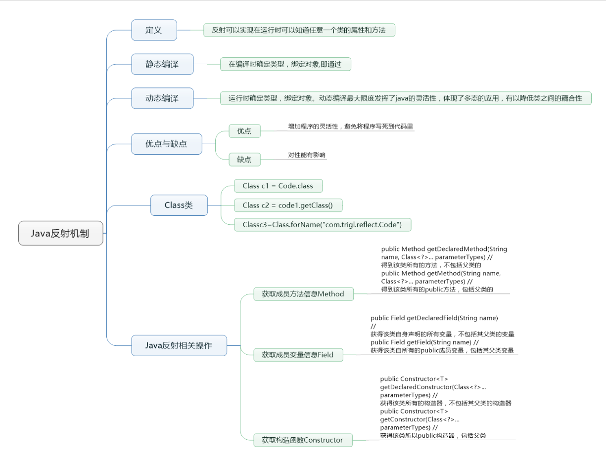

# 1、注解（Annotation）

## **1.1 什么是注解(Annotation)**

注解不是程序本身，可以在程序编译、类加载和运行时被读取，并执行相应的处理。注解的格式为"@注释名(参数值)"，可以附加在包、类、方法和字段上，通过反射机制实现实现注解的访问。

**注解(Annotation)相当于一种标记，在程序中加入注解就等于为程序打上某种标记**，没有加，则等于没有任何标记，以后，javac编译器、开发工具和其他程序可以通过反射来了解你的类及各种元素上有无何种标记，看你的程序有什么标记，就去干相应的事，**标记可以加在包、类，属性、方法，方法的参数以及局部变量上。**

## 1.2内置注解

JDK1.5之后内部提供的三个注解

 @Deprecated 意思是“**废弃的，过时的**”

 @Override 意思是“**重写、覆盖**”

 @SuppressWarnings 意思是“**压缩警告**”，作用：用于抑制编译器产生警告信息。

​		该注解作用的类、方法和属性会取消显示编译器警告，其参数主要是进行警告说明以及取消(unchecked)等。

```java

public class AnnotationTest {
    /**
     * @param args 
     * 这里就是注解，称为压缩警告，这是JDK内部自带的一个注解，一个注解就是一个类，在这里使用了这个注解就是创建了 SuppressWarnings类的一个实例对象
     */
    public static void main(String[] args) {
        sayHello();
        //这里的sayHello()方法画了一条横线表示此方法已经过时了，不建议使用了

        @SuppressWarnings("unused")
        String str = "sdfd";
    }

    /**
     * 这也是JDK内部自带的一个注解，意思就是说这个方法已经废弃了，不建议使用了
     该注解表示某个属性、方法或类等已过时（程序员不鼓励使用的程序元素，通常是因为它是危险的，或者因为存在更好的替代方法），当其他程序使用已过时的属性、方法或者类时，编译器会给出警告（删除线）。

/**

* 该注解表示此方法已过时，存在危险，不推荐使用，其有代替方法，如果继续使用会通过删除线进行标识

*/
     */
    @Deprecated 
    public static void sayHello() {
        System.out.println("hi,xxxx");
    }

    /**
     * 这也是JDK1.5之后内部提供的一个注解，意思就是要重写(覆盖)JDK内部的toString()方法
     * @return
     */
    @Override 
    public String toString() {
        return "xxxx";
    }
}
```

## 1.3自定义注解，元注解

**元注解**

> 元注解就是用来注解其他注解，java提供了4个标准的meta-annotation类型，他们被用来提供对其他annotation类型作说明.
>
> 这些类型和他们所支持的类在`java.lang.annotation`包中可以找到（**`@Target`, `@Retention`,`@Documented`, `@Inherited`** ）

- **@Target**:用于描述注解的使用范围（即被描述的注解可以用在什么地方）

- **@Retention**：表示需要在什么级别保存该注释信息，用于描述注解的声明周期（**SOURCE<CLASS<RUNTIME**）

- **@Target 用于描述所修饰的对象范围，既被描述的注解可以用在什么地方 @Target({ElementType.TYPE})给类注解**

  ```
      TYPE,  //给类（型）注解
      FIELD, //给字段注解，不要忘了，字段可以是对象
      METHOD, //给方法注解
      PARAMETER, //给参数注解
      CONSTRUCTOR, //给构造方法注解
      LOCAL_VARIABLE, //给局部变量注解
      ANNOTATION_TYPE,//给注解注解（这貌似把自己不当类来看）
      PACKAGE, //给包注解
  ```

   @Retention 表示需要在什么级别保存注解信息，用于描述注解运行状态，SOURCE<CLASS<RUNTIME，表示我们注解在什么地方有效

  ```
     SOURCE, //源码状态运行，
     CLASS, //编译类文件时运行
     RUNTIME //运行时运行
  ```

  

   **@Document 说明该注解将被包含在Javadoc中 表示是否将我们的注解生成在JAVADoc中**

   **@ inherited 说明子类可以继承父类中的注解**

**自定义注解**

当使用`@interface`自定义注解时，自动继承了`java.lang.annotation.Annotation`接口。

- `@interface`用来声明一个注解，格式：public @ inteface 注解名{定义内容}
- 其中的每一个方法实际上是声明了一个配置参数。
- 方法名称就是参数的名称
- 返回值类型就是参数的类型(返回值只能是基本类型，Class,String, enum)
- 可以通过default来声明参数的默认值
- 如果只有一个参数成员，一般参数名为`value`
- 注解元素必须有值，我们定义注解元素时，经常使用空字符串，0作为默认值

实例代码

```
import java.lang.annotation.*;

//什么是注解，学习下
@SuppressWarnings("")
public class TestAnnotation1 extends Object{
    @Override
    public String toString() {
        return super.toString();
    }
    public void test(){}
    //定义一个注解


}
//Target 表示我们的注解可以用在哪些地方
@Target(value = {ElementType.METHOD, ElementType.TYPE})
//Retention表示我们的注解在什么地方还有效
@Retention(value = RetentionPolicy.RUNTIME)
//@Documented 表示是否将我们的注解生成在JAVAdoc中
@Documented
//Inherited 子类可以继承父类的注解
@Inherited
@interface MyAnnotation{

}
```

示例代码2，带有多个参数

```
public class TestAnnotationDemo2 {
    //注解可以显示赋值，如果么有默认值，我们就必须给注解赋值
    @MyAnnotation2(age=18, name = "qinjiang")
    public void test(){}
    
    @MyAnnotation3("all")
    public void test2(){}
}


@Target({ElementType.TYPE,ElementType.METHOD})
@Retention(RetentionPolicy.RUNTIME)
@interface MyAnnotation2{
    //注解的参数： 参数类型+参数名();
    String name() default ""; //可以使用默认值
    int age() default 0;
    int id() default -1;//如果默认值为-1，代表不存在。
    String[] schools() default {"西部凯旋","清华大学"};

}
@Target({ElementType.TYPE,ElementType.METHOD})
@Retention(RetentionPolicy.RUNTIME)
@interface MyAnnotation3{
    String value(); //如果只有一个参数，建议直接使用value
}
```

## 1.4 自定义注解的真实使用场景

- 场景描述：使用springboot拦截器实现这样一个功能，如果方法上加了@LoginRequired，则提示用户该接口需要登录才能访问，否则不需要登录

```java
//1. 首先先定义一个注解

@Target(ElementType.METHOD)
@Retention(RetentionPolicy.RUNTIME)
public @interface LoginRequired {
    
}

//2. 写两个接口
@RestController
public class IndexController {

    @GetMapping("/sourceA")
    public String sourceA(){
        return "你正在访问sourceA资源";
    }

    @GetMapping("/sourceB")
    public String sourceB(){
        return "你正在访问sourceB资源";
    }

}
// 3. 测试 现在访问两个接口是都可以成功的

// 4. 自定义拦截器，实现拦截功能
public class SourceAccessInterceptor implements HandlerInterceptor {
  @Override
    public boolean preHandle(HttpServletRequest request, HttpServletResponse response, Object handler) throws Exception {
        System.out.println("进入拦截器了");

        // 反射获取方法上的LoginRequred注解
        HandlerMethod handlerMethod = (HandlerMethod)handler;
        LoginRequired loginRequired = handlerMethod.getMethod().getAnnotation(LoginRequired.class);
        if(loginRequired == null){
            return true;
        }

        // 有LoginRequired注解说明需要登录，提示用户登录
        response.setContentType("application/json; charset=utf-8");
        response.getWriter().print("你访问的资源需要登录");
        return false;
    }


    @Override
    public void postHandle(HttpServletRequest request, HttpServletResponse response, Object handler, ModelAndView modelAndView) throws Exception {

    }

    @Override
    public void afterCompletion(HttpServletRequest request, HttpServletResponse response, Object handler, Exception ex) throws Exception {

    }
}

// 5. 实现spring类WebMvcConfigurer，创建配置类把拦截器添加到拦截器链中
@Configuration
public class InterceptorTrainConfigurer implements WebMvcConfigurer {
    @Override
    public void addInterceptors(InterceptorRegistry registry) {
        registry.addInterceptor(new SourceAccessInterceptor()).addPathPatterns("/**");
    }
}

// 6. 在刚刚的接口中的一个接口添加注解
@RestController
public class IndexController {

    @GetMapping("/sourceA")
    public String sourceA(){
        return "你正在访问sourceA资源";
    }

    @LoginRequired
    @GetMapping("/sourceB")
    public String sourceB(){
        return "你正在访问sourceB资源";
    }

}
//7. 验证一下，访问接口B就会被拦截
```


# 2.JAVA反射



> 主要是指程序可以访问，检测和修改它本身状态或行为的一种能力，并能根据自身行为的状态和结果，调整或修改应用所描述行为的状态和相关的语义。

## 2.1反射机制是什么

> 面试有可能会问到，这句话不管你能不能理解，但是你只要记住就可以了

反射机制就是在运行状态中，**对于任意一个类，都能够知道这个类的所有属性和方法；对于任意一个对象，都能够调用它的任意一个方法和属性**；这种动态获取的信息以及动态调用对象的方法的功能称为java语言的反射机制。

用一句话总结就是反射可以实现在**运行**时可以知道**任意一个类**的**属性和方法**

**动态语言**，是一种在运行时可以改变其结构的语言，例如新的函数、对象甚至代码可以被引进，他有的函数可以被删除或是其他结构上的变化，通俗点说就是代码可以根据某些条件改变自身结构

主要动态语言 Object-c c# javascript php python等

**静态语言**相对应的，运行时结构不可变的语言就是静态语言，比如java,c,c++ java不是动态语言，但是java可以称之为动态准语言，既JVA有一定的动态性，我么可以利用反射机制获得类似动态语言的特性，JAVA的动态性让编程的时候更加灵活。

Reflection(反射) 是java被视为动态语言的关键，反射机制允许程序在执行期间借助于Reflection API获取任何类的内部信息，并能直接操作任意对象的内部属性及方法

 Class c = Class.forName("Java.lang.String")

加载完成之后，在堆内存的方法区就会产生一个Class类型的对象，一个类只有一个Class对象，这个对象就包含了完整的类的结构信息，我们可以通过这个对象看到类的结构，这个对象就像一面镜子，透过这个镜子看到类的结构，所以我们形象的称之为：反射

**正常的方式** : 引入需要的包类名称---->通过new实例化--->取得实例化对象

**反射方式**：实例化对象---getClass()方法--->获得完整的包类名称

**JAVA反射机制提供的功能**：

```
- 在运行时判断任意一个对象所属的类
- 在运行时构造任意一个类的对象
- 在运行时判断任意一个类所具有的成员变量和方法
- 在运行时获取泛型的信息
- 在运行时调用任意一个对象的成员变量和方法
- 在运行时处理注解
- 生成动态代理
- ....
```

## 2.2 **JAVA反射机制的优点和缺点**

```
- 优点  可以实现动态创建对象和编译，体现了很大的灵活性
- 缺点，对性能有影响，使用反射基本上是一种解释操作，我们可以告诉JVM，我们希望做什么并且他满足我们的要求，这类操作总是慢于直接执行相同的操作。
```

## 2.3 **JAVA反射相关的主要API**

```
- java.lang.Class 代表一个类
- java.lang.reflect.Method 代表类的方法
- java.lang.reflect.Field 代表类的成员变量
- java.lang.reflect.Constructor  代表类的构造器
- ....................
```

示例代码

```
public class User{
    public static void main(String[] args) throws ClassNotFoundException {
        //通过反射获取类的Class对象
        Class c1 = Class.forName("top.aigoo.reflection.pojoUser");
        System.out.println(c1);
        System.out.println(c1.hashCode());

        //通过C2,C3,C4打印的hashCode一样，可以证明一个类在内存中只会有一个Class对象
        Class c2 = Class.forName("top.aigoo.reflection.pojoUser");
        System.out.println(c2.hashCode());
        Class c3 = Class.forName("top.aigoo.reflection.pojoUser");
        System.out.println(c3.hashCode());

        Class c4 = Class.forName("top.aigoo.reflection.pojoUser");
        System.out.println(c4.hashCode());

    }
}

###  //实体类 pojo extity什么叫做实体类 ，只有属性的类叫做实体类
class pojoUser {
    private String name;
    private int id;
    private int age;

    public pojoUser() {
    }

    public pojoUser(String name, int id, int age) {
        this.name = name;
        this.id = id;
        this.age = age;
    }

    public String getName() {
        return name;
    }

    public void setName(String name) {
        this.name = name;
    }

    public int getId() {
        return id;
    }

    public void setId(int id) {
        this.id = id;
    }

    public int getAge() {
        return age;
    }

    public void setAge(int age) {
        this.age = age;
    }
}

```

Class类

在Object类中定义了以下的方法，此方法被所有子类继承

 Public final Class getClass()

以上的方法返回值的类型是一个Class类，此类是Java反射的源头，实际上所谓反射从程序的运行结果来看也很好理解，既可通过对象反射求出类的名称，

## 2.4 理解Class类并获取Classs实例

**Class类的基本概念**

对象照镜子后可以得到的信息，某个类的属性、方法和构造器，某个类到底实现了哪些接口。对于每个类而言，JRE都保留一个不变的Class类型的对象，一个Class对象包含了特定某个结构(class/interface/enum/annotation/primitive type/void[]) 的有关信息。

```
- Class本身也是一个类;
- Class对象只能由系统建立对象;
- 一个加载的类在JVM中只会有一个Class实例;
- 一个Class 对象对应的是一个加载到JVM的一个.class文件;
- 每个类的实例都会记得自己是由哪个Class实例所生成
- 通过Class可以完整的得到一个类中所有被加载的结构
- Class类是Reflection的根源，针对任何你想动态加载、运行的类，唯有先获得相应的Class对象
```

**Classs类的常用方法**

```java
static ClassforName(String name) 返回指定类名name的Class对象

Object newInstance() 调用缺省构造函数，返回Class对象的一个实例

getName() 返回此Class对象所表示的实体(类，接口，，数组类或void）的名称

Class getSuperClass() 返回当前Class对象的父类的Class对象

Class [] getinterfaces() 获取当前Class对象的接口

ClassLoader getClassLoader() 返回该类的类加载器

Constrtuctor [] getConstructors() 返回一个包含某些Constructor对象的数组

Method getMethed(String name,Class...T) 返回一个Method对象，此对象的形参类型为paramType

Field[] getDeclaredFields() 返回Field对象的一个数组
```

**获取Class类的实例**

- 如果已知具体的类名，通过类的class属性获取，该方法最为安全可靠，程序性能最高，Class clazz = Person.class;
- 已知某个类的实例，调用该实例的getClass（）方法获取Class对象 Class clazz = person.getClass();
- 已知一个类的类名和存储路径，且该类在类路径下，可通过Class类的静态方法forName()获取，可能抛出ClassNotFoundException Class clazz =Class.forName("demo01.Student");
- 内置基本类型数据可以直接用类名 .Type
- 还可以利用ClassLoader我们之后讲解

实例代码：

```
public class test03 {
    public static void main(String[] args) throws ClassNotFoundException {
        Person person = new Student();
        System.out.println("这个人是" + person.name);

        //方式一：通过Person实例对象获取类Class
        Class  c1 = person.getClass();
        System.out.println(c1.hashCode());

        //方式二：通过Class.forName()获取class
        Class c2 = Class.forName("top.aigoo.reflection.Student");
        System.out.println(c2.hashCode());

        //方式三：通过类名获取Class对象
        Class c3 = Student.class;
        System.out.println(c3.hashCode());

        //方式四：基本内置类型的包装类都有一个Type属性
        Class c4 = Integer.TYPE;
        System.out.println(c4);

        //获取父类类型  通过对象person中person.getClass()获取person的类Student ,然后通过这个c1的c1.getSupercLass()获取父类
        Class c5 = c1.getSuperclass();
        System.out.println(c5);
    }
}

class Person{
    String name;

    public Person() {
    }

    public Person(String name) {
        this.name = name;
    }
}

class Student extends Person{
    public Student() {
        this.name="-->学生";
    }
}

class Teacher extends Person{
    public Teacher() {
        this.name="-->老师";
    }
}


460141958
460141958
460141958
int
class Person
```

**那些类型可以有Class对象**

```java
 class 外部类，成员(成员内部类，静态内部类)，局部内部类，匿名内部类

 interface:接口

 [] 数组

 enum 枚举

 annotation 注解@interface

 primitive type: 基本数据类型

 void
```

示例代码

```
public class test04 {
    private int age;

    public static void main(String[] args) {
        Class c1 = test04.class;
        Class c2 = String[].class;
        Class c3 = int[][].class;
        Class c4 = Object.class;
        Class c5 = Comparable.class;
        Class c6 = Override.class;
        Class c7 = ElementType.class;
        Class c8 = void.class;
        Class c9 = Integer.class;

//        System.out.println("Class的getSuperclass:"+c1.getSuperclass());//Class的getSuperclass:class java.lang.Object
//        System.out.println("Class的getName:"+c1.getName());//Class的getName:top.aigoo.reflection.test04
//        System.out.println("Class的getSimpleName:"+c1.getSimpleName());//Class的getSimpleName:test04
//        System.out.println("Class的getTypeName:"+c1.getTypeName());//Class的getTypeName:top.aigoo.reflection.test04
//        System.out.println("Class的getClasses:"+c1.getClasses());
//        System.out.println("Class的getFields:"+c1.getFields());
//        System.out.println("Class的getClassLoader():"+c1.getClassLoader());
//        System.out.println("Class的getClassLoader():"+c1.getMethods()[0]);


        System.out.println(c1);
        System.out.println(c2);
        System.out.println(c3);
        System.out.println(c4);
        System.out.println(c5);
        System.out.println(c6);
        System.out.println(c7);
        System.out.println(c8);
        System.out.println("c9"+c9);

        //只要元素类型和维度一样，就是同一个Class
        int[] a = new int[10];
        int[] b = new int[100];
        System.out.println(a.getClass().getSimpleName());
        System.out.println(b.getClass().getSimpleName());
    }
}
```

> 只要元素类型和维度一样，就是同一个class

## 2.5 类的加载与ClassLoader

### 一、什么是ClassLoader?

大家都知道，当我们写好一个Java程序之后，不是管是CS还是BS应用，都是由若干个.class文件组织而成的一个完整的Java应用程序，当程序在运行时，即会调用该程序的一个入口函数来调用系统的相关功能，而这些功能都被封装在不同的class文件当中，所以经常要从这个class文件中要调用另外一个class文件中的方法，如果另外一个文件不存在的，则会引发系统异常。而程序在启动的时候，并不会一次性加载程序所要用的所有class文件，而是根据程序的需要，通过Java的类加载机制（ClassLoader）来动态加载某个class文件到内存当中的，从而只有class文件被载入到了内存之后，才能被其它class所引用。所以ClassLoader就是用来动态加载class文件到内存当中用的。

### 二、Java默认提供的三个ClassLoader

1. **BootStrap ClassLoader**：称为启动类加载器，是Java类加载层次中最顶层的类加载器，负责加载JDK中的核心类库，如：rt.jar、resources.jar、charsets.jar等，可通过如下程序获得该类加载器从哪些地方加载了相关的jar或class文件：


```jsx
URL[] urls = sun.misc.Launcher.getBootstrapClassPath().getURLs();  
for (int i = 0; i < urls.length; i++) {  
    System.out.println(urls[i].toExternalForm());  
}

以下内容是上述程序从本机JDK环境所获得的结果：
file:/C:/Program%20Files/Java/jdk1.6.0_22/jre/lib/resources.jar
file:/C:/Program%20Files/Java/jdk1.6.0_22/jre/lib/rt.jar
file:/C:/Program%20Files/Java/jdk1.6.0_22/jre/lib/sunrsasign.jar
file:/C:/Program%20Files/Java/jdk1.6.0_22/jre/lib/jsse.jar
file:/C:/Program%20Files/Java/jdk1.6.0_22/jre/lib/jce.jar
file:/C:/Program%20Files/Java/jdk1.6.0_22/jre/lib/charsets.jar
file:/C:/Program%20Files/Java/jdk1.6.0_22/jre/classes/  
```

其实上述结果也是通过查找sun.boot.class.path这个系统属性所得知的。
 `System.out.println(System.getProperty("sun.boot.class.path"));`


```css
打印结果：C:\Program Files\Java\jdk1.6.0_22\jre\lib\resources.jar;C:\Program Files\Java\jdk1.6.0_22\jre\lib\rt.jar;C:\Program Files\Java\jdk1.6.0_22\jre\lib\sunrsasign.jar;C:\Program Files\Java\jdk1.6.0_22\jre\lib\jsse.jar;C:\Program Files\Java\jdk1.6.0_22\jre\lib\jce.jar;C:\Program Files\Java\jdk1.6.0_22\jre\lib\charsets.jar;C:\Program Files\Java\jdk1.6.0_22\jre\classes
```

1. **Extension ClassLoader**：称为扩展类加载器，负责加载Java的扩展类库，默认加载`JAVA_HOME/jre/lib/ext/`目下的所有jar。
2. **App ClassLoader**：称为系统类加载器，负责加载应用程序`classpath`目录下的所有jar和class文件。
    注意： 除了Java默认提供的三个ClassLoader之外，用户还可以根据需要定义自已的ClassLoader，而这些自定义的ClassLoader都**必须继承**自java.lang.ClassLoader类，也包括Java提供的另外二个ClassLoader（Extension ClassLoader和App ClassLoader）在内，但是Bootstrap ClassLoader不继承自ClassLoader，因为它不是一个普通的Java类，底层由C++编写，已嵌入到了JVM内核当中，当JVM启动后，Bootstrap ClassLoader也随着启动，负责加载完核心类库后，并构造Extension ClassLoader和App ClassLoader类加载器。

### 三、ClassLoader加载类的原理

##### 1、原理介绍

> 双亲委派模型工作过程是：如果一个类加载器收到类加载的请求，它首先不会自己去尝试加载这个类，而是把这个请求委派给父类加载器完成。每个类加载器都是如此，只有当父加载器在自己的搜索范围内找不到指定的类时（即ClassNotFoundException），子加载器才会尝试自己去加载。

ClassLoader使用的是*双亲委托模型*来搜索类的，每个ClassLoader实例都有一个父类加载器的引用（不是继承的关系，是一个包含的关系），虚拟机内置的类加载器（Bootstrap ClassLoader）本身没有父类加载器，但可以用作其它ClassLoader实例的的父类加载器。当一个ClassLoader实例需要加载某个类时，它会试图亲自搜索某个类之前，先把这个任务委托给它的父类加载器，这个过程是由上至下依次检查的，首先由最顶层的类加载器Bootstrap ClassLoader试图加载，如果没加载到，则把任务转交给Extension ClassLoader试图加载，如果也没加载到，则转交给App ClassLoader 进行加载，如果它也没有加载得到的话，则返回给委托的发起者，由它到指定的文件系统或网络等URL中加载该类。如果它们都没有加载到这个类时，则抛出ClassNotFoundException异常。否则将这个找到的类生成一个类的定义，并将它加载到内存当中，最后返回这个类在内存中的Class实例对象。

##### 2、为什么要使用双亲委托这种模型呢？

因为这样可以避免重复加载，当父亲已经加载了该类的时候，就没有必要子ClassLoader再加载一次。考虑到安全因素，我们试想一下，如果不使用这种委托模式，那我们就可以随时使用自定义的String来动态替代java核心api中定义的类型，这样会存在非常大的安全隐患，而双亲委托的方式，就可以避免这种情况，因为String已经在启动时就被引导类加载器（Bootstrcp ClassLoader）加载，所以用户自定义的ClassLoader永远也无法加载一个自己写的String，除非你改变JDK中ClassLoader搜索类的默认算法。


**什么时候回发生类的初始化**

- 类的主动引用(一定会发生类的初始化)
  - 当虚拟机启动时，会初始化main方法所在的类
  - new一个新的对象的时候
    - d调用类的静态成员(除了final常量)和静态方法
  - 使用java.lang.reflec包的方法对垒进行反射调用
  - 当初始化一个类，如果其父类没有被初始化，则贤惠初始化它的父类
- 类的被动引用(不会发生类的初始化)
  - 当访问一个静态域时候，只有真正声明这个域的类才会被初始化，如当通过子类引用父类的静态变量，不会导致子类初始化
  - 通过数组定义类引用，不会触发此类的初始化
    - 引用常量不会触发此类的初始化(常量在连接阶段就存入调用类的常量池中了)

演示代码

```
package com.kuang.reflection;

public class Test06 {
    
    static {
        System.out.println("main类被初始化加载"); // 当虚拟机启动，先初始化main方法所在的类
    }
    public static void main(String[] args) throws ClassNotFoundException {
        //下面会导致类的初始化

        // Son son = new Son(); //1.new 一个类的对象，发生类的初始化
        Class<?> aClass = Class.forName("com.kuang.reflection.Son");//反射产生类的初始化
        System.out.println(Son.b); //调用类的静态成员和静态方法 发生类的初始化
        //初始化一个类，如果父类没有被初始化，会先初始化他的父类
        //不会产生类的引用的方法
        //System.out.println(Son.b); //调用父类的静态变量、方法不会产生类的初始化
        //Son[] array = new Son[5]; //生成数组，不会产生类的初始化
        //System.out.println(Son.M);//引用常量，也不会产生此类的初始化(常量在连接阶段就存入调用类的常量池h)
    }
}

class Father{
    static int b =2;
    static {
        System.out.println("static方法：父类被加载!");
    }
}

class Son extends Father{
    static {
        System.out.println("static方法: 子类被加载");
        m= 300;
    }
    static int m =100;
    static final int M = 1;
}
```

## 2.6 **类加载器的作用**

```
- 将class文件字节码内容加载到内存中，并将这些静态数据转换成方法区运行时的数据结构。然后再堆中生成一个代表这个类的java.lang.Class对象，作为方法区中数据的访问入口
- 类缓存  标准的JAVASE类加载器可以按要求查找类，但一旦某个类被加载到类加载器中，它将维持加载(缓存)一段时间，不过JVM垃圾回收机制可以回收这些class对象
```

类加载器的作用 ：

就是把类装载进入内存中，JVM规范定了如下类型的类的加载器

- **引导类加载器**，用C++编写的，是JVM自带的类加载器，负责JAVA平台和辛苦，用来装载核心类库，该加载器无法直接获取

- 扩展类加载器

  ，负责jre/lib/ext目录下jar包或者 D Java.ext.dirs指定目录下的jar包装入工作裤

  - **系统类加载器** 负责java-classpath 或者 -D java.class.path 所指的目录下类与jar包装入工作，是最常用的加载器

示例代码：

```
public class test05 {
    public static void main(String[] args) throws ClassNotFoundException {
        //获取系统类的加载器
        ClassLoader loader = ClassLoader.getSystemClassLoader();
        System.out.println(loader);
        //获取系统类加载器的父类加载器-->扩展类加载器
        ClassLoader loader1 = loader.getParent();
        System.out.println(loader1);
        //获取扩展类加载器的父类加载器--->根加载器(c/c++)
        ClassLoader loader2 = loader1.getParent();
        System.out.println(loader2);

        //测试当前类是哪个类加载的
        ClassLoader loader3 = Class.forName("top.aigoo.reflection.test05").getClassLoader();
        System.out.println(loader3);
//        测试JDK内置的类是谁加载的
        ClassLoader loader4 = Class.forName("java.lang.Object").getClassLoader();
        System.out.println(loader4);
        //获取系统类加载器都可以加载哪些路径
        System.out.println(System.getProperty("java.class.path"));
    }
}
输出结果：
sun.misc.Launcher$AppClassLoader@18b4aac2
sun.misc.Launcher$ExtClassLoader@74a14482
null
sun.misc.Launcher$AppClassLoader@18b4aac2    
```

## 2.7 创建运行时类的对象

通过反射获取运行时类的完整结果 Field、Method、Constructor、Superclass、Interface、Annotation

```
- 实现的全部接口
- 所继承的父类
- 全部的构造器
- 全部的方法
- 全部的Field
- 注解.....
- 
```

示例代码

```
public class test06 {
    public static void main(String[] args) throws ClassNotFoundException, NoSuchFieldException, NoSuchMethodException {
        Class c1 = Class.forName("top.aigoo.reflection.pojoUser");

        System.out.println(c1.getName());//获得全路径类名
        System.out.println(c1.getSimpleName());  //获得类名
        
        //获取类的属性
        Field[] fields = c1.getFields();//只能获取Public属性
        for (Field field : fields) {
            System.out.println(field);
        }

        Field[] fields1 = c1.getDeclaredFields();  //获得所有属性
        for (Field field : fields1) {
            System.out.println(field);
        }

        Field field = c1.getDeclaredField("name");
        System.out.println(field);
		//获得类的方法
        Method[] methods = c1.getMethods();//获取本类及其父类的全部Public方法

        for (Method method : methods) {
            System.out.println(method);
        }
        Method[] methods1 = c1.getDeclaredMethods();//获取本类的全部方法
        for (Method method : methods1) {
            System.out.println("本类:::"+method);
        }
        //获取指定方法
        Method getName = c1.getMethod("getName", null);
        Method setName = c1.getMethod("setName", String.class);

        System.out.println("getName:"+getName);
        System.out.println("setName:"+setName);

    }
}
运行结果
    top.aigoo.reflection.pojoUser
    pojoUser
    private java.lang.String top.aigoo.reflection.pojoUser.name
    private int top.aigoo.reflection.pojoUser.id
    private int top.aigoo.reflection.pojoUser.age
    private java.lang.String top.aigoo.reflection.pojoUser.name

    Process finished with exit code 0
```

小结

```
- 在实际的操作中，取得类的信息的操作代码，并不会经常开发
- 一定要熟悉java.lang.reflect包的作用，反射机制
- 如何取得属性、方法、构造器的名称，修饰符等
```

## 2.8 获取运行时类的完整结构

```
public class Test02 {
    public static void main(String[] args) throws ClassNotFoundException, NoSuchMethodException {
        Class c1 = Class.forName("com.kuang.reflection.User");
        System.out.println("===============================");
        System.out.println(c1.getName());
        System.out.println(c1.getSimpleName());
        //获取类的属性
        System.out.println("===============================");

        Field[] fields = c1.getFields(); //获取本类的所有属性
        for (Field field : fields) {
            System.out.println(field);
        }
        fields = c1.getDeclaredFields(); //获取本类的所有属性
        for (Field field : fields) {
            System.out.println(field);
        }

        //获得类的方法
        System.out.println("===============================");
        Method[] methods = c1.getMethods();//获得本类及其父类的全部public方法
        for (Method method : methods) {
            System.out.println("正常的:"+method);
        }
        methods =c1.getDeclaredMethods();//获取本类的所有方法
        for (Method method : methods) {
            System.out.println("getDeclaredMethods():"+method);
        }

        //获得指定的方法
        //重载
        System.out.println("===============================");
        Method getName = c1.getMethod("getName", null);
        Method setName = c1.getMethod("setName", String.class);
        System.out.println(getName);
        System.out.println(setName);

        //获得指定的构造器
        System.out.println("===============================");
        Constructor[] constructors = c1.getConstructors();//获得public构造器
        for (Constructor constructor : constructors) {
            System.out.println(constructor);
        }
        constructors= c1.getDeclaredConstructors(); //获得所有的构造器
        for (Constructor constructor : constructors) {
            System.out.println("getDeclaredConstructors():"+constructor);
        }

        Constructor constructor = c1.getConstructor(String.class, String.class, int.class);//获取指定构造器
        System.out.println(constructor);

    }
}
```

**有了Class对象可以做什么？**

- 创建类的对象可调用Class对象的newInstance()方法，
- 类必须有一个无参数的构造器，
  - 类的构造器的访问权限需要足够

```
//动态的创建对象，通过反射
public class Test09 {
    public static void main(String[] args) throws ClassNotFoundException, IllegalAccessException, InstantiationException {
        //获得Class对象
        Class c1 = Class.forName("com.kuang.reflection.User");
        //构造一个对象
        User user = (User) c1.newInstance();//本质这种是调用类的无参构造器来创建一个User的实例
        System.out.println(user);
        
    }
}
```

**思考**，难道没有无参构造器就不能创建对象了吗，只要在操作的时候明确的调用类中的构造器，并将参数传递进入之后，就可以实例化操作

- 步骤
  - 通过Class类的getDeclaredConstructor(Class ...parameterTypes)取得本类的指定形参类型的构造器
  - 向构造器的形参中传递一个对象数组进去，里面包含了构造器中所需要的的各个参数
  - 通过Constructor实例化对象

示例代码

```
public class Test07 {
    public static void main(String[] args) throws ClassNotFoundException, IllegalAccessException, InstantiationException, NoSuchMethodException, InvocationTargetException, NoSuchFieldException {
        Class c1 = Class.forName("top.aigoo.reflection.pojoUser");
        //#1 使用镜像创建对象
        pojoUser user = (pojoUser) c1.newInstance();
        System.out.println(user);

        //#2 通过构造器创建对象
        Constructor constructor = c1.getConstructor(String.class, int.class, int.class);
        pojoUser user2 = (pojoUser) constructor.newInstance("秦僵", 001, 18);
        System.out.println(user2.getName());

        pojoUser user3 = (pojoUser) c1.newInstance();

        //#3 通过反射获取普通方法并使用
        Method setName = c1.getDeclaredMethod("setName", String.class); //先获取类的方法
        setName.invoke(user3,"狂神"); //通过invoke将方法setName和对象user3绑定，同时传进去方法实参
        System.out.println(user3.getName());

        //#4 通过反射操作属性
        pojoUser user4 = (pojoUser) c1.newInstance();
        Field name = c1.getDeclaredField("name");
        name.setAccessible(true); //关闭权限检测，就可以操作private属性了
        name.set(user4,"狂神2"); //通过set将对象和属性绑定
        System.out.println(user4.getName());
    }
}
```

**调用指定方法**

 Object invoke(Object obj,Object.... args)

```
- Object对应原方法的返回值，若原方法无返回值，此时返回null
- 若原方法为静态方法，此时形参Object obj可以是null
- 若原方法形参列表为空则Object[]arg为null
- 若原方法声明为private,则需要在调用此invode()方法前，显示调用方法对象的SetAccessable(true)方法，将可访问private方法
```

**setAccessible()方法**

Method和Field、Constructor对象都设置SetAccessible()方法

作用 启动和金庸访问安全设置的开关

参数为true则指示反射的对象在使用时应该取消java语言检查访问，这样可提高反射效率，如果代码中必须反射，则该句代码需要频繁的被调用，那么清设置为true,使得原本无法访问的私有成员也可以被访问

参数值为false则指示反射的对象应该实施JAVA语言的访问检查

设定前后，性能影响很明显

```
public class Test8 {
    //普通方式调用十亿次
    public static void test1(){
        pojoUser user = new pojoUser();
        long starttime = System.currentTimeMillis();
        for (int i = 0; i < 1000000000; i++) {
            user.getName();
        }
        long endtime = System.currentTimeMillis();
        System.out.println("普通方式执行:"+(endtime - starttime)+" ms");
    }

    //使用反射方式调用十亿次
    public static void test2() throws NoSuchMethodException, InvocationTargetException, IllegalAccessException, InstantiationException {
        pojoUser user = new pojoUser();

        Class c1 = user.getClass(); //获取Class对象
        pojoUser user_mirror = (pojoUser)c1.newInstance(); //根据Class对象获取pojoUser实例
        Method getName = c1.getDeclaredMethod("getName", null);  //通过Class对象获取pojoUser的方法


        long starttime = System.currentTimeMillis();
        for (int i = 0; i < 1000000000; i++) {
            getName.invoke(user_mirror,null); //通过Method 的invode激活方法
        }
        long endtime = System.currentTimeMillis();
        System.out.println("反射方式执行:"+(endtime - starttime)+"ms");
    }

    //关闭检测调用十亿次
    public static void test3() throws NoSuchMethodException, InvocationTargetException, IllegalAccessException, InstantiationException {
        pojoUser user = new pojoUser();

        Class c1 = user.getClass(); //获取Class对象
        pojoUser user_mirror = (pojoUser)c1.newInstance(); //根据Class对象获取pojoUser实例
        Method getName = c1.getDeclaredMethod("getName", null);  //通过Class对象获取pojoUser的方法
        getName.setAccessible(true);//关闭检测

        long starttime = System.currentTimeMillis();
        for (int i = 0; i < 1000000000; i++) {
            getName.invoke(user_mirror,null); //通过Method 的invode激活方法
        }
        long endtime = System.currentTimeMillis();
        System.out.println("关闭检测执行:"+(endtime - starttime)+"ms");
    }

    public static void main(String[] args) throws NoSuchMethodException, IllegalAccessException, InvocationTargetException, InstantiationException {
        test1();
        test2();
        test3();
    }
}
输出结果:
	普通方式执行:4ms
    反射方式执行:1623ms
    关闭检测执行:1059ms
```

## 2.9 调用运行时类的指定结构

**反射操作泛型**

- JAVA采用泛型擦除的机制来引入泛型，JAVA中的泛型仅仅是给编译器JAVAC使用的，确保数据的安全性和免去强制类型转换的问题，但是，一旦编译完成，所有和泛型有关的类型全部擦除
- 为了通过反射操作这些类型，JAVA新增了parameterizedType,GenericArrayType,TypeVariable和WildcardType几种类型来代表不能被归一到Class类中的类型但是又和原生类型齐名的类型
- ParameterizedType 表示一种参数化类型，比如Collection
- GenericArrayType 表示一种元素类型是参数化类型或者类型变量的数组元素
- TypeVariable 是各种类型变量的公共父接口
- WildcardType 代表一种通配符类型表达式

实例代码

```
//通过反射获取泛型
public class Test09 {
    //带有泛型参数的方法
    public void test1(Map<String, pojoUser> map, List<pojoUser> list){
        System.out.println("我是test1方法");
    }
    //带有泛型返回值的方法
    public List<pojoUser> test1(){
        System.out.println("我是test2方法");

        return null;
    }

    public static void main(String[] args) throws NoSuchMethodException {
        Method method = Test09.class.getMethod("test1", Map.class, List.class);
        //获取方法的返回泛型
        Type[] genericParameterTypes = method.getGenericParameterTypes();

        for (Type genericParameterType : genericParameterTypes) {
            System.out.println("#-->" + genericParameterType);
            System.out.println("====");
            if (genericParameterType instanceof ParameterizedType){
                Type[] actualTypeArguments = ((ParameterizedType) genericParameterType).getActualTypeArguments();
                for (Type actualTypeArgument : actualTypeArguments) {
                    System.out.println(actualTypeArgument);
                }
            }
        }
    }

}
```

## 2.10 **反射操作注解**

示例代码

```
//练习反射操作注解
public class Test10 {
    public static void main(String[] args) throws ClassNotFoundException, NoSuchFieldException {
        Class c1 = Test10.class;
        //step1 或者Class类对象
        Class c2 = Class.forName("top.aigoo.reflection.Student2");
        //通过反射获得注解
        Annotation[] annotations = c2.getAnnotations();
        for (Annotation annotation : annotations) {
            System.out.println("annotation-->"+annotation);
        }

        //通过反射获得注解的value值
        Tablekuang tablekuang = (Tablekuang)c2.getAnnotation(Tablekuang.class);
        String value = tablekuang.value();
        System.out.println("tablekuang.Value()-->"+tablekuang.Value()); //通过.Value()直接获取指定注解的值

        //通过反射 获得类的  指定属性的 注解
        Field field = c2.getDeclaredField("name");
        Fieldkuang annotation = (Fieldkuang)field.getAnnotation(Fieldkuang.class);
        System.out.println("annotation.columenName-->"+annotation.columenName());
        System.out.println("annotation.type-->"+annotation.type());
        System.out.println("annotation.length-->"+annotation.length());

        Field field2 = c2.getDeclaredField("id");
        Fieldkuang annotation2 = (Fieldkuang)field.getAnnotation(Fieldkuang.class);
        System.out.println("annotation2.columenName-->"+annotation2.columenName());
        System.out.println("annotation2.type-->"+annotation2.type());
        System.out.println("annotation2.length-->"+annotation2.length());
    }
}
@Tablekuang(Value = "db_student")
class Student2{
    @Fieldkuang(columenName = "db_id",type = "int",length = 10)
    private int id;
    @Fieldkuang(columenName = "db_age",type = "int",length = 10)
    private int age;
    @Fieldkuang(columenName = "db_name",type = "varchar",length = 3)
    private String name;

    public Student2(int id, int age, String name) {
        this.id = id;
        this.age = age;
        this.name = name;
    }

    public Student2() {
    }

    public int getId() {
        return id;
    }

    public void setId(int id) {
        this.id = id;
    }

    public int getAge() {
        return age;
    }

    public void setAge(int age) {
        this.age = age;
    }

    public String getName() {
        return name;
    }

    public void setName(String name) {
        this.name = name;
    }

    @Override
    public String toString() {
        return "Student2{" +
                "id=" + id +
                ", age=" + age +
                ", name='" + name + '\'' +
                '}';
    }
}

//注解类名
@Target(ElementType.TYPE)
@Retention(RetentionPolicy.RUNTIME)
@interface  Tablekuang{
    String Value();
}

//属性注解
@Target(ElementType.FIELD)
@Retention(RetentionPolicy.RUNTIME)
@interface Fieldkuang{
    String columenName();
    String type();
    int length();
}
```